# StateDMI / Installation and Configuration #

This appendix describes how to install StateDMI in the CDSS (Colorado's Decision Support Systems) environment.
CDSS consists of the HydroBase database, modeling, and data viewing/editing software.
StateDMI can be used within this system to process data from the HydroBase database, CDSS model files, and other files.

*   [Overview](#overview)
*   [File Locations](#file-locations)
    +   [Installation Files](#installation-files)
    +   [User Files](#user-files)
*   [Installing StateDMI](#installing-statedmi)
*   [Uninstalling StateDMI](#uninstalling-statedmi)
*   [Running StateDMI](#running-statedmi)
*   [StateDMI Configuration](#statedmi-configuration)

---------------

## Overview ##

CDSS consists of the HydroBase database, modeling, and data viewing/editing software.
StateDMI can be used within this system to process data for StateCU and StateMod models.
The TSTool software is used to process time series from the HydroBase database,
CDSS model files, and other databases and files.
Alternatively, StateDMI can be installed independently of CDSS,
in which case the only connection is that the installation folder on Windows defaults to `C:\CDSS\TSTool-Version`.
StateDMI can also be installed on Linux, typically in `/opt/StateDMI-Version`;
however, this is not currently supported to the degree that TSTool on Linux is supported.

## File Locations ##

Standard locations of StateDMI software files are as follows.

### Installation Files ###

These files are referred to as "installation files".

Files are normally installed on Windows on the `C:` drive but can be installed in a shared location on a server
if the software is provided in a shared environment (in this case it is recommended to install in `C:` first
and then copy the `StateDMI-Version` folder to the server).  Note that the following list of software `*.jar`
files may be different from the current StateDMI version.
In the future separate documentation may be provided explaining software components and licenses.

```
C:\CDSS\StateDMI-Version           Windows Top-level install directory.
  bin\                             Software program files folder
    *.jar                          Generally, software libraries used by StateDMI.
    Blowfish*.jar                  Used for encryption/security.
    cdss.*.jar                     CDSS components.
    commons*.jar                   Apache Foundation libraries.
    gson*.jar                      JSON library.
    jackson*.jar                   Jackson library for JSON, XML, CSV, etc.
    jcommon.jar, jfreechart.jar    Plotting package.
    jsr173_1.0_api.jar, xml*.jar   XML support.
    jython.jar                     Jython support.
    log*.jar                       Logging libraries.
    poi*.jar                       Excel integration library.
    sqljdbc4.jar                   Microsoft SQL Server packages.
    StateDMI.exe                   Executable program to run StateDMI using the JRE software.
    StateDMI.l4j.ini               Configuration file for StateDMI.exe launcher.
  datastores/                      Datastore configuration files (software installation).
    HydroBase.cfg                  HydroBase database datastore configuration.
    HydroBaseWeb.cfg               HydroBase web services database datastore configuration.
  doc/                             Legacy documenation folder, now is online.
  jre/                             Java Runtime Environment (JRE) used by StateDMI
  logs/                            Legacy log file folder, not used in newer StateDMI.
  system/                          Installation configuration files.
    CDSS.cfg                       CDSS configuration file for default (login) HydroBase database connection.
    DATAUNIT                       Data units file.
    StateDMI.cfg                   Configuration file for StateDMI defaults.
```

### User Files ###

These files are referred to the "user files".
These files were implemented in StateDMI version 5 to provide more flexibility in
configuring the software.

In addition to the software installation files above,
user files are saved in a `.statedmi` folder under the user’s home folder and
provide user-specific customization of the StateDMI installation.
Folder names beginning with a period are by default hidden on Linux computers.
The user files are separated by major StateDMI version,
meaning that files for version 5.00.00, 5.00.01, 5.01.00, etc. are all stored under `.statedmi/5`.
This allows sharing of configuration file in major version while allowing StateDMI features and configuration files to evolve over time.
User configuration files will override the installation configuration
file settings when configuration setting values are found in both places, in particular:

*   user `.statedmi/N/system/StateDMI.cfg` properties will override install `system/StateDMI.cfg`
*   user `.statedmi/N/datastores/*.cfg` datastore configuration files will override install `datastores/*.cfg`

The following design was implemented in StateDMI 5.00.00.

StateDMI user configuration files:

```
C:\Users\user\.statedmi\        Windows user StateDMI configuration files.
/home/user/.statedmi/           Linux user StateDMI configuration files.
  N/                            StateDMI major version, e.g., 5
    command-file-history.txt    History of opened command files, used to populate choices in the File / Open / Command file menu.
    datastores/
      *.cfg                     User’s datastore configuration files.
                                Use the Enabled=True property in a datastore configuration file to enable the datastore and
                                Enabled=False to disable the datastore.  Other options to disable the datastore are
                                delete the datastore file or move out of the ./statedmi/datastores folder.
    logs/*.log                  Startup log file, which will be used until StartLog commands specify a different log file.
    system/
      StateDMI.cfg              User’s StateDMI configuration settings.  This file is mainly used to globally enable/disable
                                datastore types that are of interest to the user, but typically not needed.
    ui-state.txt                Properties describing the user interface state, such as last selected choices.
```

## Installing StateDMI ##

StateDMI is typically installed as part of the CDSS environment,
in order to support StateCU and StateMod modeling.
In contast, TSTool software is often installed for general use.
The StateDMI software installation is similar to TSTool,
but has more specific uses.

Use the following instructions to install StateDMI using the `StateDMI_CDSS_Version_Setup.exe` installer program,
for example if StateDMI software was downloaded from the [CDSS website](https://cdss.colorado.gov/software/statedmi)
or [OpenCDSS website](https://opencdss.state.co.us/statedmi/):

**1. Run the StateDMI_CDSS_Version_Setup.exe file by selecting from Windows Explorer, the Start / Run /  menu, or from a command shell.**

The setup filename will include a version number (e.g., `StateDMI_CDSS_5.00.00_Setup.exe`).

You must be logged into the computer using an account with administrator privileges.  Otherwise, a warning may be displayed.
Administrator privileges are required to set registry settings to facilitate normal Windows uninstall (this may be changed in the future).

If you have administrative privileges, the following welcome will be displayed, and the installation can continue:

**<p style="text-align: center;">
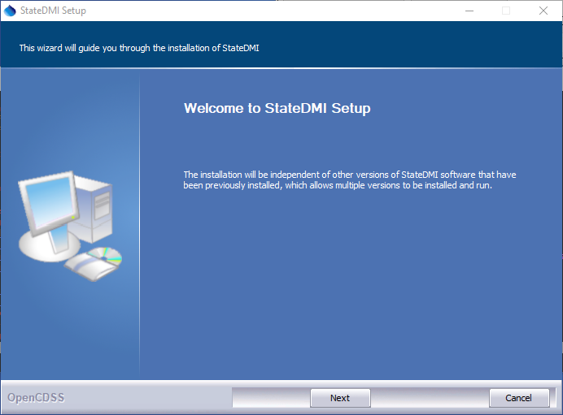
</p>**

**<p style="text-align: center;">
StateDMI Install - Welcome (<a href="../Install_Welcome.png">see also the full-size image</a>)
</p>**

Press ***Next*** to continue with the installation.

**<p style="text-align: center;">
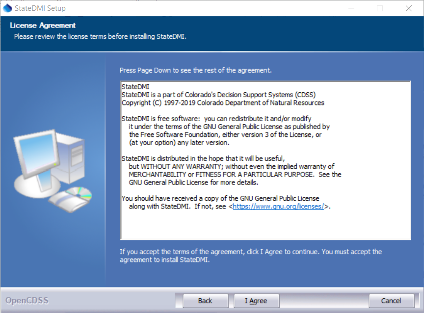
</p>**

**<p style="text-align: center;">
StateDMI Install - License Agreement (<a href="../Install_License.png">see also the full-size image</a>)
</p>**

StateDMI is distributed with CDSS with GPL v3+ license.
Press ***I Agree*** to continue with the installation.

** 2. Several components can be selected for the install as shown in the following dialog.  Position the mouse over a component to see its description.**

**<p style="text-align: center;">
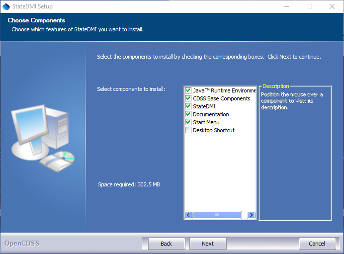
</p>**

**<p style="text-align: center;">
StateDMI Install - Choose Components (<a href="../Install_SelectComponents.png">see also the full-size image</a>)
</p>**

Select the components to install and press ***Next***.

**3. The following dialog is then shown and is used to select the installation location for StateDMI.**

Multiple versions of StateDMI can be installed and there are no dependencies between the versions.  It is recommenced that the default install location shown is used.

**<p style="text-align: center;">
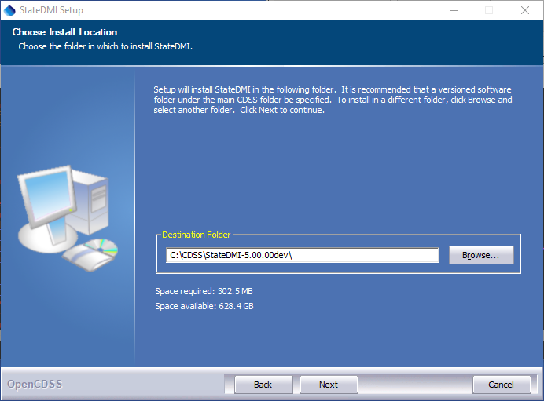
</p>**

**<p style="text-align: center;">
StateDMI Install - Choose Install Location (<a href="../Install_SelectFolder.png">see also the full-size image</a>)
</p>**

After selecting the install location, press ***Next***.

Note that this location will be saved as a Windows registry setting
(`HKEY_LOCAL_MACHINE\Software\State of Colorado\StateDMI-Version\Path`) to allow future updates to check
for and default to the same install location, and to allow the standard software uninstall procedure to work correctly.

** 4. The following dialog will be shown to select the menu for the software:**

**<p style="text-align: center;">
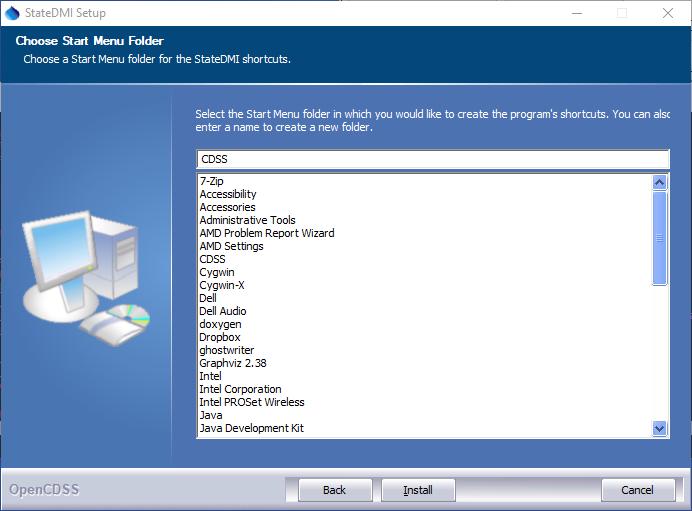
</p>**

**<p style="text-align: center;">
StateDMI  Install - Choose Start Menu Folder (<a href="../Install_StartMenuFolder.png">see also the full-size image</a>)
</p>**

After selecting the folder, press ***Install***.

** 5. The following dialog will show the progress of the installation:**

**<p style="text-align: center;">
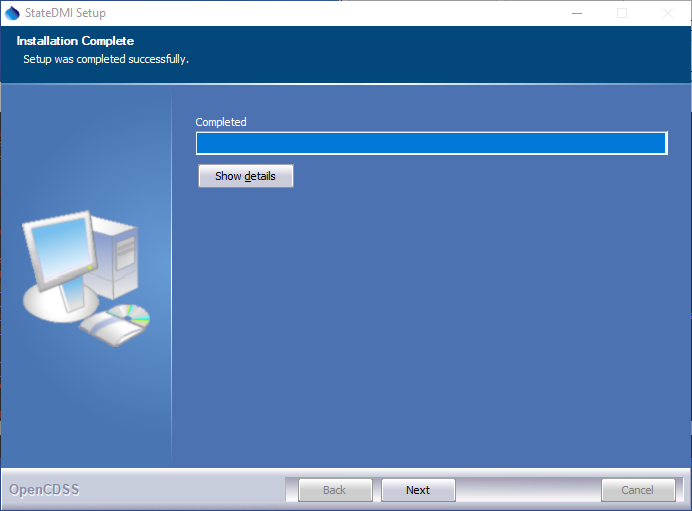
</p>**

**<p style="text-align: center;">
StateDMI Install - Installation Complete (<a href="../Install_Complete.png">see also the full-size image</a>)
</p>**

Press ***Show details*** to see the files that were installed or press ***Next*** to continue.

**6. If the CDSS Base Components were selected for install (the default), the following dialog will be displayed:**

**<p style="text-align: center;">
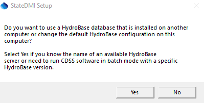
</p>**

**<p style="text-align: center;">
StateDMI Setup - HydroBase Configuration Question (<a href="../Install_HydroBaseQuestion.png">see also the full-size image</a>)
</p>**

StateDMI and other CDSS software can utilize HydroBase running on the local computer as well as other computers.
Press ***Yes*** if HydroBase has been installed on another computer in the network environment
and may be used by the software (then continue to the next step).  Otherwise, press ***No*** (skip to step 8).

**7. The following dialog allows additional HydroBase servers to be specified for use by CDSS software**

The example below configures CDSS software to list the `localhost` HydroBase server in
choices and defaults to HydroBase on the local computer):
The dialog will initially show previous settings from the `\CDSS\StateDMI-Version\system\CDSS.cfg`
file and settings typically only need to be changed after installing a new HydroBase version.

**<p style="text-align: center;">
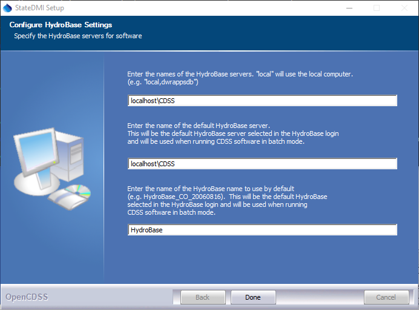
</p>**

**<p style="text-align: center;">
StateDMI Setup - Configure HydroBase Settings (<a href="../Install_HydroBaseConfiguration.png">see also the full-size image</a>)
</p>**

After entering the name of a HydroBase server and the default server to use, press ***Done***.

**8. The following dialog will then be shown indicate how to run the software:**

**<p style="text-align: center;">
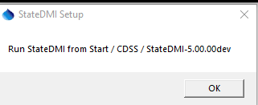
</p>**

**<p style="text-align: center;">
StateDMI Setup - Run Software Instructions (<a href="../Install_RunStateDMIInstructions.png">see also the full-size image</a>)
</p>**

Press ***Yes*** to run the software or No to exit the installation procedure.

## Uninstalling StateDMI ##

As of StateDMI 5.00.00, the software uninstall process has been simplified to
take advantage of Windows features.  Make sure that StateDMI is not running.

### Uninstall StateDMI on Windows

**Uninstall StateDMI 5.x.x and Later from Windows**

As of StateDMI 5.00.00, the software uninstall process has been simplified
to take advantage of Windows features.  Make sure that StateDMI is not running.

The first way to uninstall is to right-click on the StateDMI software version in the ***Start***
menu and select the ***Uninstall*** menu, as shown in the following image.
The next steps are similar to those described below.

**<p style="text-align: center;">
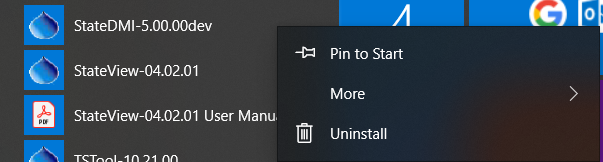
</p>**

The second way to uninstall StateDMI is as follows.
Use the windows ***Run*** search field (lower left of desktop).
Enter `uninstall`.  This should display an option to open ***Add or remove programs***.

**<p style="text-align: center;">
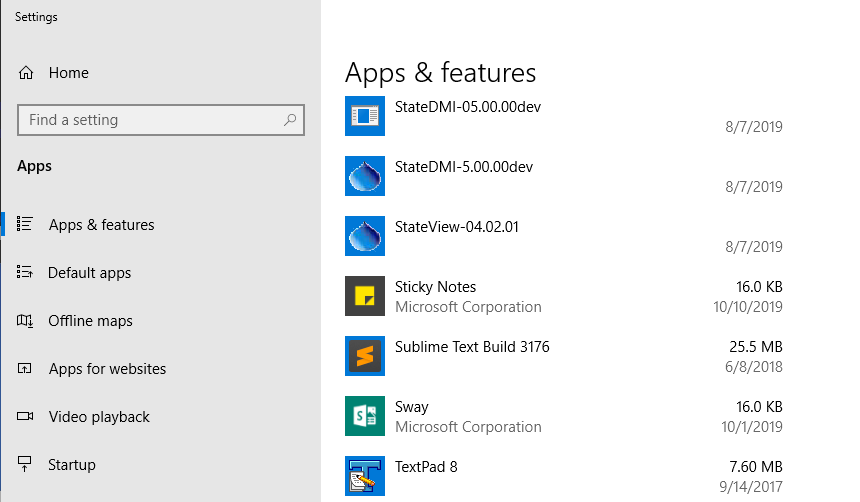
</p>**

Search for `StateDMI` as shown above.
Select the version of StateDMI to uninstall and press ***Uninstall***.
A confirmation will be requested.
The uninstall will then continue as shown in images in the next section.

After uninstalling, the software files will have been removed from `C:\CDSS\StateDMI-Version`.
However, any files that exist in the user's files will remain.
This allows datastore configurations and other user-configured files to be shared with
other StateDMI version installations.

**Uninstall StateDMI 4.x.x and Earlier from Windows**

To uninstall StateDMI software for versions 4.x.x and earlier,
select ***CDSS / Uninstall / StateDMI-Version*** from the ***Start*** menu and confirm the uninstall.
User data will remain installed.

**<p style="text-align: center;">
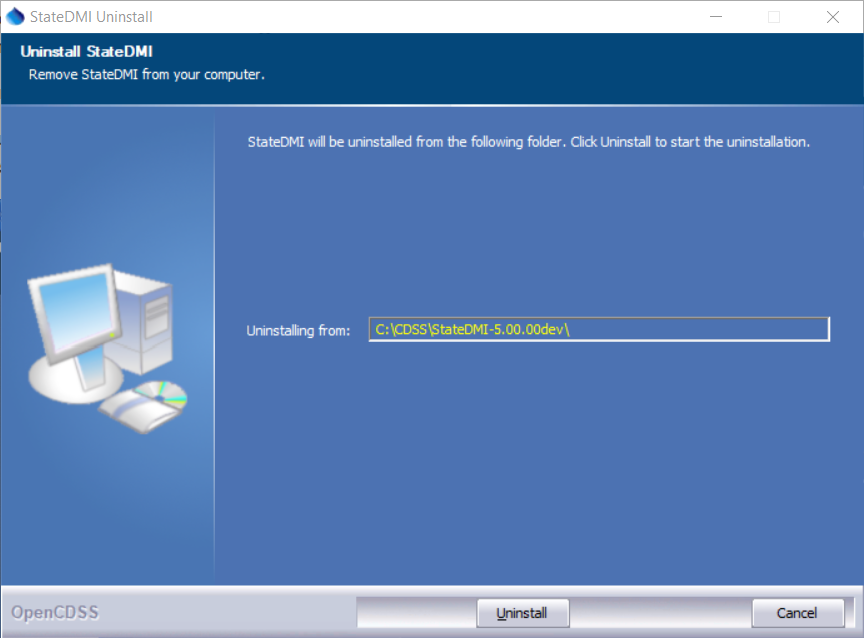
</p>**

**<p style="text-align: center;">
StateDMI Uninstall Confirmation (<a href="../Uninstall_Confirmation.png">see also the full-size image</a>)
</p>**

Press ***Uninstall*** to uninstall the software.

The following dialog shows the status of the uninstall.

**<p style="text-align: center;">
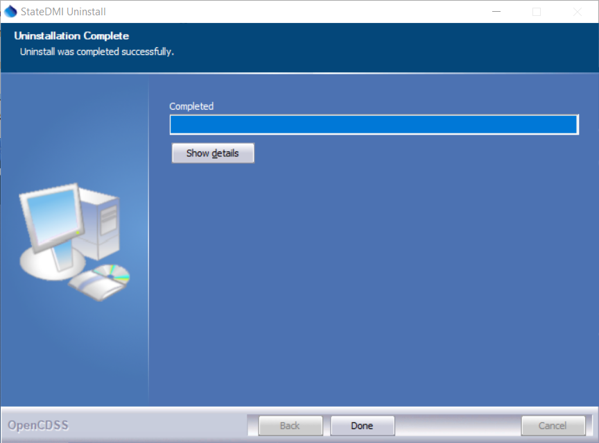
</p>**

**<p style="text-align: center;">
StateDMI Uninstall Complete (<a href="../Uninstall_Complete.png">see also the full-size image</a>)
</p>**

Press ***Show details*** to see the list of files that were removed.  Press ***Done*** to exit the uninstall.

## Running StateDMI ##

StateDMI can be started in several ways as described below.

### CDSS Menu ###

The ***Start / All Programs / CDSS / StateDMI-Version*** (or ***Start / Programs / CDSS / StateDMI-Version***)
menu can be used to start the software.  This runs the `StateDMIInstallHome\bin\StateDMI.exe` software.

### Command Line Executable ###

The installation process does NOT add the `StateDMIInstallHome\bin` folder to the path;
however, this addition can be made by the user, allowing the StateDMI software to be started anywhere by running StateDMI.
Running StateDMI from any location will result in the software being run in the installation location.
Specifying a command file on the command line or interactively will reset the working directory to that of the command file.

### StateDMI Batch File – Windows ###

A batch file can be used to run the `StateDMI.exe` program,
for example using the `–commands command` line parameter to specify a command file.
In this case it may be necessary to specify the absolute path to the command file to ensure that the software can locate related files.

## StateDMI Configuration ##

StateDMI requires minimal configuration after installation.
This section describes StateDMI configuration files that can be customized for a system.
Configuration is specified by installation files for each StateDMI installation.
As of StateDMI version 5.00.00, user configuration files are saved in the user's `.statedmi` folder,
which allows overriding the installation files configuration files.

### StateDMI Configuration File ###

The `system\StateDMI.cfg` file can be specified in the following two locations on Windows:

*   Installation files:
    +   Windows:  `C:\CDSS\StateDMI-Version\system\StateDMI.cfg`
    +   Linux:  `/opt/StateDMI-Version/system/StateDMI.cfg`
*   User files (`N` below is the StateDMI major version number, e.g., `5`):
    +   Windows:  `C:\Users\user\.statedmi\N\system\StateDMI.cfg`
    +   Linux:  `/home/user/.statedmi/N/system/StateDMI.cfg`

The `StateDMI.cfg` file installation folder contains top-level configuration information for StateDMI.
User file configuration properties take precedence over the installation configuration properties.
Currently, there is typically no reason to modify this file.

### Data Units File ###

The `system\DATAUNIT` file under the main installation directory contains data unit
information that defines conversions and output precision.
In most cases the default file can be used but additional units may need to be added
for a user's needs (in this case please notify the developers so the units can
be added to the default file distributed with installations).
Currently, the data units file is the only source for units information – in the
future units may be determined from the various input sources.

### CDSS Configuration File ###

By default, StateDMI will automatically look for HydroBase databases on the current (local) machine and the State servers.
State server databases are typically only accessible to State of Colorado computers.
If SQL Server HydroBase versions have been installed on a different machine,
the `\CDSS\StateDMI-Version\system\CDSS.cfg` file can be used to indicate the database servers.
These properties may be moved to a HydroBase datastore configuration file in the future.
An example of the configuration file is as follows:

```
[HydroBase]

ServerNames="ServerName,local"
DefaultServerName="ServerName"
DefaultDatabaseName="HydroBase_CO_20080730"
```

The CDSS configuration properties are described in the following table:

**<p style="text-align: center;">
CDSS HydroBase Database Configuration Properties
</p>**

| **Property**&nbsp;&nbsp;&nbsp;&nbsp;&nbsp;&nbsp;&nbsp;&nbsp;&nbsp;&nbsp;&nbsp;&nbsp;&nbsp;&nbsp;&nbsp;&nbsp;&nbsp;&nbsp;&nbsp;&nbsp;&nbsp;&nbsp;&nbsp;&nbsp;&nbsp;&nbsp; | **Description** | **Default**&nbsp;&nbsp;&nbsp;&nbsp;&nbsp;&nbsp;&nbsp;&nbsp;&nbsp;&nbsp;&nbsp;&nbsp;&nbsp;&nbsp;&nbsp;&nbsp;&nbsp;&nbsp;&nbsp;&nbsp;&nbsp;&nbsp;&nbsp;&nbsp;&nbsp;&nbsp;&nbsp;&nbsp; |
| -- | -- | -- |
| `ServerNames` | A comma-separated list of server names to list in the HydroBase login dialog. | The state server is listed. |
| `DefaultServerName` | The default HydroBase server name to use.  This allows the HydroBase login dialog to preselect a default that applies to most users in the system. | `greenmtnstate.co.us` |
| `DefaultDatabaseName` | The default HydroBase database name to use.  This allows the HydroBase login dialog to preselect a default that applies to most users in the system. | |
| `DatabaseEngine` | Reserved for internal use. | |
| `DatabaseName` | The database name to use for the initial connection.  This overrides the default server. | |
| `DatabaseServer` | The server name to use for the initial connection.  This overrides the default server. | |
| `SystemLogin` | Reserved for internal use. | |
| `SystemPassword` | Reserved for internal use. | |
| `UserLogin` | Reserved for internal use. | |
