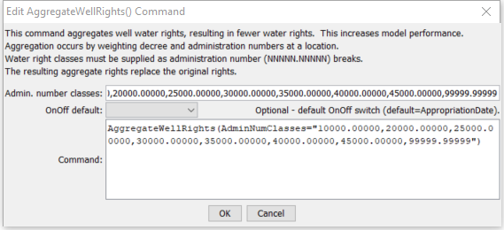

# StateDMI / Command / AggregateWellRights #

* [Overview](#overview)
* [Command Editor](#command-editor)
* [Command Syntax](#command-syntax)
* [Examples](#examples)
* [Troubleshooting](#troubleshooting)
* [See Also](#see-also)

-------------------------

## Overview ##

The `AggregateWellRights` command (for StateMod) aggregates well rights by weighting
the decree by administration number (in simple terms the number of days since 1849).
It is typical to aggregate water rights in basins where individual rights do not
need to be modeled (modeling individual rights increases the run time and amount of model output).
For example, Río Grande well rights are typically aggregated;
however, South Platte rights are not, due to detailed modeling of augmentation plans.
Aggregating well rights is typically the last step in well right processing before writing the well rights file.
The [`ReadWellRightsFromHydroBase`](../ReadWellRightsFromHydroBase/ReadWellRightsFromHydroBase.md)
command prior to StateDMI 2.14 performed aggregation in one step;
however, this is no longer desirable because unaggregated rights are needed for data processing,
such as limiting groundwater-only supply parcels back in time,
and setting the pumping maximum in the irrigation practice time series.

The following figure illustrates the difference between raw, merged, and aggregated rights.
Raw rights contain output for multiple years of irrigated lands parcel data.
Merged rights consider all years of irrigated lands data but avoid double-counting rights
that result from more than one year of parcel data processing (see the
[`MergeWellRights`](../MergeWellRights/MergeWellRights.md) command).

**<p style="text-align: center;">

</p>**

**<p style="text-align: center;">
Graph Showing Cumulative Well Rights (<a href="../AggregateWellRights_Graph.png">see also the full-size image</a>)
</p>**

The end result of aggregation is well rights that have an identifier matching the location, with a number suffix.
The suffix `.01` corresponds to rights with an administration number <= to the first administration number class.
The last administration number class should therefore be larger than any
administration number that is expected (e.g., use `99999.99999`).  Example output in StateMod format is as follows:

```
#>   ID               Name             Struct          Admin #   Decree  On/Off 
#>---------eb----------------------eb----------eb--------------eb------eb------e

200511W.08                          200511           57343.00000    3.01    2006
200812W.03                          200812           21307.00000    4.68    1908
200812W.04                          200812           29515.00000   45.48    1930
200812W.05                          200812           32589.00000  954.42    1939
200812W.06                          200812           37671.00000 1608.05    1953
200812W.07                          200812           41917.00000  911.48    1964
200812W.08                          200812           47211.00000  659.28    1979
```

The following steps occur to aggregate well water rights at each location where
aggregate/systems are specified with parcels or a well station has an associated diversion ID:

1. Initialize aggregate water rights.  Aggregate water rights for each water class are initialized to zero.
If at the end of processing the value is still zero, a right will NOT be added for the class.
Aggregate rights for a groundwater-only location have an identifier that starts with the location.
Other locations that have supplemental supply use the location identifier, followed by a `W`.
All rights then have a `.NN` ending, corresponding to the water right class.
2. For each class, the following sums are calculated:  `sum(decree*AdminNum)` and `sum(decree)`,
where the administration number is determined from the appropriation date
derived from the original HydroBase administration number (it will not have a remainder).
3. After processing all rights for the location, the final administration number for the
class is determined (it will not have a remainder) as:  `int(sum(decree*AdminNum)/sum(decree))`.
4. For each non-zero aggregate, a well right is added for the location.
Only the whole number part of the administration will be set (the remainder will be zero).
5. The well rights are added to the overall list for output.
All previous rights for the location are replaced by the aggregate rights.

If the output does not show aggregation as expected,
verify that the location is properly being specified as a groundwater only location with aggregate/system parcel list,
and that the associated diversion ID is specified in well station or list file used as input.

## Command Editor ##

The following dialog is used to edit the command and illustrates the command syntax.

**<p style="text-align: center;">

</p>**

**<p style="text-align: center;">
`AggregateWellRights` Command Editor (<a href="../AggregateWellRights.png">see also the full-size image</a>)
</p>**

## Command Syntax ##

The command syntax is as follows:

```text
AggregateWellRights(Parameter="Value",...)
```
**<p style="text-align: center;">
Command Parameters
</p>**

| **Parameter**&nbsp;&nbsp;&nbsp;&nbsp;&nbsp;&nbsp;&nbsp;&nbsp;&nbsp;&nbsp;&nbsp;&nbsp;&nbsp;&nbsp; | **Description** | **Default**&nbsp;&nbsp;&nbsp;&nbsp;&nbsp;&nbsp;&nbsp;&nbsp;&nbsp;&nbsp;&nbsp;&nbsp;&nbsp;&nbsp;&nbsp;&nbsp;&nbsp;&nbsp;&nbsp;&nbsp;&nbsp;&nbsp;&nbsp;&nbsp;&nbsp;&nbsp; |
| --------------|-----------------|----------------- |
| `AdminNumClasses` | A list of administration numbers, separated by spaces or commas, to define the breaks for aggregate water rights, for well aggregates.  For example, if the class breaks are `10000.00000`, `20000.00000`, and `99999.99999`, the first group will contain water rights with administration numbers <= `10000.00000`, the second will contain water rights with administration number > `10000.00000` and <= `20000.00000`, and the third will contain water rights with administration number > `20000.00000` and <= `99999.99999`.  The last administration number should be larger than any data value that is expected to occur. | If not specified, diversion aggregates will be treated as diversion systems, with all water rights explicitly included in output. |
| `OnOffDefault` | Indicates how to set the on/off switch for resulting water rights.  A value of 1 indicates that the right is on for the whole period.  If the value is `AppropriationDate`, the switch is set to the year corresponding to the appropriation date, indicating that the right will be turned on starting in the year.  The appropriation date for aggregate rights is taken from the whole number part of the administration number because the remainder is a result of the weighting and does not have meaning. | `AppropriationDate` |

## Examples ##

See the [automated tests](https://github.com/OpenCDSS/cdss-app-statedmi-test/tree/master/test/regression/commands/AggregateWellRights).

The following example illustrates the full process for creating well rights in the Rio Grande basin, including well right aggregation (this is an abbreviated command file with repetitive steps removed):

```
StartLog(LogFile="Wells_wer.StateDMI.log")
# Wells_WER.StateDMI
# _________________________________________________________
# Step 1 - open a log file for this run
#
StartLog(LogFile="Wells_WER.StateDMI.log")
# _________________________________________________________
# Step 2 - read stations
# readWellStationsFromStateMod(InputFile="rg2007.wes")
ReadWellStationsFromStateMod(InputFile="rg2007.wes")
# _________________________________________________________
# Step 3 - define aggregates and systems
#     Diversions are collections using a list of WDIDs, and the list of IDs is
#     constant through the model period.
#         Aggregates will result in well rights being aggregated.
#         Systems will be modeled with all well rights (no aggregation).
#     Well-only lands are collections using a list of parcel identifiers, and
#     the lists are specified for each year where data are available because the
#     parcel identifiers change from year to year.
#
# Diversions with and without groundwater supply...
SetWellAggregateFromList(ListFile="..\Diversions\rgTW_divaggregates.csv",
  IDCol=1,PartIDsCol=2,PartsListedHow=InRow,PartType=Ditch)
SetDiversionSystemFromList(ListFile="..\Diversions\rgTW_divsystems.csv",
  IDCol=1,PartIDsCol=2,PartsListedHow=InRow, PartType=Ditch)
# Wells with only groundwater supply...#
SetWellSystemFromList(ListFile="..\Wells\1998_GWonly_agg.csv",Year=1998,Div=3,
  PartType=Parcel,IDCol=1,PartIDsCol=2,PartsListedHow=InColumn)
# _________________________________________________________
# Step 4 - read rights from HydroBase (NO AGGREGATION)
#     Include Appropriation Date for on/off
#     1936 is included for more rights and because used in later data filling.
#     APEX is NOT used.
#
ReadWellRightsFromHydroBase(ID="*",IDFormat="HydroBaseID",Year="1998",Div="3",
  DefaultAppropriationDate="1950-01-01",DefineRightHow=RightIfAvailable,
  ReadWellRights=True,UseApex=False,OnOffDefault=AppropriationDate)
# _________________________________________________________
# Step 5 - set data not in HydroBase
#     M&I are not tied to an irrigated parcel and therefore may not be in
#     HydroBase.
#     Also, StateDMI does not currently read well rights/permits for explicit
#     non-irrigation well locations.
#
# 5a; Set Alamosa Refuge
# Mumm Well and estimated small wells (4 cfs) (refine only with additional information from USFWS)
SetWellRight(ID="20MS06W.98",Name="Small_ANWR_Wells",StationID="20MS06",
  AdministrationNumber=90000.00000,Decree=4.00,OnOff=1,IfNotFound=Add,IfFound=Warn)
…many omitted
# _________________________________________________________
# Step 6 - write rights from multiple years of irrigated lands
#     Note since not aggregating, the ID's assigned will be
#     true Well IDs, not structure id.01, etc.
#     The *wer file is written containing all parcel years and
#     "data comments" on the right side of the file are written to
#     facilitate use when filling the *cds and *ipy files.
#     The following is used to fill the CDS and IPY acreage prior to 1998,
#     using the rights resulting from 1998 parcels.
#
SortWellRights(Order=LocationIDAscending,Order2=IDAscending)
WriteWellRightsToStateMod(OutputFile="rg2007_NotMerged.wer",WriteDataComments=True)
# _________________________________________________________
# Step 7 - merge multiple years (but do not aggregate)
#    The water rights resulting from multiple years of parcel data (above) are
#    merged.  Blocks of rights with the same right ID and location ID are
#    checked.  If all are the same in two years, then all are kept in the
#    result.  Otherwise, the rights from the year resulting in the highest
#    decree sum are kept in the result.  The process compares two years at a
#    time, going through all years where data are available.
#    The following version of the file is used to set IPY max pumping.
#
MergeWellRights()
SortWellRights(Order=LocationIDAscending,Order2=IDAscending)
WriteWellRightsToStateMod(OutputFile="rg2007.wer")
#
WriteWellRightsToStateMod(OutputFile="rg2007.wer")
WriteWellRightsToStateMod(OutputFile="..\StateMod\Historic\rg2007.wer")
# _________________________________________________________
# Step 8 - aggregate into water rights classes
#    This step is needed in the Rio Grande but not in the South Platte.
#    Rights are aggregated by weighting by decree and administration number.
#    The right identifiers are set to LocationID.##, where ## is the class.
#
AggregateWellRights(AdminNumClasses="10000.00000,20000.00000,25000.00000,
  30000.00000,35000.00000,40000.00000,45000.00000,99999.99999",OnOffDefault="AppropriationDate")
WriteWellRightsToStateMod(OutputFile="rg2007_Agg.wer")
WriteWellRightsToStateMod(OutputFile="..\StateMod\Historic\rg2007_Agg.wer")
#
# Check the results
CheckWellRights(ID="*")
WriteCheckFile(OutputFile="Wells_wer.StateDMI.check.html")
```

## Troubleshooting ##

## See Also ##

* [`MergeWellRights`](../MergeWellRights/MergeWellRights.md) command
* [`ReadWellRightsFromHydroBase`](../ReadWellRightsFromHydroBase/ReadWellRightsFromHydroBase.md) command
