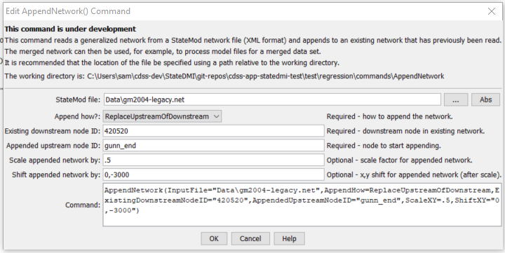

# StateDMI / Command / AppendNetwork #

* [Overview](#overview)
* [Command Editor](#command-editor)
* [Command Syntax](#command-syntax)
* [Examples](#examples)
* [Troubleshooting](#troubleshooting)
* [See Also](#see-also)

-------------------------

## Overview ##

**This command is under development.**

The `AppendNetwork` command (for StateMod) reads a generalized network from a StateMod XML network file
and appends to the network that has previously been read (e.g., with the
[`ReadNetworkFromStateMod`](../ReadNetworkFromStateMod/ReadNetworkFromStateMod.md) command).
The merged network can then be manipulated and utilized by other commands.
StateDMI also can be used to merge other data set files (by reading multiple files and then writing out)
or the SmLink StateMod utility program can be used.
It is likely that the plotting coordinates for different networks will not be consistent and
therefore the appended network must be scaled and shifted to achieve a desirable layout.
After processing, the network can be interactively edited in the network editor,
although changes will be overwritten when rerunning commands.
This command may be updated in the future to better handle discontinuities between networks.

## Command Editor ##

The following dialog is used to edit the command and illustrates the command syntax.

**<p style="text-align: center;">

</p>**

**<p style="text-align: center;">
`AppendNetwork` Command Editor (<a href="../AppendNetwork.png">see also the full-size image</a>)
</p>**

## Command Syntax ##

The command syntax is as follows:

```text
AppendNetwork(Parameter="Value",...)
```
**<p style="text-align: center;">
Command Parameters
</p>**

| **Parameter**&nbsp;&nbsp;&nbsp;&nbsp;&nbsp;&nbsp;&nbsp;&nbsp;&nbsp;&nbsp;&nbsp;&nbsp;&nbsp;&nbsp;&nbsp;&nbsp;&nbsp;&nbsp;&nbsp;&nbsp;&nbsp;&nbsp;&nbsp;&nbsp;&nbsp;&nbsp;&nbsp;&nbsp;&nbsp;&nbsp;&nbsp;&nbsp;&nbsp;&nbsp; | **Description** | **Default**&nbsp;&nbsp;&nbsp;&nbsp;&nbsp;&nbsp;&nbsp;&nbsp;&nbsp;&nbsp; |
| --------------|-----------------|----------------- |
| `InputFile`<br>**required**| The name of the StateMod XML network file to read. | None – must be specified. |
| `AppendHow`<br>**required**| Indicates how the network should be appended, one of:<ul><li>`ReplaceUpstreamOfDownstream` – replace all nodes upstream of the existing downstream node with the appended network.</li><li>`AddUpstreamOfDownstream` – add the appended network as a reach upstream of the existing downstream node.</li></ul> | None – must be specified. |
| `ExistingDownstreamNodeID`<br>**required**| The node identifier in the existing network that will be downstream of the appended network. | None – must be specified. |
| `AppendedUpstreamNodeID`<br>**required**| The node identifier in the appended network that will be upstream of the `ExistingDownstreamNodeID`.  All nodes in the appended network below the appended node will be discarded. | None – must be specified. |
| `ScaleXY` | The scale to be applied to the appended network.  The appended network is first shifted so that the plotting coordinates for `AppendedUpstreamNodeID` are `0,0`.  The appended network coordinates are then scaled by `ScaleXY` relative to this origin.  The scale should be specified to equilibrate the spacing of nodes in the existing and appended network. | `1.0` |
| `ShiftXY` | The X,Y plotting coordinates to shift the appended network after the scale is applied, to position the appended nodes relative to the existing network. | `0,0` |

## Examples ##

See the [automated tests](https://github.com/OpenCDSS/cdss-app-statedmi-test/tree/master/test/regression/commands/AppendNetwork).

The following example illustrates how to append the Gunnison model network to the Colorado model network:

```
# Test appending Colorado and Gunnison networks
StartLog(LogFile="LinkedModel.StateDMI.log")
ReadNetworkFromStateMod(InputFile="cm2005.net")
# Add upstream of 420520 so that the nodes in the Gunnison network replace
# duplicates in the Colorado model.
AppendNetwork(InputFile="gm2004.net",AppendHow=ReplaceUpstreamOfDownstream,ExistingDownstreamNodeID="420520",AppendedUpstreamNodeID="gunn_end",ScaleXY=.5,ShiftXY="0,-3000")
WriteNetworkToStateMod(OutputFile="LinkedModel.net”)
```

## Troubleshooting ##

## See Also ##

* [`ReadNetworkFromStateMod`](../ReadNetworkFromStateMod/ReadNetworkFromStateMod.md) command
