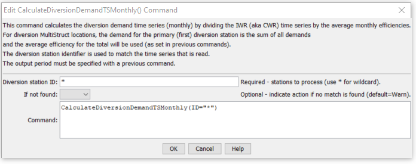

# StateDMI / Command / CalculateDiversionDemandTSMonthly #

* [Overview](#overview)
* [Command Editor](#command-editor)
* [Command Syntax](#command-syntax)
* [Examples](#examples)
* [Troubleshooting](#troubleshooting)
* [See Also](#see-also)

-------------------------

## Overview ##

The `CalculateDiversionDemandTSMonthly` command (for StateMod) calculates diversion demand time series (monthly)
by dividing the irrigation water requirement (IWR) time series (monthly) by average monthly efficiencies.
The diversion stations should first be read with another command (e.g.,
[`ReadDiversionStationsFromStateMod`](../ReadDiversionStationsFromStateMod/ReadDiversionStationsFromStateMod.md))
and provide the list of diversion stations to be processed – every
diversion station will have a demand time series in the result.
The IWR time series should have been read by a previous command.
The diversion station efficiencies should also have been calculated previously.
The output year type must be specified correctly because efficiencies are stored in
diversion stations according to the year type for the StateMod data set.  The following rules apply:

* If a diversion station is defined as a MultiStruct,
the demand for the primary station (the first one listed in the MultiStruct)
is the sum of the demands for all of its parts and the average efficiency
for the total will be used (as set in previous commands).
The demands for the secondary stations will be set to zero.
* If required time series data are not available for calculations (i.e., no IWR time series is found),
a demand time series with zero values is created.
This demand time series can be replaced with
[`SetDiversionDemandTSMonthly`](../SetDiversionDemandTSMonthly/SetDiversionDemandTSMonthly.md) commands, if necessary.
* If an IWR value for a month is zero, then the demand value for the
month is set to zero (whether there was a historical diversion or not).
In this case the demand can later be adjusted to a larger value using the
[`CalculateDiversionDemandTSMonthlyAsMax`](../CalculateDiversionDemandTSMonthlyAsMax/CalculateDiversionDemandTSMonthlyAsMax.md) command.
* If the efficiency for a month is zero:  if the IWR is zero, then the demand is set to zero; otherwise the demand is set to missing.

## Command Editor ##

The following dialog is used to edit the command and illustrates the command syntax.

**<p style="text-align: center;">

</p>**

**<p style="text-align: center;">
`CalculateDiversionDemandTSMonthly` Command Editor (<a href="../CalculateDiversionDemandTSMonthly.png">see also the full-size image</a>)
</p>**

## Command Syntax ##

The command syntax is as follows:

```text
CalculateDiversionDemandTSMonthly(Parameter="Value",...)
```
**<p style="text-align: center;">
Command Parameters
</p>**

| **Parameter**&nbsp;&nbsp;&nbsp;&nbsp;&nbsp;&nbsp;&nbsp;&nbsp;&nbsp;&nbsp;&nbsp;&nbsp; | **Description** | **Default**&nbsp;&nbsp;&nbsp;&nbsp;&nbsp;&nbsp;&nbsp;&nbsp;&nbsp;&nbsp; |
| --------------|-----------------|----------------- |
| `ID` | A single diversion station identifier to match or a pattern using wildcards (e.g., `20*`). | None – must be specified. |
| `IfNotFound` | Used for error handling, one of the following:<ul><li>`Fail` – generate a failure message if the ID is not matched</li><li>`Ignore` – ignore (don’t add and don’t generate a message) if the ID is not matched</li><li>`Warn` – generate a warning message if the ID is not matched</li></ul> | `Warn` |

## Examples ##

See the [automated tests](https://github.com/OpenCDSS/cdss-app-statedmi-test/tree/master/test/regression/commands/CalculateDiversionDemandTSMonthly).

The following abbreviated command file illustrates how irrigation water requirement
time series can be processed into average demand time series:

```
StartLog(LogFile="Cddm.commands.StateDMI.log")
# Cddm.commands.StateDMI
#
#  StateDMI command file to create the Calculated demand file
#
#
#  Step 1 - set the output period, used to compute averages...
#
SetOutputPeriod(OutputStart="10/1908",OutputEnd="09/2005")
SetOutputYearType(OutputYearType=Water)
#
#  Step 2 - read historical diversion file -defines structures for *.ddm file
#           plus read *.ddh file
#
ReadDiversionStationsFromStateMod(InputFile="..\StateMod\cm2005.dds")
ReadDiversionHistoricalTSMonthlyFromStateMod(InputFile="..\StateMod\cm2005.ddh")
#
#  Step 3 - read StateCU *.iwr and *.def files (irrigation requirements and average efficiencies)
#
ReadIrrigationWaterRequirementTSMonthlyFromStateCU(InputFile="..\StateMod\cm2005.iwr")
# calculateDiversionStationEfficiencies(ID="*",EffMin=0,EffMax=60,EffCalcStart=10/1974,EffCalcEnd=9/2004,LEZeroInAverage=False)
SetDiversionStationsFromList(ListFile="cm2005.def",IDCol="1",EffMonthlyCol="2",Delim="Space",MergeDelim=True)
#
#  Step 4 - determine calculated demand = iwr/efficiency
#         - take max of calculated demand and historical diversion
#
CalculateDiversionDemandTSMonthly(ID="*")
CalculateDiversionDemandTSMonthlyAsMax(ID="*")
#
#  Step 5 - set carriers nodes demand to 0, set full demand and summary demand nodes
#
#  set carrier "transbasin" diversion to Divide Creek to "0", use operating rules to satisfy demand
SetDiversionDemandTSMonthlyConstant(ID="724721",Constant=0)
# place summary demand at the Moffat Tunnel, zero out collection points
SetDiversionDemandTSMonthly(ID="514655",TSID="514655..DivTotal.Month~StateMod~514655.stm")
...similar commands omitted...
#
#   Step 6 - set calculated demand to historic for structures whose historical acreage is
#             different from current
#
SetDiversionDemandTSMonthly(ID="360687",TSID="360687..DivTotal.MONTH~StateMod~..\StateMod\cm2005H.ddm")
SetDiversionDemandTSMonthly(ID="360725",TSID="360725..DivTotal.MONTH~StateMod~..\StateMod\cm2005H.ddm")
...similar commands omitted...
#
#  Set Ute WCD demand node structure and set other structures to zero
SetDiversionDemandTSMonthly(ID="950020",TSID="950020..DivTotal.Month~StateMod~950020.stm")
SetDiversionDemandTSMonthlyConstant(ID="950030",Constant=0)
… similar commands omitted…
#
#  Set Orchard Mesa Check
SetDiversionDemandTSMonthly(ID="950003",TSID="950003..DivTotal.MONTH~StateMod~..\StateMod\cm2005H.ddm")
#
# Set Excess HUP node demands for Homestake, Dillon, Williams Fork, and Wolford Reservoirs
SetDiversionDemandTSMonthlyConstant(ID="954516D",Constant=999999)
...similar commands omitted...
#  Step 7 - write out calculated demand file
#
WriteDiversionDemandTSMonthlyToStateMod(OutputFile="..\StateMod\cm2005C.ddm")
#
# Check the results
CheckDiversionDemandTSMonthly(ID="*")
WriteCheckFile(OutputFile="Cddm.commands.StateDMI.check.html")
```

## Troubleshooting ##

## See Also ##

* [`ReadDiversionStationsFromStateMod`](../ReadDiversionStationsFromStateMod/ReadDiversionStationsFromStateMod.md) command
* [`SetDiversionDemandTSMonthly`](../SetDiversionDemandTSMonthly/SetDiversionDemandTSMonthly.md) commands
* [`CalculateDiversionDemandTSMonthlyAsMax`](../CalculateDiversionDemandTSMonthlyAsMax/CalculateDiversionDemandTSMonthlyAsMax.md) command
