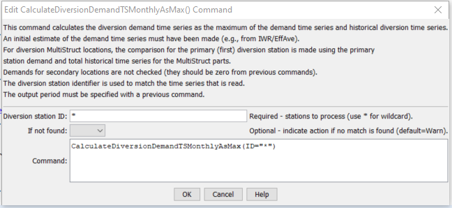

# StateDMI / Command / CalculateDiversionDemandTSMonthlyAsMax #

* [Overview](#overview)
* [Command Editor](#command-editor)
* [Command Syntax](#command-syntax)
* [Examples](#examples)
* [Troubleshooting](#troubleshooting)
* [See Also](#see-also)

-------------------------

## Overview ##

The `CalculateDiversionDemandTSMonthlyAsMax` command (for StateMod) 
calculates diversion demand time series (monthly) as the maximum of the
existing demands and the historical diversion time series.
This command is typically used after the
[`CalculateDiversionDemandTSMonthly`](../CalculateDiversionDemandTSMonthly/CalculateDiversionDemandTSMonthly.md) command.

If a diversion is defined as a MultiStruct,
the primary diversion station will be checked using the sum of the
historical time series and a sum of the demand time series.
Secondary diversion stations will not be checked (the demand will likely
have been set to zero in a previous
[`CalculateDiversionDemandTSMonthly`](../CalculateDiversionDemandTSMonthly/CalculateDiversionDemandTSMonthly.md) command).

If necessary, use set commands after this command to force demand time series values (e.g., zeros).

## Command Editor ##

The following dialog is used to edit the command and illustrates the command syntax.

**<p style="text-align: center;">

</p>**

**<p style="text-align: center;">
`CalculateDiversionDemandTSMonthlyAsMax` Command Editor (<a href="../CalculateDiversionDemandTSMonthlyAsMax.png">see also the full-size image</a>)
</p>**

## Command Syntax ##

The command syntax is as follows:

```text
CalculateDiversionDemandTSMonthlyAsMax(Parameter="Value",...)
```
**<p style="text-align: center;">
Command Parameters
</p>**

| **Parameter**&nbsp;&nbsp;&nbsp;&nbsp;&nbsp;&nbsp;&nbsp;&nbsp;&nbsp;&nbsp;&nbsp;&nbsp; | **Description** | **Default**&nbsp;&nbsp;&nbsp;&nbsp;&nbsp;&nbsp;&nbsp;&nbsp;&nbsp;&nbsp; |
| --------------|-----------------|----------------- |
| `ID`<br>**required**| A single diversion station identifier to match or a pattern using wildcards (e.g., `20*`). | None – must be specified. |
| `IfNotFound` | Used for error handling, one of the following:<ul><li>`Add` – add the time series if the ID is not matched and is not a wildcard</li><li>`Fail` – generate a failure message if the `ID` is not matched</li><li>`Ignore` – ignore (don’t add and don’t generate a message) if the `ID` is not matched</li><li>`Warn` – generate a warning message if the ID is not matched</li></ul> | `Warn` |

## Examples ##

See the [automated tests](https://github.com/OpenCDSS/cdss-app-statedmi-test/tree/master/test/regression/commands/CalculateDiversionDemandTSMonthlyAsMax).

The following abbreviated command file illustrates how irrigation water requirement
time series can be processed into average demand time series:

```
StartLog(LogFile="Cddm.commands.StateDMI.log")
# Cddm.commands.StateDMI
#
#  StateDMI command file to create the Calculated demand file
#
#  Step 1 - set the output period, used to compute averages...
#
SetOutputPeriod(OutputStart="10/1908",OutputEnd="09/2005")
SetOutputYearType(OutputYearType=Water)
#
#  Step 2 - read historical diversion file -defines structures for *.ddm file
#           plus read *.ddh file
#
ReadDiversionStationsFromStateMod(InputFile="..\StateMod\cm2005.dds")
ReadDiversionHistoricalTSMonthlyFromStateMod(InputFile="..\StateMod\cm2005.ddh")
#
#  Step 3 - read StateCU *.iwr and *.def files (irrigation requirements and average efficiencies)
#
ReadIrrigationWaterRequirementTSMonthlyFromStateCU(InputFile="..\StateMod\cm2005.iwr")
# calculateDiversionStationEfficiencies(ID="*",EffMin=0,EffMax=60,EffCalcStart=10/1974,EffCalcEnd=9/2004,LEZeroInAverage=False)
SetDiversionStationsFromList(ListFile="cm2005.def",IDCol="1",EffMonthlyCol="2",Delim="Space",MergeDelim=True)
#
#  Step 4 - determine calculated demand = iwr/efficiency
#         - take max of calculated demand and historical diversion
#
CalculateDiversionDemandTSMonthly(ID="*")
CalculateDiversionDemandTSMonthlyAsMax(ID="*")
#
#  Step 5 - set carriers nodes demand to 0, set full demand and summary demand nodes
#
#  set carrier "transbasin" diversion to Divide Creek to "0", use operating rules to satisfy demand
SetDiversionDemandTSMonthlyConstant(ID="724721",Constant=0)
...similar commands omitted...
#  Step 7 - write out calculated demand file
#
WriteDiversionDemandTSMonthlyToStateMod(OutputFile="..\StateMod\cm2005C.ddm")
#
# Check the results
CheckDiversionDemandTSMonthly(ID="*")
WriteCheckFile(OutputFile="Cddm.commands.StateDMI.check.html")
```

## Troubleshooting ##

[See the main troubleshooting documentation](../../troubleshooting/troubleshooting.md)

## See Also ##

* [`CalculateDiversionDemandTSMonthly`](../CalculateDiversionDemandTSMonthly/CalculateDiversionDemandTSMonthly.md) command
