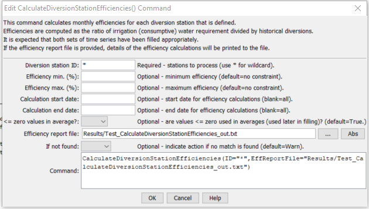

# StateDMI / Command / CalculateDiversionStationEfficiencies #

* [Overview](#overview)
* [Command Editor](#command-editor)
* [Command Syntax](#command-syntax)
* [Examples](#examples)
* [Troubleshooting](#troubleshooting)
* [See Also](#see-also)

-------------------------

## Overview ##

The `CalculateDiversionStationEfficiencies` command (for StateMod)
**This command is generally not used with current modeling procedures.
Instead, a variable efficiency approach is used where monthly average efficiencies
are computed in StateCU and are set in diversion stations using a
[`SetDiversionStationsFromList(…,EffMonthlyCol=…)`](../SetDiversionStationsFromList/SetDiversionStationsFromList.md) command.
This command is retained to duplicate previous work.**

The
[`CalculateDiversionStationEfficiencies`](../CalculateDiversionStationEfficiencies/CalculateDiversionStationEfficiencies.md)
command calculates average monthly efficiencies for diversion
stations and updates the diversion station information in memory.
Efficiencies are calculated as irrigation water requirement divided by historical diversion time series.
The detailed results of calculations can optionally be printed to a report file.
The diversion historical time series (monthly) and irrigation water
requirement time series (monthly) should be read or created with other commands,
and should be filled before calculations, if appropriate.
Only StateMod diversion stations with demand source for agricultural irrigation will be processed.
The output year type must be specified correctly because efficiencies are
stored in diversion stations according to the year type for the StateMod data set.
Diversion MultiStruct stations are processed by using the total irrigation water
requirement and historical diversions for all stations in the MultiStruct.  A
[`WriteDiversionStationsToStateMod`](../WriteDiversionStationsToStateMod/WriteDiversionStationsToStateMod.md)
command must be executed to actually write the updated efficiency data.

## Command Editor ##

The following dialog is used to edit the command and illustrates the command syntax.

**<p style="text-align: center;">

</p>**

**<p style="text-align: center;">
`CalculateDiversionStationEfficiencies` Command Editor (<a href="../CalculateDiversionStationEfficiencies.png">see also the full-size image</a>)
</p>**

## Command Syntax ##

The command syntax is as follows:

```text
CalculateDiversionStationEfficiencies(Parameter="Value",...)
```
**<p style="text-align: center;">
Command Parameters
</p>**

| **Parameter**&nbsp;&nbsp;&nbsp;&nbsp;&nbsp;&nbsp;&nbsp;&nbsp;&nbsp;&nbsp;&nbsp;&nbsp;&nbsp;&nbsp; | **Description** | **Default**&nbsp;&nbsp;&nbsp;&nbsp;&nbsp;&nbsp;&nbsp;&nbsp;&nbsp;&nbsp; |
| --------------|-----------------|----------------- |
| `ID`<br>**required**| A single diversion station identifier to match or a pattern using wildcards (e.g., `20*`). | None – must be specified. |
| `EffMin` | Minimum efficiency to allow, percent.  Calculated efficiencies less than this value will be set to the minimum. | Do not constrain the efficiency. |
| `EffMax` | Maximum efficiency to allow, percent.  Calculated efficiencies greater than this value will be set to the maximum. | Do not constrain the efficiency. |
| `EffCalcStart` | The start date (e.g., `YYYY-MM`) for efficiency calculations.  Use this to limit the period for data considered in calculations. | Use the full period. |
| `EffCalcEnd` | The end date (e.g., `YYYY-MM`) for efficiency calculations.  Use this to limit the period for data considered in calculations. | Use the full period. |
| `LEZeroInAverage` | If `True`, values less than or equal to zero will be considered when computing monthly time series averages.  If `False`, values less than or equal to zero will be excluded from the averages. | `True` |
| `EffReportFile` | If specified, a high-detail report will be created, listing for each diversion station the irrigation water requirement, historical diversion, and resulting efficiency values.  Creating the report slows processing slightly. | If blank, no report is generated. |
| `IfNotFound` | Used for error handling, one of the following:<ul><li>`Fail` – generate a failure message if the `ID` is not matched</li><li>`Ignore` – ignore (don’t add and don’t generate a message) if the `ID` is not matched</li><li>`Warn` – generate a warning message if the `ID` is not matched</li></ul> | `Warn` |

## Examples ##

See the [automated tests](https://github.com/OpenCDSS/cdss-app-statedmi-test/tree/master/test/regression/commands/CalculateDiversionStationEfficiencies).

## Troubleshooting ##

## See Also ##

* [`CalculateDiversionStationEfficiencies`](../CalculateDiversionStationEfficiencies/CalculateDiversionStationEfficiencies.md) command
* [`WriteDiversionStationsToStateMod`](../WriteDiversionStationsToStateMod/WriteDiversionStationsToStateMod.md) command
