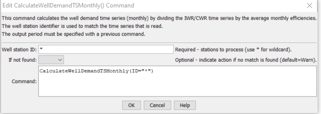

# StateDMI / Command / CalculateWellDemandTSMonthly #

* [Overview](#overview)
* [Command Editor](#command-editor)
* [Command Syntax](#command-syntax)
* [Examples](#examples)
* [Troubleshooting](#troubleshooting)
* [See Also](#see-also)

-------------------------

## Overview ##

The `CalculateWellDemandTSMonthly` command (for StateMod)
calculates well demand time series (monthly) by dividing the irrigation water requirement (IWR)
time series (monthly) by average monthly efficiencies.
The IWR time series should have been read by a previous command.
The well station efficiencies should also have been calculated, set, or read using previous commands.
The output year type must be specified correctly because efficiencies are
stored in well stations according to the year type for the StateMod data set.
If time series data are not available,
a demand time series with zero values is created – this time series can be replaced with
[`SetWellDemandTSMonthly`](../SetWellDemandTSMonthly/SetWellDemandTSMonthly.md)
commands, if necessary.
Only well stations that have a demand type (StateMod well station `idvcomw`) equal to one are processed.
For “diversion + well” well stations,
the demand is typically calculated using only the diversion station IWR
and historical diversion time series and is written to the diversion demand time series file.

## Command Editor ##

The following dialog is used to edit the command and illustrates the command syntax.

**<p style="text-align: center;">

</p>**

**<p style="text-align: center;">
`CalculateWellDemandTSMonthly` Command Editor (<a href="../CalculateWellDemandTSMonthly.png">see also the full-size image</a>)
</p>**

## Command Syntax ##

The command syntax is as follows:

```text
CalculateWellDemandTSMonthly(Parameter="Value",...)
```
**<p style="text-align: center;">
Command Parameters
</p>**

| **Parameter**&nbsp;&nbsp;&nbsp;&nbsp;&nbsp;&nbsp;&nbsp;&nbsp;&nbsp;&nbsp;&nbsp;&nbsp; | **Description** | **Default**&nbsp;&nbsp;&nbsp;&nbsp;&nbsp;&nbsp;&nbsp;&nbsp;&nbsp;&nbsp; |
| --------------|-----------------|----------------- |
| `ID`<br>**required**| A single well station identifier to match or a pattern using wildcards (e.g., `20*`). | None – must be specified. |
| `IfNotFound` | Used for error handling, one of the following:<ul><li>`Fail` – generate a failure message if the `ID` is not matched</li><li>`Ignore` – ignore (don’t add and don’t generate a message) if the `ID` is not matched</li><li>`Warn` – generate a warning message if the `ID` is not matched</li></ul> | `Warn` |

## Examples ##

See the [automated tests](https://github.com/OpenCDSS/cdss-app-statedmi-test/tree/master/test/regression/commands/CalculateWellDemandTSMonthly).

## Troubleshooting ##

[See the main troubleshooting documentation](../../troubleshooting/troubleshooting.md)

## See Also ##

* [`SetWellDemandTSMonthly`](../SetWellDemandTSMonthly/SetWellDemandTSMonthly.md) command
