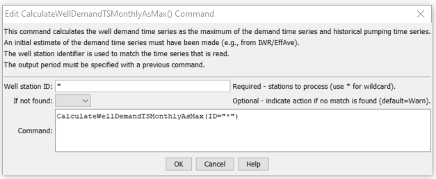

# StateDMI / Command / CalculateWellDemandTSMonthlyAsMax #

* [Overview](#overview)
* [Command Editor](#command-editor)
* [Command Syntax](#command-syntax)
* [Examples](#examples)
* [Troubleshooting](#troubleshooting)
* [See Also](#see-also)

-------------------------

## Overview ##

The `CalculateWellDemandTSMonthlyAsMax` command (for StateMod)
calculates well demand time series (monthly) as the maximum of the existing demands and the historical pumping time series.

## Command Editor ##

The following dialog is used to edit the command and illustrates the command syntax.

**<p style="text-align: center;">

</p>**

**<p style="text-align: center;">
`CalculateWellDemandTSMonthlyAsMax` Command Editor (<a href="../CalculateWellDemandTSMonthlyAsMax.png">see also the full-size image</a>)
</p>**

## Command Syntax ##

The command syntax is as follows:

```text
CalculateWellDemandTSMonthlyAsMax(Parameter="Value",...)
```
**<p style="text-align: center;">
Command Parameters
</p>**

| **Parameter**&nbsp;&nbsp;&nbsp;&nbsp;&nbsp;&nbsp;&nbsp;&nbsp;&nbsp;&nbsp;&nbsp;&nbsp; | **Description** | **Default**&nbsp;&nbsp;&nbsp;&nbsp;&nbsp;&nbsp;&nbsp;&nbsp;&nbsp;&nbsp; |
| --------------|-----------------|----------------- |
| `ID`<br>**required** | A single well station identifier to match or a pattern using wildcards (e.g., `20*`). | None – must be specified. |
| `IfNotFound` | Used for error handling, one of the following:<ul><li>`Add` – add the time series if the `ID` is not matched and is not a wildcard</li><li>`Fail` – generate a failure message if the `ID` is not matched</li><li>`Ignore` – ignore (don’t add and don’t generate a message) if the `ID` is not matched</li><li>`Warn` – generate a warning message if the `ID` is not matched</li></ul> | `Warn` |

## Examples ##

See the [automated tests](https://github.com/OpenCDSS/cdss-app-statedmi-test/tree/master/test/regression/commands/CalculateWellDemandTSMonthlyAsMax).

## Troubleshooting ##

## See Also ##

