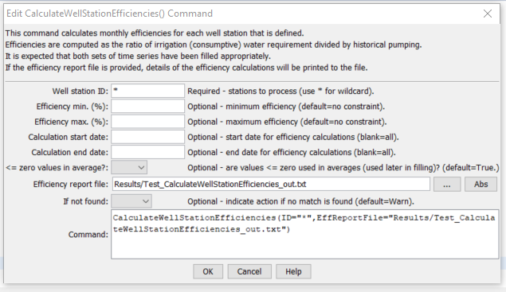

# StateDMI / Command / CalculateWellStationEfficiencies #

* [Overview](#overview)
* [Command Editor](#command-editor)
* [Command Syntax](#command-syntax)
* [Examples](#examples)
* [Troubleshooting](#troubleshooting)
* [See Also](#see-also)

-------------------------

## Overview ##

**This command is generally not used with current modeling procedures.
Instead, a variable efficiency approach is used where monthly average efficiencies
are computed in StateCU and are set in well stations using a
[`SetWellStationsFromList(...,EffMonthlyCol=...)`](../SetWellStationsFromList/SetWellStationsFromList.md)
command.  This command is retained to duplicate previous work.**

The `CalculateWellStationEfficiencies` command (for StateMod)
calculates average monthly efficiencies for well stations and updates the well station information in memory.
Efficiencies are calculated as irrigation water requirement divided by historical well pumping time series.
The detailed results of calculations can optionally be printed to a report file.
The well historical pumping time series (monthly) and irrigation water requirement time
series (monthly) should be read or created with other commands,
and should be filled before efficiency calculations, if appropriate.
Only StateMod well stations with demand type of `1` (monthly total demand) will be processed.
The output year type must be specified correctly because efficiencies are stored
in diversion stations according to the year type for the StateMod data set.  A
[`WriteWellStationsToStateMod`](../WriteWellStationsToStateMod/WriteWellStationsToStateMod.md)
command must be executed to actually write the updated efficiency data.

## Command Editor ##

The following dialog is used to edit the command and illustrates the command syntax.

**<p style="text-align: center;">

</p>**

**<p style="text-align: center;">
`CalculateWellStationEfficiencies` Command Editor (<a href="../CalculateWellStationEfficiencies.png">see also the full-size image</a>)
</p>**

## Command Syntax ##

The command syntax is as follows:

```text
CalculateWellStationEfficiencies(Parameter="Value",...)
```
**<p style="text-align: center;">
Command Parameters
</p>**

| **Parameter**&nbsp;&nbsp;&nbsp;&nbsp;&nbsp;&nbsp;&nbsp;&nbsp;&nbsp;&nbsp;&nbsp;&nbsp;&nbsp;&nbsp; | **Description** | **Default**&nbsp;&nbsp;&nbsp;&nbsp;&nbsp;&nbsp;&nbsp;&nbsp;&nbsp;&nbsp;&nbsp;&nbsp;&nbsp;&nbsp;&nbsp;&nbsp;&nbsp;&nbsp; |
| --------------|-----------------|----------------- |
| `ID`<br>**required** | A single well station identifier to match or a pattern using wildcards (e.g., `20*`). | None – must be specified. |
| `EffMin` | Minimum efficiency to allow, percent.  Calculated efficiencies less than this value will be set to the minimum. | Do not constrain the efficiency. |
| `EffMax` | Maximum efficiency to allow, percent.  Calculated efficiencies greater than this value will be set to the maximum. | Do not constrain the efficiency. |
| `EffCalcStart` | The start date (e.g., `YYYY-MM`) for efficiency calculations.  Use this to limit the period for data considered in calculations. | Use the full period. |
| `EffCalcEnd` | The end date (e.g., `YYYY-MM`) for efficiency calculations.  Use this to limit the period for data considered in calculations. | Use the full period. |
| `LEZeroInAverage` | If true, values less than or equal to zero will be considered when computing monthly time series averages.  If false, values less than or equal to zero will be excluded from the averages. | `True` |
| `EffReportFile` | If specified, a high-detail report will be created, listing for each well station the irrigation water requirement, historical well pumping, and resulting efficiency values.  Creating the report slows processing. | If blank, no report is generated. |
| `IfNotFound` | Used for error handling, one of the following:<ul><li>`Fail` – generate a failure message if the `ID` is not matched</li><li>`Ignore` – ignore (don’t add and don’t generate a message) if the `ID` is not matched</li><li>`Warn` – generate a warning message if the `ID` is not matched</li></ul> | `Warn` |

## Examples ##

See the [automated tests](https://github.com/OpenCDSS/cdss-app-statedmi-test/tree/master/test/regression/commands/CalculateWellStationEfficiencies).

## Troubleshooting ##

## See Also ##

* [`WriteWellStationsToStateMod`](../WriteWellStationsToStateMod/WriteWellStationsToStateMod.md) command
