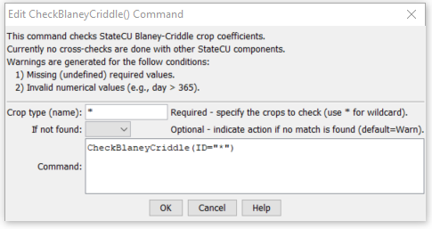

# StateDMI / Command / CheckBlaneyCriddle #

* [Overview](#overview)
* [Command Editor](#command-editor)
* [Command Syntax](#command-syntax)
* [Examples](#examples)
* [Troubleshooting](#troubleshooting)
* [See Also](#see-also)

-------------------------

## Overview ##

The `CheckBlaneyCriddle` command (for StateCU)
checks the Blaney-Criddle crop coefficient data for problems.
The command should usually be used with a
[`WriteCheckFile`](../WriteCheckFile/WriteCheckFile.md)
command at the end of a command file.

## Command Editor ##

The following dialog is used to edit the command and illustrates the command syntax.

**<p style="text-align: center;">

</p>**

**<p style="text-align: center;">
`CheckBlaneyCriddle` Command Editor (<a href="../CheckBlaneyCriddle.png">see also the full-size image</a>)
</p>**

## Command Syntax ##

The command syntax is as follows:

```text
CheckBlaneyCriddle(Parameter="Value",...)
```
**<p style="text-align: center;">
Command Parameters
</p>**

| **Parameter**&nbsp;&nbsp;&nbsp;&nbsp;&nbsp;&nbsp;&nbsp;&nbsp;&nbsp;&nbsp;&nbsp;&nbsp; | **Description** | **Default**&nbsp;&nbsp;&nbsp;&nbsp;&nbsp;&nbsp;&nbsp;&nbsp;&nbsp;&nbsp; |
| --------------|-----------------|----------------- |
| `ID` | The name of the crop(s) to check.  Use `*` to match a pattern. | None – must be specified. |
| `IfNotFound` | One of the following:<ul><li>`Fail` – generate a failure message if the `ID` is not matched</li><li>`Ignore` – ignore (don’t generate a message) if the `ID` is not matched</li><li>`Warn` – generate a warning message if the `ID` is not matched</li></ul> | `Warn` |

## Examples ##

See the [automated tests](https://github.com/OpenCDSS/cdss-app-statedmi-test/tree/master/test/regression/commands/CheckBlaneyCriddle).

The following example command file illustrates how Blaney-Criddle
coefficients can be defined, checked, and written to a StateCU file:

```
StartLog(LogFile="Crops_KBC.StateDMI.log")
#
# StateDMI commands to create the Rio Grande Blaney-Criddle coefficients File
#
# History:
#
# 2004-03-16 Steven A. Malers, RTi  Initial version using StateDMI.
# 2007-04-23 SAM, RTi               Update for Rio Grande Phase 5.
#
# Step 1 - read data from HydroBase
#
# Read the general Blaney-Criddle coefficients first and then override with Rio Grande
# data.
ReadBlaneyCriddleFromHydroBase(BlaneyCriddleMethod="BLANEY-CRIDDLE_TR-21")
ReadBlaneyCriddleFromHydroBase(BlaneyCriddleMethod="BLANEY-CRIDDLE_RIO_GRANDE")
#
# Step 3 - write the file
#
SortBlaneyCriddle(Order=Ascending)
WriteBlaneyCriddleToStateCU(OutputFile="rg2007.kbc")
#
# Check the results
#
CheckBlaneyCriddle(ID="*")
WriteCheckFile(OutputFile="rg2007.kbc.check.html")
```

## Troubleshooting ##

## See Also ##

* [`WriteCheckFile`](../WriteCheckFile/WriteCheckFile.md) command
