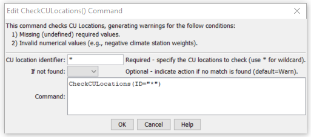

# StateDMI / Command / CheckCULocations #

* [Overview](#overview)
* [Command Editor](#command-editor)
* [Command Syntax](#command-syntax)
* [Examples](#examples)
* [Troubleshooting](#troubleshooting)
* [See Also](#see-also)

-------------------------

## Overview ##

The `CheckCULocations` command (for StateCU)
checks the CU Location data for problems.  The command should usually be used with a
[`WriteCheckFile`](../WriteCheckFile/WriteCheckFile.md) command at the end of a command file.

## Command Editor ##

The following dialog is used to edit the command and illustrates the command syntax.

**<p style="text-align: center;">

</p>**

**<p style="text-align: center;">
`CheckCULocations` Command Editor (<a href="../CheckCULocations.png">see also the full-size image</a>)
</p>**

## Command Syntax ##

The command syntax is as follows:

```text
CheckCULocations(Parameter="Value",...)
```
**<p style="text-align: center;">
Command Parameters
</p>**

| **Parameter**&nbsp;&nbsp;&nbsp;&nbsp;&nbsp;&nbsp;&nbsp;&nbsp;&nbsp;&nbsp;&nbsp;&nbsp; | **Description** | **Default**&nbsp;&nbsp;&nbsp;&nbsp;&nbsp;&nbsp;&nbsp;&nbsp;&nbsp;&nbsp; |
| --------------|-----------------|----------------- |
| `ID` | The identifier for the location(s) to check.  Use `*` to match a pattern. |None – must be specified. |
| `IfNotFound` | One of the following:<ul><li>`Fail` – generate a failure message if the location identifier is not matched</li><li>`Ignore` – ignore (don’t generate a message) if the location identifier is not matched</li><li>`Warn` – generate a warning message if the location identifier is not matched</li></ul> |`Warn` |

## Examples ##

See the [automated tests](https://github.com/OpenCDSS/cdss-app-statedmi-test/tree/master/test/regression/commands/CheckCULocations).

The following example command file illustrates how CU locations can be defined, sorted, checked, and written to a StateCU file (this is an abbreviated command file):

```
# Sp2008L_STR.StateDMI
# South Platte Decision Support System
# Historic Consumptive Use Model
# Structure File (*.str)
#
#  Step 1 - Read Structure List File (WDID, Name)
#
#  Structure List includes Key Structures from Task 3, Aggregate GW, and Aggregate SW
ReadCULocationsFromList(ListFile="Sp2008L_StructList.csv",IDCol=1,NameCol=3)
#
#  Step 2 - Read structure information from HydroBase (Latitude, County, HUC)
FillCULocationsFromHydroBase(ID="*",CULocType=Structure,Region1Type=County,Region2Type=HUC)
#
#  Step 3 - Assign AWC values based on Task 57, generate using the CDSS Toolbox
#
# # Key Structure AWC Values
SetCULocationsFromList(ListFile="AWC_2001.csv",IDCol=1,AWCCol=2)
#
# # GW AGG Structure AWC Values
SetCULocationsFromList(ListFile="AWC_Agg_GW.csv",IDCol=1,AWCCol=2)
#
# # SW AGG Structure AWC Values
SetCULocationsFromList(ListFile="AWC_Agg_SW.csv",IDCol=1,AWCCol=2)
#
#  Step 4 - Assign Elevation
FillCULocationsFromList(ListFile="Key_Elev.csv",IDCol=1,ElevationCol=3)
#
# Step 5 - Set Demand Structure Information based on Demand Carrier
SetCULocation(ID="0100503_I",Latitude=40.38,Elevation=4533.00,Region1="WELD",Region2="10190003",AWC=0.1375,IfNotFound=Warn)
SetCULocation(I
#
SetCULocation(ID="6400526",AWC=0.1393,IfNotFound=Warn)
#
# Missing values assigned to Diversion Systems
SetCULocation(ID="0100503_D",Latitude=40.28567,Region1="MORGAN",IfNotFound=Warn)
# DivSys and Aggregate use weighted latitude from climate station assignments
# County and HUC information not assigned to DivSys or Aggregate Structures
#
# Step 6 - Read structure climate weights from list created from the CDSS Toolbox Climate Tool
SetCULocationClimateStationWeightsFromList(ListFile="Climate_2001.csv",IDCol=1,StationIDCol=2,TempWtCol=3,PrecWtCol=3)
SetCULocationClimateS
# Set Climate Stations above 6500
SetCULocationClimateStationWeightsFromList(ListFile="SP2008_DWHA_OroAdj.csv",IDCol=1,StationIDCol=2,TempWtCol=3,PrecWtCol=4,OrographicTempAdjCol=6,OrographicPrecAdjCol=5)
#
# Step 8 - Fill Key Climate Station
#
FillCULocationClimateStationWeights(ID="01*",IncludeOrographicTempAdj=False,IncludeOrographicPrecAdj=False,Weights="0945,1.0,1.0")
#
# Step 7 - Write Structure File
SortCULocations()
WriteCULocationsToStateCU(OutputFile="SP2008L.str")
# Check the results
CheckCULocations(ID="*")
WriteCheckFile(OutputFile="SP2008L.str.check.html")
```

## Troubleshooting ##

[See the main troubleshooting documentation](../../troubleshooting/troubleshooting.md)

## See Also ##

* [`WriteCheckFile`](../WriteCheckFile/WriteCheckFile.md) command
