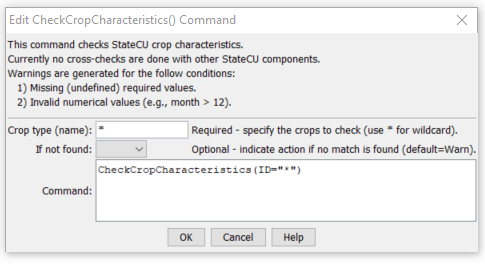

# StateDMI / Command / CheckCropCharacteristics #

* [Overview](#overview)
* [Command Editor](#command-editor)
* [Command Syntax](#command-syntax)
* [Examples](#examples)
* [Troubleshooting](#troubleshooting)
* [See Also](#see-also)

-------------------------

## Overview ##

The `CheckCropCharacteristics` command (for StateCU)
checks the crop characteristics data for problems.  The command should usually be used with a
[`WriteCheckFile`](../WriteCheckFile/WriteCheckFile.md) command at the end of a command file.

## Command Editor ##

The following dialog is used to edit the command and illustrates the command syntax.

**<p style="text-align: center;">

</p>**

**<p style="text-align: center;">
`CheckCropCharacteristics` Command Editor (<a href="../CheckCropCharacteristics.png">see also the full-size image</a>)
</p>**

## Command Syntax ##

The command syntax is as follows:

```text
CheckCropCharacteristics(Parameter="Value",...)
```
**<p style="text-align: center;">
Command Parameters
</p>**

| **Parameter**&nbsp;&nbsp;&nbsp;&nbsp;&nbsp;&nbsp;&nbsp;&nbsp;&nbsp;&nbsp;&nbsp;&nbsp; | **Description** | **Default**&nbsp;&nbsp;&nbsp;&nbsp;&nbsp;&nbsp;&nbsp;&nbsp;&nbsp;&nbsp; |
| --------------|-----------------|----------------- |
| `ID` | The name of the crop(s) to check.  Use `*` to match a pattern. | None – must be specified. |
| `IfNotFound` | One of the following:<ul><li>`Fail` – generate a failure message if the identifier is not matched</li><li>`Ignore` – ignore (don’t generate a message) if the identifier is not matched</li><li>`Warn` – generate a warning message if the identifier is not matched</li></ul> | `Warn` |

## Examples ##

See the [automated tests](https://github.com/OpenCDSS/cdss-app-statedmi-test/tree/master/test/regression/commands/CheckCropCharacteristics).

The following example command file illustrates how crop characteristics can be defined, checked, and written to a StateCU file:

```
StartLog(LogFile="Crops_CCH.StateDMI.log")
#
# StateDMI commands to create the Rio Grande Crop Characteristics File
#
# History:
#
# 2004-03-16 Steven A. Malers, RTi  Initial version using StateDMI.
# 2007-04-22 SAM, RTi               Use new directory structure, current
#                                   software and HydroBase.
#
# Step 1 - read data from HydroBase
#
# Read the general TR-21 characteristics first and then override with Rio Grande
# data.
ReadCropCharacteristicsFromHydroBase(CUMethod="BLANEY-CRIDDLE_TR-21")
ReadCropCharacteristicsFromHydroBase(CUMethod="BLANEY-CRIDDLE_RIO_GRANDE")
#
# Step 2 - adjust crop characteristics if needed
#    No resets are needed.
#
# Step 3 - write the file
#
WriteCropCharacteristicsToStateCU(OutputFile="rg2007.cch")
#
# Check the results
#
CheckCropCharacteristics(ID="*")
WriteCheckFile(OutputFile="rg2007.cch.check.html")
```

## Troubleshooting ##

## See Also ##

* [`WriteCheckFile`](../WriteCheckFile/WriteCheckFile.md) command
