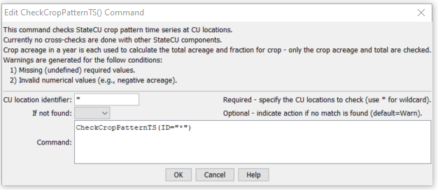

# StateDMI / Command / CheckCropPatternTS #

* [Overview](#overview)
* [Command Editor](#command-editor)
* [Command Syntax](#command-syntax)
* [Examples](#examples)
* [Troubleshooting](#troubleshooting)
* [See Also](#see-also)

-------------------------

## Overview ##

The `CheckCropPatternTS` command (for StateCU)
checks the crop pattern time series data for problems.  The command should usually be used with a
[`WriteCheckFile`](../WriteCheckFile/WriteCheckFile.md) command at the end of a command file.

## Command Editor ##

The following dialog is used to edit the command and illustrates the command syntax.

**<p style="text-align: center;">

</p>**

**<p style="text-align: center;">
`CheckCropPatternTS` Command Editor (<a href="../CheckCropPatternTS.png">see also the full-size image</a>)
</p>**

## Command Syntax ##

The command syntax is as follows:

```text
CheckCropPatternTS(Parameter="Value",...)
```
**<p style="text-align: center;">
Command Parameters
</p>**

| **Parameter**&nbsp;&nbsp;&nbsp;&nbsp;&nbsp;&nbsp;&nbsp;&nbsp;&nbsp;&nbsp;&nbsp;&nbsp; | **Description** | **Default**&nbsp;&nbsp;&nbsp;&nbsp;&nbsp;&nbsp;&nbsp;&nbsp;&nbsp;&nbsp; |
| --------------|-----------------|----------------- |
| `ID` | The name of the crop(s) to check.  Use `*` to match a pattern. | None – must be specified. |
| `IfNotFound` | One of the following:<ul><li>`Fail` – generate a failure message if the identifier is not matched</li><li>`Ignore` – ignore (don’t generate a message) if the identifier is not matched</li><li>`Warn` – generate a warning message if the identifier is not matched</li></ul> | `Warn` |

## Examples ##

See the [automated tests](https://github.com/OpenCDSS/cdss-app-statedmi-test/tree/master/test/regression/commands/CheckCropPatternTS).

The following example command file illustrates how crop pattern time series can be defined, checked, and written to a StateCU file:

```
# Step 1 - Set output period and read CU locations
SetOutputPeriod(OutputStart="1950",OutputEnd="2006")
ReadCULocationsFromStateCU(InputFile="..\StateCU\cm2006.str")
# Step 2 - Read SW aggregates
SetDiversionSystemFromList(ListFile="colorado_divsys.csv",IDCol=1,NameCol=2,PartIDsCol=3,PartsListedHow=InRow)
SetDiversionAggregateFromList(ListFile="colorado_agg.csv",IDCol=1,NameCol=2,PartIDsCol=3,PartsListedHow=InRow)
# Step 3 - Create *.cds file form and read acreage/crops from HydroBase
CreateCropPatternTSForCULocations(ID="*",Units="ACRE")
ReadCropPatternTSFromHydroBase(ID="*")
# Step 4 - Need to translate crops out of HB to include TR21 suffix
# Translate all crops from HB to include .TR21 suffix
TranslateCropPatternTS(ID="*",OldCropType="GRASS_PASTURE",NewCropType="GRASS_PASTURE.TR21")
TranslateCropPatternTS(ID="*",OldCropType="CORN_GRAIN",NewCropType="CORN_GRAIN.TR21")
TranslateCropPatternTS(ID="*",OldCropType="ALFALFA",NewCropType="ALFALFA.TR21")
TranslateCropPatternTS(ID="*",OldCropType="SMALL_GRAINS",NewCropType="SPRING_GRAIN.TR21")
TranslateCropPatternTS(ID="*",OldCropType="VEGETABLES",NewCropType="VEGETABLES.TR21")
TranslateCropPatternTS(ID="*",OldCropType="ORCHARD_WO_COVER",NewCropType="ORCHARD_WO_COVER.TR21")
TranslateCropPatternTS(ID="*",OldCropType="ORCHARD_WITH_COVER",NewCropType="ORCHARD_WITH_COVER.TR21")
TranslateCropPatternTS(ID="*",OldCropType="DRY_BEANS",NewCropType="DRY_BEANS.TR21")
TranslateCropPatternTS(ID="*",OldCropType="GRAPES",NewCropType="GRAPES.TR21")
TranslateCropPatternTS(ID="*",OldCropType="WHEAT",NewCropType="SPRING_GRAIN.TR21")
TranslateCropPatternTS(ID="*",OldCropType="SUNFLOWER",NewCropType="SPRING_GRAIN.TR21")
TranslateCropPatternTS(ID="*",OldCropType="SOD_FARM",NewCropType="GRASS_PASTURE.TR21")
# Step 5 - Translate crop names
# use high-altitude coefficients for structures with more than 50% of
# irrigated acreage above 6500 feet
TranslateCropPatternTS(ListFile="cm2005_HA.lst",IDCol=1,OldCropType="GRASS_PASTURE.TR21",NewCropType="GRASS_PASTURE.DWHA")
# Step 6 - Fill Acreage
#      Fill SW structure acreage backword from 1999 to 1950
#      Fill acreage forward for all structures from 2000 to 2006
FillCropPatternTSRepeat(ID="*",CropType="*",FillStart=1950,FillEnd=1993,FillDirection=Backward)
FillCropPatternTSRepeat(ID="*",CropType="*",FillStart=1993,FillEnd=1999,FillDirection=Forward)
FillCropPatternTSRepeat(ID="*",CropType="*",FillStart=2000,FillEnd=2006,FillDirection=Forward)
# Step 7 - Write final *.cds file
WriteCropPatternTSToStateCU(OutputFile="..\StateCU\cm2006.cds",WriteCropArea=True,WriteHow=OverwriteFile)
# Check the results
CheckCropPatternTS(ID="*")
WriteCheckFile(OutputFile="cm2006.cds.StateDMI.check.html")
```

## Troubleshooting ##

## See Also ##

* [`WriteCheckFile`](../WriteCheckFile/WriteCheckFile.md) command
