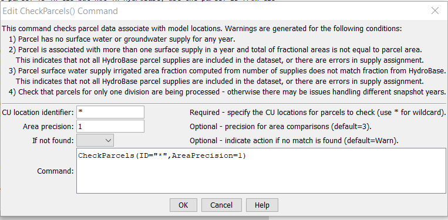

# StateDMI / Command / CheckParcels #

* [Overview](#overview)
* [Command Editor](#command-editor)
* [Command Syntax](#command-syntax)
* [Examples](#examples)
* [Troubleshooting](#troubleshooting)
* [See Also](#see-also)

-------------------------

## Overview ##

The `CheckParcels` command (for StateCU and StateMod) checks the parcels data for problems.
The command should be used after all parcel processing has occurred to ensure that data
issues don't impact subsequent processing.
The command should usually be used with a
[`WriteCheckFile`](../WriteCheckFile/WriteCheckFile.md) command at the end of a command file.

## Command Editor ##

The following dialog is used to edit the command and illustrates the command syntax.

**<p style="text-align: center;">

</p>**

**<p style="text-align: center;">
`CheckParcels` Command Editor (<a href="../CheckParcels.png">see also the full-size image</a>)
</p>**

## Command Syntax ##

The command syntax is as follows:

```text
CheckParcels(Parameter="Value",...)
```
**<p style="text-align: center;">
Command Parameters
</p>**

| **Parameter**&nbsp;&nbsp;&nbsp;&nbsp;&nbsp;&nbsp;&nbsp;&nbsp;&nbsp;&nbsp;&nbsp;&nbsp; | **Description** | **Default**&nbsp;&nbsp;&nbsp;&nbsp;&nbsp;&nbsp;&nbsp;&nbsp;&nbsp;&nbsp; |
| --------------|-----------------|----------------- |
| `ID` | The identifier for the location(s) to check.  Use `*` to match a pattern. |None – must be specified. |
| `AreaPrecision` | The number of digits used to perform comparisons of area. If warnings result due to round-off, reduce the value. | 3 |
| `IfNotFound` | One of the following:<ul><li>`Fail` – generate a failure message if the location identifier is not matched</li><li>`Ignore` – ignore (don’t generate a message) if the location identifier is not matched</li><li>`Warn` – generate a warning message if the location identifier is not matched</li></ul> |`Warn` |

## Examples ##

See the [automated tests](https://github.com/OpenCDSS/cdss-app-statedmi-test/tree/master/test/regression/commands/CheckParcels).

The following example command file illustrates how parcels can be defined and checked:

```
#
# Step 1 - Set output period and read CU locations
SetOutputPeriod(OutputStart="1950",OutputEnd="2018")
ReadCULocationsFromStateCU(InputFile="..\StateCU\Ark2020_CROP.str")
#
#
# Step 2 - Read DivSys and MultiSys
SetDiversionSystemFromList(ListFile="2020_08_18_Ark2020_DivSys_Acres.txt",IDCol="1",NameCol="2",PartIDsCol="3",PartsListedHow=InRow,PartIDsColMax="12",IfNotFound=Warn)
SetDiversionSystemFromList(ListFile="2020_08_18_Ark2020_MultiStr_DDM.txt",IDCol="1",NameCol="2",PartIDsCol="3",PartsListedHow=InRow,PartIDsColMax="7",IfNotFound=Warn)
# The following was added by Steve Malers
SetWellAggregateFromList(ListFile="2020_04_06_Ark2020_GWAgg_StateCU.txt",PartType=Well,IDCol="1",PartIDsCol="2",PartIDTypeColumn="3",PartsListedHow=InColumn)
#
# Step 2.1 - Read parcel data, which is used by following commands
#  old command names
ReadParcelsFromHydroBase(ID="*")
CheckParcels(ID="*",DeepCheck=True)
WriteParcelsToFile(OutputFile="Ark2020_CDS.StateDMI.model-parcel-supply.txt")
```

## Troubleshooting ##

The following are troubleshooting suggestions based on experience.

| **Error Example** | **Suggestion** |
| -- | -- |
| `CU location "1000569" year 2010 parcel 21016428 supply ID "1000569" parcel area fraction from ditch supply number of ditches(1.0) does not equal parcel area fraction from HydroBase (0.5).`| Possible causes include:<ul><li>Model dataset does not include all irrigated parcels and supplies that were loaded into HydroBase for involved parcels.  For example, collections may not include all necessary structures.</li><li>A supply in the original irrigated lands data is miscoded as ditch or well when it is the other.</li></ul>|

## See Also ##

* [`WriteCheckFile`](../WriteCheckFile/WriteCheckFile.md) command
