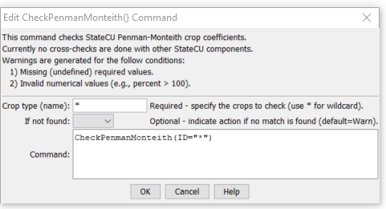

# StateDMI / Command / CheckPenmanMonteith #

* [Overview](#overview)
* [Command Editor](#command-editor)
* [Command Syntax](#command-syntax)
* [Examples](#examples)
* [Troubleshooting](#troubleshooting)
* [See Also](#see-also)

-------------------------

## Overview ##

The `CheckPenmanMonteith` command (for StateCU)
checks the Penman-Monteith crop coefficient data for problems.  The command should usually be used with a
[`WriteCheckFile`](../WriteCheckFile/WriteCheckFile.md) command at the end of a command file.

## Command Editor ##

The following dialog is used to edit the command and illustrates the command syntax.

**<p style="text-align: center;">

</p>**

**<p style="text-align: center;">
`CheckPenmanMonteith` Command Editor (<a href="../CheckPenmanMonteith.png">see also the full-size image</a>)
</p>**

## Command Syntax ##

The command syntax is as follows:

```text
CheckPenmanMonteith(Parameter="Value",...)
```
**<p style="text-align: center;">
Command Parameters
</p>**

| **Parameter**&nbsp;&nbsp;&nbsp;&nbsp;&nbsp;&nbsp;&nbsp;&nbsp;&nbsp;&nbsp;&nbsp;&nbsp; | **Description** | **Default**&nbsp;&nbsp;&nbsp;&nbsp;&nbsp;&nbsp;&nbsp;&nbsp;&nbsp;&nbsp; |
| --------------|-----------------|----------------- |
| `ID` | The name of the crop(s) to check.  Use `*` to match a pattern. | None – must be specified. |
| `IfNotFound` | One of the following:<ul><li>`Fail` – generate a failure message if the identifier is not matched</li><li>`Ignore` – ignore (don’t generate a message) if the identifier is not matched</li><li>`Warn` – generate a warning message if the identifier is not matched</li></ul> | `Warn` |

## Examples ##

See the [automated tests](https://github.com/OpenCDSS/cdss-app-statedmi-test/tree/master/test/regression/commands/CheckPenmanMonteith).

The following example command file illustrates how Penman-Monteith coefficients can be defined, checked, and written to a StateCU file:

```
StartLog(LogFile="Crops_KPM.StateDMI.log")
#
# StateDMI commands to create the Penman-Monteith crop coefficients file
#
# Step 1 - read data from HydroBase
#
# Read the general ASCE standardized coefficients
ReadPenmanMonteithFromHydroBase(PenmanMonteithMethod="PENMAN-MONTEITH_ALFALFA")
#
# Step 3 - write the file
#
SortPenmanMonteith()
WritePenmanMonteithToStateCU(OutputFile="rg2007.kpm")
#
# Check the results
#
CheckPenmanMonteith(ID="*")
WriteCheckFile(OutputFile="Crops_KPM.StateDMI.check.html")
```

## Troubleshooting ##

## See Also ##

* [`WriteCheckFile`](../WriteCheckFile/WriteCheckFile.md) command
