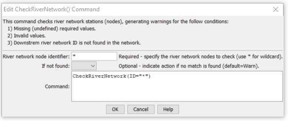

# StateDMI / Command / CheckRiverNetwork #

* [Overview](#overview)
* [Command Editor](#command-editor)
* [Command Syntax](#command-syntax)
* [Examples](#examples)
* [Troubleshooting](#troubleshooting)
* [See Also](#see-also)

-------------------------

## Overview ##

The `CheckRiverNetwork` command (for StateMod)
checks river network data for problems.  The command should usually be used with a
[`WriteCheckFile`](../WriteCheckFile/WriteCheckFile.md) command at the end of a command file.

## Command Editor ##

The following dialog is used to edit the command and illustrates the command syntax.

**<p style="text-align: center;">

</p>**

**<p style="text-align: center;">
`CheckRiverNetwork` Command Editor (<a href="../CheckRiverNetwork.png">see also the full-size image</a>)
</p>**

## Command Syntax ##

The command syntax is as follows:

```text
CheckRiverNetwork(Parameter="Value",...)
```
**<p style="text-align: center;">
Command Parameters
</p>**

| **Parameter**&nbsp;&nbsp;&nbsp;&nbsp;&nbsp;&nbsp;&nbsp;&nbsp;&nbsp;&nbsp;&nbsp;&nbsp; | **Description** | **Default**&nbsp;&nbsp;&nbsp;&nbsp;&nbsp;&nbsp;&nbsp;&nbsp;&nbsp;&nbsp; |
| --------------|-----------------|----------------- |
| `ID` | The identifier for the location(s) to check.  Use `*` to match a pattern. | None – must be specified. |
| `IfNotFound` | One of the following:<ul><li>`Fail` – generate a failure message if the location identifier is not matched</li><li>`Ignore` – ignore (don’t generate a message) if the location identifier is not matched</li><li>`Warn` – generate a warning message if the location identifier is not matched</li></ul> | `Warn` |

## Examples ##

See the [automated tests](https://github.com/OpenCDSS/cdss-app-statedmi-test/tree/master/test/regression/commands/CheckRiverNetwork).

The following command file illustrates how a StateMod river network file can be created from the generalized network file:

```
StartLog(LogFile="rin.commands.StateDMI.log")
# rin.commands.StateDMI
#
# creates the river network file for the Colorado River monthly/daily models
#
#  Step 1 - read river nodes from the network file and create file framework
#
ReadNetworkFromStateMod(InputFile="cm2005.net")
CreateRiverNetworkFromNetwork()
#
#  Step 2 - get node (diversion, stream stations, reservoirs, instream flows)
#           names from HydroBase
#
FillRiverNetworkFromHydroBase(ID="*",NameFormat=StationName_NodeType)
#
#  Step 3 - read missing node names from network file
#
FillRiverNetworkFromNetwork(ID="*",NameFormat="StationName_NodeType",CommentFormat="StationID")
#
#  Step 4 - create StateMod river network file
#
WriteRiverNetworkToStateMod(OutputFile="..\StateMod\cm2005.rin")
#
# Check the results
CheckRiverNetwork(ID="*")
WriteCheckFile(OutputFile="rin.commands.StateDMI.check.html")
```

## Troubleshooting ##

[See the main troubleshooting documentation](../../troubleshooting/troubleshooting.md)

## See Also ##

* [`WriteCheckFile`](../WriteCheckFile/WriteCheckFile.md) command
