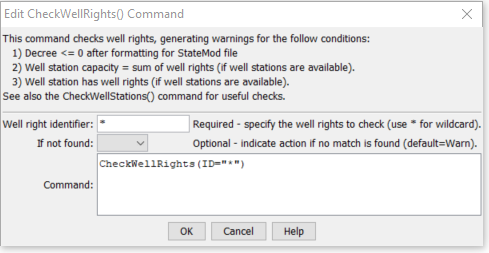

# StateDMI / Command / CheckWellRights #

* [Overview](#overview)
* [Command Editor](#command-editor)
* [Command Syntax](#command-syntax)
* [Examples](#examples)
* [Troubleshooting](#troubleshooting)
* [See Also](#see-also)

-------------------------

## Overview ##

The `CheckWellRights` command (for StateCU and StateMod) checks well rights data for problems.
The command should usually be used with a
[`WriteCheckFile`](../WriteCheckFile/WriteCheckFile.md) command at the end of a command file.

## Command Editor ##

The following dialog is used to edit the command and illustrates the command syntax.

**<p style="text-align: center;">

</p>**

**<p style="text-align: center;">
`CheckWellRights` Command Editor (<a href="../CheckWellRights.png">see also the full-size image</a>)
</p>**

## Command Syntax ##

The command syntax is as follows:

```text
CheckWellRights(Parameter="Value",...)
```
**<p style="text-align: center;">
Command Parameters
</p>**

| **Parameter**&nbsp;&nbsp;&nbsp;&nbsp;&nbsp;&nbsp;&nbsp;&nbsp;&nbsp;&nbsp;&nbsp;&nbsp; | **Description** | **Default**&nbsp;&nbsp;&nbsp;&nbsp;&nbsp;&nbsp;&nbsp;&nbsp;&nbsp;&nbsp; |
| --------------|-----------------|----------------- |
| `ID` <br>**required** | The identifier for the location(s) to check.  Use `*` to match a pattern. | None – must be specified. |
| `IfNotFound` | One of the following:<ul><li>`Fail` – generate a failure message if the location identifier is not matched</li><li>`Ignore` – ignore (don’t generate a message) if the location identifier is not matched</li><li>`Warn` – generate a warning message if the location identifier is not matched</li></ul> | `Warn` |

## Examples ##

See the [automated tests](https://github.com/OpenCDSS/cdss-app-statedmi-test/tree/master/test/regression/commands/CheckWellRights).

The following example command file illustrates how well rights can be defined, sorted, checked, and written to a StateMod file:

```
# Well Rights File (*.wer)
#
StartLog(LogFile="Sp2008L_WER.log")
# _________________________________________________________
# Step 1 - Read all structures
#
ReadWellStationsFromNetwork(InputFile="..\Network\Sp2008L.net")
SortWellStations()
# _________________________________________________________
# Step 2 - define diversion and d&w aggregates and demand systems
SetWellAggregateFromList(ListFile="..\Sp2008L_SWAgg.csv",PartType=Ditch,IDCol=1,
  NameCol=2,PartIDsCol=3,PartsListedHow=InColumn,IfNotFound=Warn)
SetWellSystemFromList(ListFile="..\Sp2008L_DivSys_DDH.csv",PartType=Ditch,IDCol=1,
  NameCol=2,PartIDsCol=3,PartsListedHow=InRow,IfNotFound=Warn)
#
SetWellAggregateFromList(ListFile="Sp2008L_AugRchWell_Aggregates.csv",PartType=Well,
  IDCol=1,PartIDsCol=2,PartsListedHow=InRow)
# _________________________________________________________
# Step 3- Set Well aggregates (GW Only lands)
# rrb Same as provided by LRE as Sp_GWAgg_xxxx.csv except non WD 01 and 64 removed
SetWellSystemFromList(ListFile="..\Sp2008L_GWAgg_1956.csv",Year=1956,Div=1,
  PartType=Parcel,IDCol=1,PartIDsCol=2,PartsListedHow=InColumn)
SetWellSystemFromList(ListFile="..\Sp2008L_GWAgg_1976.csv",Year=1976,Div=1,
  PartType=Parcel,IDCol=1,PartIDsCol=2,PartsListedHow=InColumn)
SetWellSystemFromList(ListFile="..\Sp2008L_GWAgg_1987.csv",Year=1987,Div=1,
  PartType=Parcel,IDCol=1,PartIDsCol=2,PartsListedHow=InColumn)
SetWellSystemFromList(ListFile="..\Sp2008L_GWAgg_2001.csv",Year=2001,Div=1,
  PartType=Parcel,IDCol=1,PartIDsCol=2,PartsListedHow=InColumn)
SetWellSystemFromList(ListFile="..\Sp2008L_GWAgg_2005.csv",Year=2005,Div=1,
  PartType=Parcel,IDCol=1,PartIDsCol=2,PartsListedHow=InColumn)
# _________________________________________________________
# Step 4 - Read Augmentation and Recharge Well Aggregate Parts
SetWellAggregateFromList(ListFile="Sp2008L_AugRchWell_Aggregates.csv",PartType=Well,
  IDCol=1,PartIDsCol=2,PartsListedHow=InRow,PartIDsColMax=25,IfNotFound=Ignore)
SetWellAggregateFromList(ListFile="Sp2008L_AlternatePoint_Aggregates.csv",PartType=Well,
  IDCol=1,PartIDsCol=2,PartsListedHow=InRow,PartIDsColMax=1,IfNotFound=Ignore)
# _________________________________________________________
# Step 5 - Read rights from HydroBase
ReadWellRightsFromHydroBase(ID="*",IDFormat="HydroBaseID",Year="1956,1976,1987,2001,2005",
  Div="1",DefaultAppropriationDate="1950-01-01",DefineRightHow=RightIfAvailable,
  ReadWellRights=True,UseApex=True,OnOffDefault=AppropriationDate)
# _________________________________________________________
# Step 6 - Sort and Write
#  Write Data Comments="True" provides output used for subsequent cds & ipy acreage filling
#  Write Data Comments="False" provides merged file used for seting ipy max pumping
SortWellRights(Order=LocationIDAscending,Order2=IDAscending)
# _________________________________________________________
WriteWellRightsToStateMod(OutputFile="Sp2008L_NotMerged.wer",WriteDataComments=True)
MergeWellRights(OutputFile="..\StateMod\Historic\Sp2008L.wer")
SortWellRights(Order=LocationIDAscending,Order2=IDAscending)
# _________________________________________________________
WriteWellRightsToStateMod(OutputFile="Sp2008L.wer",
  WriteDataComments=False,WriteHow=OverwriteFile)
# Check the well rights
CheckWellRights(ID="*")
WriteCheckFile(OutputFile="Sp2008L.wer.check.html",Title="Well Rights Check File")
```

## Troubleshooting ##

## See Also ##

* [`ReadWellRightsFromHydroBase`](../ReadWellRightsFromHydroBase/ReadWellRightsFromHydroBase.md) command
