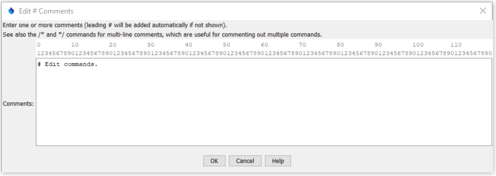
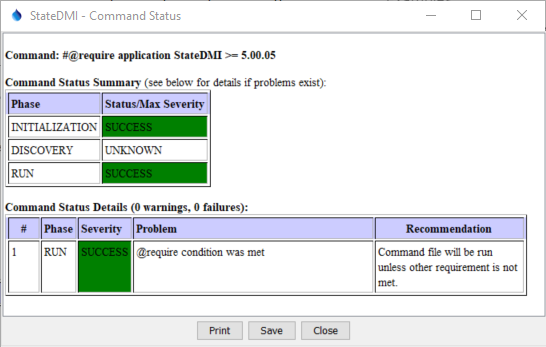
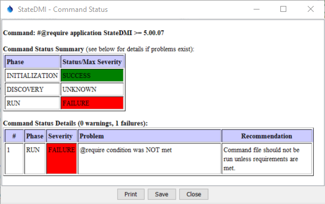

# StateDMI / Command / Comment `#` #

* [Overview](#overview)
	+ [Special Comments](#special-comments)
* [Command Editor](#command-editor)
* [Command Syntax](#command-syntax)
* [Examples](#examples)
	+ [Checking StateDMI Version Requirements](#checking-statedmi-version-requirements)
	+ [Checking HydroBase Version Requirements](#checking-hydrobase-version-requirements)
* [Troubleshooting](#troubleshooting)
* [See Also](#see-also)

-------------------------

## Overview ##

Single-line comments start with `#`.
Spaces and tabs before the comment character are currently not allowed.
Comments cannot be added after commands - comments must exist on their own command line.
Commands can be converted to and from `#` comments by right-clicking on a command in StateDMI
and selecting ***Convert selected commands to # comments*** and
***Convert selected commands from # comments*** from the popup menu.
See also the [`/*`](../CommentBlockStart/CommentBlockStart.md) and [`*/`](../CommentBlockEnd/CommentBlockEnd.md)
comment block commands, which are used to comment multiple commands.

## Special Comments ##

The following table lists annotation tags that can be placed in comments to provide additional
information to software that processes the commands, using notation similar to the following:

```
#@expectedStatus Failure
```

The ***Commands / General - Comments*** menu provides menu items to insert special comments.

**<p style="text-align: center;">
`#` Comment Annotation Tags
</p>**

|**Annotation Tag**&nbsp;&nbsp;&nbsp;&nbsp;&nbsp;&nbsp;&nbsp;&nbsp;&nbsp;&nbsp;&nbsp;&nbsp;&nbsp;&nbsp;&nbsp;&nbsp;&nbsp;&nbsp;&nbsp;&nbsp;&nbsp;&nbsp;&nbsp;&nbsp;&nbsp;&nbsp;&nbsp;&nbsp;&nbsp;&nbsp;&nbsp;&nbsp;&nbsp;&nbsp;&nbsp;&nbsp;&nbsp;&nbsp;&nbsp;&nbsp;&nbsp;&nbsp;&nbsp;&nbsp;&nbsp;|**Command That Uses**&nbsp;&nbsp;&nbsp;&nbsp;&nbsp;&nbsp;&nbsp;&nbsp;&nbsp;&nbsp;&nbsp;&nbsp;&nbsp;&nbsp;&nbsp;&nbsp;&nbsp;&nbsp;&nbsp;&nbsp;&nbsp;&nbsp;&nbsp;&nbsp;&nbsp;&nbsp;&nbsp;&nbsp;&nbsp;&nbsp;&nbsp;&nbsp;&nbsp;&nbsp;&nbsp;&nbsp;&nbsp;&nbsp;&nbsp;&nbsp;&nbsp;&nbsp;&nbsp;&nbsp;&nbsp;&nbsp;&nbsp;&nbsp;&nbsp;&nbsp;&nbsp;&nbsp;&nbsp;&nbsp;&nbsp;|**Description**&nbsp;&nbsp;&nbsp;&nbsp;&nbsp;&nbsp;&nbsp;&nbsp;&nbsp;&nbsp;|
|----------------|--------------------------|----------------- |
|`@enabled False`| [`RunCommands`](../RunCommands/RunCommands.md) |Used to disable a command file.  For example, use this annotation in a test command file when the test is not ready for use in the software release process.|
|`@expectedStatus Failure`<br>`@expectedStatus Warning`|[`RunCommands`](../RunCommands/RunCommands.md)|Used to help the test framework know if an error or warning is expected, in which case a passing test can occur even if the command status is not “success”.|
|`@os Windows`<br>`@os UNIX`|[`CreateRegressionTestCommandFile`](../CreateRegressionTestCommandFile/CreateRegressionTestCommandFile.md)|Used to filter out test command files that are not appropriate for the operating system.  Linux is included in UNIX.|
|`@readOnly`|StateDMI main interface and command editors|Indicates that the command file should not be edited.  StateDMI will update old command syntax to current syntax when a command file is loaded.  However, this tag will cause the software to warn the user when saving the command file, so that they can cancel.  This tag is often used with templates to protect the template from mistakenly being edited and saved in StateDMI (StateDMI does not currently allow editing templates within the interface).|
|`@require application StateDMI >= Version`<br><br>Available since StateDMI 5.00.06 | StateDMI main interface and [`RunCommands`](../RunCommands/RunCommands.md). | Check that the software application version meets requirements for the command file. This can be used to prevent running the command file with incompatible software. The version should match the format shown in ***Help / About StateDMI*** (e.g., `5.00.05`). Only the first three parts of the version are compared. <ul><li>For interactive session, fail if a requirement is not met.</li><li>When running tests that use [`RunCommands(IfRequirementsNotMet=Ignore)`](../RunCommands/RunCommands.md), command files that don't meet requirements are skipped.  This is the default when tests are processed using [`CreateRegressionTestCommandFile`](../CreateRegressionTestCommandFile/CreateRegressionTestCommandFile).</li></ul>The comparison operator can be:<ul><li>`<` (less than)</li><li>`<=` (less than or equal)</li><li>`=` or `==` (equal)</li><li>`!=` (not equal)</li><li>`>` (greater than)</li><li>`>=` (greater than or equal)</li></ul> |
|`@require datastore HydroBase >= Version`<br><br>Available since StateDMI 5.00.06 | StateDMI main interface and [`RunCommands`](../RunCommands/RunCommands.md).| Check that the datastore version meets requirements for the command file. This can be used to prevent running the command file with incompatible database. The version should match the format used in the HydroBase database name shown in ***View / Datastores*** (e.g., `20200720`). See above for available comparison operators and behavior when conditions are not met. |
|`@template`|StateDMI main interface|Similar to `@readOnly` and indicates a template command file.  Currently, a text file editor needs to be used to edit template files because StateDMI checks commands for final syntax.|
|`@testSuite ABC`|[`CreateRegressionTestCommandFile`](../CreateRegressionTestCommandFile/CreateRegressionTestCommandFile.md)|Used to filter out test command files that are not appropriate for the operating system.|

## Command Editor ##

The following dialog is used to edit the command and illustrates the command syntax.

**<p style="text-align: center;">

</p>**

**<p style="text-align: center;">
`#` Command Editor (<a href="../Comment.png">see also the full-size image</a>)
</p>**

## Command Syntax ##

The command syntax is as follows.
See also the [Special Comments](#special-comments) section above.

```text
# A comment
# Another comment
```

## Examples ##

See the [automated tests](https://github.com/OpenCDSS/cdss-app-statedmi-test/tree/master/test/regression/commands/general/Comment).

### Checking StateDMI Version Requirements ###

Special comments can be used to check the StateDMI application version.
Using these comments ensures that command files are only run with appropriate software versions.
These comments are particularly useful for implementing automated tests that need to be run
with different combinations of software and databases as versions change over time.
Command log messages are added to indicate whether a requirement is met, as shown in the following examples.

The following checks that StateDMI version 5.00.05 software is being used with the command file, using the following comment.
This type of check ensures that a command file is not used with an incompatible software version.
In this case, the requirement is met, as shown in the following image.

```
#@require application StateDMI >= 5.00.05
```

**<p style="text-align: center;">

</p>**

**<p style="text-align: center;">
`@require` Command Success Message (<a href="../require-success.png">see also the full-size image</a>)
</p>**

The following checks that StateDMI version 5.00.07 software is being used with the command file, using the following comment.
In this case, the requirement is not met, as shown in the following image,
and the comment is also marked as a failure when the command file is run.

```
#@require application StateDMI >= 5.00.07
```

**<p style="text-align: center;">

</p>**

**<p style="text-align: center;">
`@require` Command Failure Message (<a href="../require-failure.png">see also the full-size image</a>)
</p>**

### Checking HydroBase Version Requirements ###

Special comments can be used to check HydroBase versions when datastores are used
(HydroBase datastores are enabled by default for StateDMI 5.00.06 and later).
Using these comments ensures that command files are only run with appropriate database version.
These comments are particularly useful for implementing automated tests that need to be run
with different combinations of software and databases as versions change over time.
Command log messages are added to indicate whether a requirement is met, similar to the examples in the previous section.

The following checks that HydroBase version `20200720` is being used with the command file, using the following comment.
This type of check ensures that a command file is not used with an incompatible database version.

```
#@require datastore HydroBase >= 20200720
```

## Troubleshooting ##

[See the main troubleshooting documentation](../../troubleshooting/troubleshooting.md)

## See Also ##

* [`/*`](../CommentBlockStart/CommentBlockStart.md) comment block start command
* [`*/`](../CommentBlockEnd/CommentBlockEnd.md) comment block end command
* [`CreateRegressionTestCommandFile`](../CreateRegressionTestCommandFile/CreateRegressionTestCommandFile.md) command
* [`RunCommands`](../RunCommands/RunCommands.md) command
