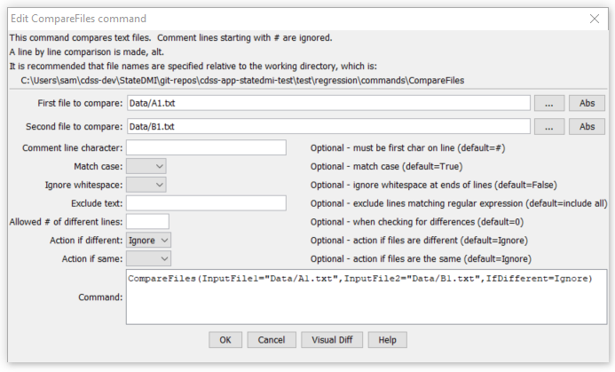

# StateDMI / Command / CompareFiles #

* [Overview](#overview)
* [Command Editor](#command-editor)
* [Command Syntax](#command-syntax)
* [Examples](#examples)
* [Troubleshooting](#troubleshooting)
* [See Also](#see-also)

-------------------------

## Overview ##

The `CompareFiles` command
compares text files to determine data differences.
For example, the command can be used to compare old and new files produced by a software process.

Each line in the file is compared.
By default, lines beginning with # are treated as comment lines and are ignored
(see `CommentLineChar` to specify the comment indicator).  Therefore, only non-comment lines are compared.
Differences and simple statistics are printed to the log file.
A warning can be generated if a difference is detected or if no differences are detected.

## Command Editor ##

The following dialog is used to edit the command and illustrates the command syntax.

**<p style="text-align: center;">

</p>**

**<p style="text-align: center;">
`CompareFiles` Command Editor (<a href="../CompareFiles.png">see also the full-size image</a>)
</p>**

## Command Syntax ##

The command syntax is as follows:

```text
CompareFiles(Parameter="Value",...)
```
**<p style="text-align: center;">
Command Parameters
</p>**

| **Parameter**&nbsp;&nbsp;&nbsp;&nbsp;&nbsp;&nbsp;&nbsp;&nbsp;&nbsp;&nbsp;&nbsp;&nbsp;&nbsp;&nbsp; | **Description** | **Default**&nbsp;&nbsp;&nbsp;&nbsp;&nbsp;&nbsp;&nbsp;&nbsp;&nbsp;&nbsp; |
| --------------|-----------------|----------------- |
| `InputFile1`<br>**required** | The name of the first file to read.  Enclose the name in double quotes to protect whitespace and special characters. | None – the file name is required. |
| `InputFile2`<br>**required** | The name of the second file to read.  Enclose the name in double quotes to protect whitespace and special characters. | None – the file name is required. |
| `CommentLineChar` | The character(s) that if found at the start of a line indicate comment lines.  Comment lines are ignored in the comparison because they typically may include information such as date/time that changes even if the remainder of the file contents are the same. | `#` |
| `WarnIfDifferent` | If True and at least one difference is detected, a warning will be generated by the command, which will result in software like TSTool displaying a warning.  If False, only status messages are written to the log file.  The warning is useful if it is critical to detect any difference in the files. | Do not generate a warning if the files are different.  Differences are printed to the log file. |
| `WarnIfSame` | If True and no differences are detected, a warning will be generated by the command, which will result in software like TSTool displaying a warning.  If False, only status messages are written to the log file.  The warning is useful if it is critical to detect files that are the same. | Do not generate a warning if the files are the same. |

## Examples ##

See the [automated tests](https://github.com/OpenCDSS/cdss-app-statedmi-test/tree/master/test/regression/commands/CompareFiles).

The following example illustrates how two files can be compared.  For example, use similar commands to compare results from two model runs, two database queries, or when testing software:

```
CompareFiles(InputFile1="Data/A1.txt",InputFile2="Data/B1.txt",WarnIfDifferent=True)
```

## Troubleshooting ##

## See Also ##

