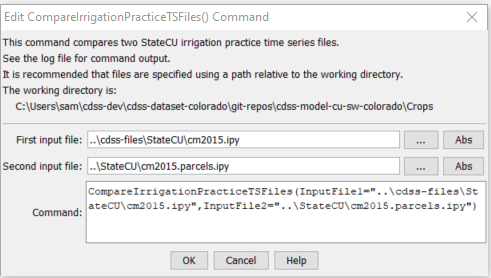

# StateDMI / Command / CompareIrrigationPracticeTSFiles #

* [Overview](#overview)
* [Command Editor](#command-editor)
* [Command Syntax](#command-syntax)
* [Examples](#examples)
* [Troubleshooting](#troubleshooting)
* [See Also](#see-also)

-------------------------

## Overview ##

The `CompareIrrigationPracticeTSFiles` command (for StateCU)
compares two StateCU irrigation practice time series files (`*.ipy`) to determine data differences.
Time series values are formatted as strings using the precision and are checked for differences.
The list of objects from the first file is used as the "master".
Currently, CU Locations and crops at a location that are found in the second file
but are not in the first are ignored.

Output is printed to the log file.

## Command Editor ##

The following dialog is used to edit the command and illustrates the command syntax.

**<p style="text-align: center;">

</p>**

**<p style="text-align: center;">
`CompareIrrigationPracticeTSFiles` Command Editor (<a href="../CompareIrrigationPracticeTSFiles.png">see also the full-size image</a>)
</p>**

## Command Syntax ##

The command syntax is as follows:

```text
CompareIrrigationPracticeTSFiles(Parameter="Value",...)
```
**<p style="text-align: center;">
Command Parameters
</p>**

| **Parameter**&nbsp;&nbsp;&nbsp;&nbsp;&nbsp;&nbsp;&nbsp;&nbsp;&nbsp;&nbsp;&nbsp;&nbsp;&nbsp;&nbsp; | **Description** | **Default**&nbsp;&nbsp;&nbsp;&nbsp;&nbsp;&nbsp;&nbsp;&nbsp;&nbsp;&nbsp; |
| --------------|-----------------|----------------- |
| `InputFile1`<br>**required** | The name of the first file to read. | None – must be specified. |
| `InputFile2`<br>**required** | The name of the second file to read. | None – must be specified. |
| `Precision` | The number of digits after the decimal point to compare for crop area values. Higher precision will result in more differences. The precision for efficiency values always defaults to `2`. | `3` |

## Examples ##

See the [automated tests](https://github.com/OpenCDSS/cdss-app-statedmi-test/tree/master/test/regression/commands/CompareIrrigationPracticeTSFiles).

## Troubleshooting ##

[See the main troubleshooting documentation](../../troubleshooting/troubleshooting.md)

## See Also ##

* [`CompareCropPatternTSFiles`](../CompareCropPatternTSFiles/CompareCropPatternTSFiles.md) command
* [`CompareFiles`](../CompareFiles/CompareFiles.md) command
