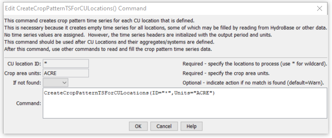

# StateDMI / Command / CreateCropPatternTSForCULocations #

* [Overview](#overview)
* [Command Editor](#command-editor)
* [Command Syntax](#command-syntax)
* [Examples](#examples)
* [Troubleshooting](#troubleshooting)
* [See Also](#see-also)

-------------------------

## Overview ##

The `CreateCropPatternTSForCULocations` command (for StateCU)
creates empty crop pattern time series for each CU Location.
This is necessary to ensure that the crop pattern time series are in the same order as
the CU locations and that lists of crop pattern time series are initialized for each location.

## Command Editor ##

The following dialog is used to edit the command and illustrates the command syntax.

**<p style="text-align: center;">

</p>**

**<p style="text-align: center;">
`CreateCropPatternTSForCULocations` Command Editor (<a href="../CreateCropPatternTSForCULocations.png">see also the full-size image</a>)
</p>**

## Command Syntax ##

The command syntax is as follows:

```text
CreateCropPatternTSForCULocations(Parameter="Value",...)
```
**<p style="text-align: center;">
Command Parameters
</p>**

| **Parameter**&nbsp;&nbsp;&nbsp;&nbsp;&nbsp;&nbsp;&nbsp;&nbsp;&nbsp;&nbsp;&nbsp;&nbsp; | **Description** | **Default**&nbsp;&nbsp;&nbsp;&nbsp;&nbsp;&nbsp;&nbsp;&nbsp;&nbsp;&nbsp; |
| --------------|-----------------|----------------- |
| `ID` | A single CU Location identifier to match or a pattern using wildcards (e.g., `20*`). | None – must be specified `*` |
| `Units` | The units for crop area time series. | `ACRE` |
| `IfNotFound` | Used for error handling, one of the following:<ul><li>`Fail` – generate a failure message if the ID is not matched</li><li>`Ignore` – ignore (don’t add and don’t generate a message) if the ID is not matched</li><li>`Warn` – generate a warning message if the ID is not matched</li></ul> | `Warn` |

## Examples ##

See the [automated tests](https://github.com/OpenCDSS/cdss-app-statedmi-test/tree/master/test/regression/commands/CreateCropPatternTSForCULocations).

The following command file illustrates how to create a crop pattern time series file:

```
# Step 1 - Set output period and read CU locations
SetOutputPeriod(OutputStart="1950",OutputEnd="2006")
ReadCULocationsFromStateCU(InputFile="..\StateCU\cm2006.str")
# Step 2 - Read SW aggregates
SetDiversionSystemFromList(ListFile="colorado_divsys.csv",IDCol=1,NameCol=2,PartIDsCol=3,PartsListedHow=InRow)
SetDiversionAggregateFromList(ListFile="colorado_agg.csv",IDCol=1,NameCol=2,PartIDsCol=3,PartsListedHow=InRow)
# Step 3 - Create *.cds file form and read acreage/crops from HydroBase
CreateCropPatternTSForCULocations(ID="*",Units="ACRE")
ReadCropPatternTSFromHydroBase(ID="*")
# Step 4 - Need to translate crops out of HB to include TR21 suffix
# Translate all crops from HB to include .TR21 suffix
TranslateCropPatternTS(ID="*",OldCropType="GRASS_PASTURE",NewCropType="GRASS_PASTURE.TR21")
TranslateCropPatternTS(ID="*",OldCropType="CORN_GRAIN",NewCropType="CORN_GRAIN.TR21")
TranslateCropPatternTS(ID="*",OldCropType="ALFALFA",NewCropType="ALFALFA.TR21")
TranslateCropPatternTS(ID="*",OldCropType="SMALL_GRAINS",NewCropType="SPRING_GRAIN.TR21")
TranslateCropPatternTS(ID="*",OldCropType="VEGETABLES",NewCropType="VEGETABLES.TR21")
TranslateCropPatternTS(ID="*",OldCropType="ORCHARD_WO_COVER",NewCropType="ORCHARD_WO_COVER.TR21")
TranslateCropPatternTS(ID="*",OldCropType="ORCHARD_WITH_COVER",NewCropType="ORCHARD_WITH_COVER.TR21")
TranslateCropPatternTS(ID="*",OldCropType="DRY_BEANS",NewCropType="DRY_BEANS.TR21")
TranslateCropPatternTS(ID="*",OldCropType="GRAPES",NewCropType="GRAPES.TR21")
TranslateCropPatternTS(ID="*",OldCropType="WHEAT",NewCropType="SPRING_GRAIN.TR21")
TranslateCropPatternTS(ID="*",OldCropType="SUNFLOWER",NewCropType="SPRING_GRAIN.TR21")
TranslateCropPatternTS(ID="*",OldCropType="SOD_FARM",NewCropType="GRASS_PASTURE.TR21")
# Step 5 - Translate crop names
# use high-altitude coefficients for structures with more than 50% of
# irrigated acreage above 6500 feet
TranslateCropPatternTS(ListFile="cm2005_HA.lst",IDCol=1,OldCropType="GRASS_PASTURE.TR21",NewCropType="GRASS_PASTURE.DWHA")
# Step 6 - Fill Acreage
#      Fill SW structure acreage backword from 1999 to 1950
#      Fill acreage forward for all structures from 2000 to 2006
FillCropPatternTSRepeat(ID="*",CropType="*",FillStart=1950,FillEnd=1993,FillDirection=Backward)
FillCropPatternTSRepeat(ID="*",CropType="*",FillStart=1993,FillEnd=1999,FillDirection=Forward)
FillCropPatternTSRepeat(ID="*",CropType="*",FillStart=2000,FillEnd=2006,FillDirection=Forward)
# Step 7 - Write final *.cds file
WriteCropPatternTSToStateCU(OutputFile="..\StateCU\cm2006.cds",WriteCropArea=True,WriteHow=OverwriteFile)
# Check the results
CheckCropPatternTS(ID="*")
WriteCheckFile(OutputFile="cm2006.cds.StateDMI.check.html")
```

## Troubleshooting ##

## See Also ##

* [`CreateIrrigationPracticeTSForCULocations`](../CreateIrrigationPracticeTSForCULocations/CreateIrrigationPracticeTSForCULocations.md) command
