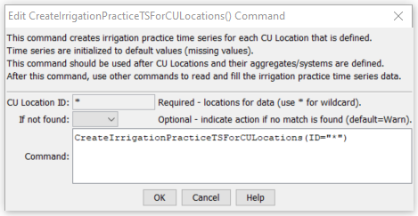

# StateDMI / Command / CreateIrrigationPracticeTSForCULocations #

* [Overview](#overview)
* [Command Editor](#command-editor)
* [Command Syntax](#command-syntax)
* [Examples](#examples)
* [Troubleshooting](#troubleshooting)
* [See Also](#see-also)

-------------------------

## Overview ##

The `CreateIrrigationPracticeTSForCULocations` command (for StateCU)
creates empty irrigation practice time series for each CU Location.
This ensures that the irrigation practice time series will be in the same order as the CU
locations initializes the time series with missing data values that can be filled with other commands.

## Command Editor ##

The following dialog is used to edit the command and illustrates the command syntax.

**<p style="text-align: center;">

</p>**

**<p style="text-align: center;">
`CreateIrrigationPracticeTSForCULocations` Command Editor (<a href="../CreateIrrigationPracticeTSForCULocations.png">see also the full-size image</a>)
</p>**

## Command Syntax ##

The command syntax is as follows:

```text
CreateIrrigationPracticeTSForCULocations(Parameter="Value",...)
```
**<p style="text-align: center;">
Command Parameters
</p>**

| **Parameter**&nbsp;&nbsp;&nbsp;&nbsp;&nbsp;&nbsp;&nbsp;&nbsp;&nbsp;&nbsp;&nbsp;&nbsp; | **Description** | **Default**&nbsp;&nbsp;&nbsp;&nbsp;&nbsp;&nbsp;&nbsp;&nbsp;&nbsp;&nbsp; |
| --------------|-----------------|----------------- |
| `ID` | A single CU Location identifier to match or a pattern using wildcards (e.g., `20*`). | None – must be specified as * |
| `IfNotFound` | Used for error handling, one of the following:<ul><li>`Fail` – generate a failure message if the ID is not matched</li><li>`Ignore` – ignore (don’t add and don’t generate a message) if the ID is not matched</li><li>`Warn` – generate a warning message if the ID is not matched</li></ul> | `Warn` |

## Examples ##

See the [automated tests](https://github.com/OpenCDSS/cdss-app-statedmi-test/tree/master/test/regression/commands/CreateIrrigationPracticeTSForCULocations).

## Troubleshooting ##

## See Also ##

* [`CreateCropPatternTSForCULocations`](../CreateCropPatternTSForCULocations/CreateCropPatternTSForCULocations.md) command
