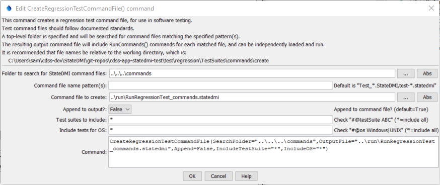

# StateDMI / Command / CreateRegressionTestCommandFile #

* [Overview](#overview)
* [Command Editor](#command-editor)
* [Command Syntax](#command-syntax)
* [Examples](#examples)
* [Troubleshooting](#troubleshooting)
* [See Also](#see-also)

-------------------------

## Overview ##

The `CreateRegressionTestCommandFile` command
is used for software testing (or certification of processes used in operations) and creates
a command file that includes a
[`StartRegressionTestResultsReport`](../StartRegressionTestResultsReport/StartRegressionTestResultsReport.md) and multiple
[`RunCommands`](../RunCommands/RunCommands.md) commands.
A starting search folder is provided and all files that match the given pattern
(by convention `Test_*.StateDMI` and `test-*.statedmi, ignoring case) are assumed to be command files that can be run to test the software.
The resulting command file is a test suite comprised of all the
individual tests and can be used to verify software before release.
The goal is to have all tests pass before software release.

The following table lists comment annotations that can be placed in
[`#` comments](../Comment/Comment.md) in command files to provide information for testing, for example:

```
#@expectedStatus Failure
```

**<p style="text-align: center;">
Command # Comment Annotations
</p>**

| **Parameter**&nbsp;&nbsp;&nbsp;&nbsp;&nbsp;&nbsp;&nbsp;&nbsp;&nbsp;&nbsp;&nbsp;&nbsp;&nbsp;&nbsp;&nbsp;&nbsp;&nbsp;&nbsp;&nbsp;&nbsp;&nbsp;&nbsp;&nbsp;&nbsp;&nbsp;&nbsp;&nbsp;&nbsp;&nbsp;&nbsp;&nbsp;&nbsp;&nbsp;&nbsp;&nbsp;&nbsp;&nbsp;&nbsp; | **Description** |
| -- | -- |
| `@enabled False` | Used to disable a command file.  For example, use this annotation in a test command file when the test is not ready for use in the software release process and don't want to see a failed test in results. |
| `@expectedStatus Failure`<br>`@expectedStatus Warning` | The [`RunCommands`](../RunCommands/RunCommands.md) command by default assumes that the most severe status for a command file should be `Success`.  However, a different status can be specified if it is expected that a command file will result in `Warning` or `Failure` and still be a successful test.  For example, if a command is obsolete and should generate a failure, the expected status can be specified as `Failure` and the test will pass.  Another example is to test that the software properly treats a missing file as a failure, which is the expected behavior. |
| `@os Windows`<br>`@os UNIX` | The test is designed to work only on the specified platform and will be included in the test suite only if the IncludeOS parameter includes the corresponding operating system (OS) type.  This is primarily used to test specific features of the OS and similar but separate test cases should be implemented for both OS types.  If the OS type is not specified as a comment annotation in a command file, the test is always included (see also the handling of included test suites). |
|`@require application StateDMI >= Version`<br><br>Available since StateDMI 5.00.06 | Check that the software application version meets requirements for the command file. This can be used to prevent running the command file with incompatible software. The version should match the format shown in ***Help / About StateDMI*** (e.g., `5.00.05`). <ul><li>For interactive session (when command file is run individually), fail if a requirement is not met.</li><li>When running tests that use [`RunCommands(IfRequirementsNotMet=Fail)`](../RunCommands/RunCommands.md), which is the default when tests are processed with `CreateRegressionTestCommandFile`, command files that don't meet requirements are not run but are listed in output.</li></ul>The comparison operator can be:<ul><li>`<` (less than)</li><li>`<=` (less than or equal)</li><li>`=` or `==` (equal)</li><li>`!=` (not equal)</li><li>`>` (greater than)</li><li>`>=` (greater than or equal)</li></ul> |
|`@require datastore HydroBase >= Version`<br><br>Available since StateDMI 5.00.06 | Check that the datastore version meets requirements for the command file. This can be used to prevent running the command file with incompatible database. The version should match the format used in the HydroBase database name shown in ***View / Datastores*** (e.g., `20200720`). See above for behavior when requirements are not met and available comparison operators. |
| `@testSuite ABC` | Indicate that the command file should be considered part of the specified test suite, as specified with the IncludeTestSuite parameter.  The test is included in all test collections if the comment annotation is not specified; therefore, for general tests, do not specify a test suite.  This comment annotation is useful if a group of tests require special setup, for example connecting to a database.  The suite names should be decided upon by the test developer. |

## Command Editor ##

The following dialog is used to edit the command and illustrates the command syntax.

**<p style="text-align: center;">

</p>**

**<p style="text-align: center;">
`CreateRegressionTestCommandFile` Command Editor (<a href="../CreateRegressionTestCommandFile.png">see also the full-size image</a>)
</p>**

## Command Syntax ##

The command syntax is as follows:

```text
CreateRegressionTestCommandFile(Parameter="Value",...)
```
**<p style="text-align: center;">
Command Parameters
</p>**

| **Parameter**&nbsp;&nbsp;&nbsp;&nbsp;&nbsp;&nbsp;&nbsp;&nbsp;&nbsp;&nbsp;&nbsp;&nbsp;&nbsp;&nbsp;&nbsp;&nbsp;&nbsp;&nbsp;&nbsp;&nbsp; | **Description** | **Default**&nbsp;&nbsp;&nbsp;&nbsp;&nbsp;&nbsp;&nbsp;&nbsp;&nbsp;&nbsp;&nbsp;&nbsp;&nbsp;&nbsp;&nbsp;&nbsp; |
| --------------|-----------------|----------------- |
| `SearchFolder` | The folder to search for regression test command files.  All subfolders will also be searched. | None – must be specified. |
| `OutputFile` | The name of the command file to create, enclosed in double quotes if the file contains spaces or other special characters.  A path relative to the command file containing this command can be specified. | None – must be specified. |
| `SetupCommandFile` | The name of a StateDMI command file that supplies setup commands, and which will be prepended to output.  Use such a file to open database connections and set other global settings that apply to the entire test run. | Do not include setup commands. |
| `FilenamePattern` | Pattern for StateDMI command files, using wildcards. | `Test_*.StateDMI` |
| `Append` | Indicate whether to append to the output file (`True`) or overwrite (`False`).  This allows multiple directory trees to be searched for tests, where the first command typically specifies False and additional commands specify `True`. | `True` |
| `IncludeTestSuite` | If *, all tests that match `FilenamePattern` and `IncludeOS` are included.  If a test suite is specified, only include tests that have `@testSuite` comment annotation values that match a value in `IncludeTestSuite`.  One or more comment annotations can be specified, separated by commas. | `*` – include all test cases. |
| `IncludeOS` | If *, all tests that match `FilenamePattern` and `IncludeTestSuite` are included.  If an OS is specified, only include tests that have @os comment annotation values that match a value in `IncludeTestSuite`.  This comment annotation is typically specified once or not at all. | `*` – include all test cases. |

## Examples ##

See the [automated tests](https://github.com/OpenCDSS/cdss-app-statedmi-test/tree/master/test/regression/commands/CreateRegressionTestCommandFile).

See the [`RunCommands`](../RunCommands/RunCommands.md) documentation for how to set up a regression test.
The following command file illustrates how to create a regression test suite.

```
CreateRegressionTestCommandFile(SearchFolder="..\..\..\commands\general",OutputFile="..\run\RunRegressionTest_commands_general.StateDMI",Append=False)
```

An example of the output file from running the tests is as follows (for StateDMI 5.00.06 and later):

```
# File generated by...
# program:      StateDMI 5.00.06.dev (2021-01-05)
# user:         sam
# date:         Wed Jan 06 00:58:28 America/Denver 2021
# host:         RoaringFork
# directory:    C:\Users\sam\cdss-dev\StateDMI\git-repos\cdss-app-statedmi-test\test\regression\TestSuites\commands\run
# command line: StateDMI
#  -home test\operational\CDSS
#
# Command file regression test report from StartRegressionTestResultsReport() and RunCommands()
#
# Explanation of columns:
#
# Num: count of the tests
# Enabled:
#    TRUE (blank) if test enabled (default).
#    FALSE if "#@enabled false" in command file.
#    FALSE-REQ if "#@require" conditions not met for command file.
# Requirements Met (see "#@require " in command file):
#    TRUE (blank) if command file requirements are met.
#    FALSE if command file requirements are not met.
#      Command files are not run because RunCommands(IfRequirementsNotMet=Ignore) and do not count as PASS or FAIL.
# Run Time: run time in milliseconds
# Test Pass/Fail:
#    PASS if the test failed (or blank if disabled).
#      A test will pass if the command file actual status matches the expected status.
#    FAIL if the test failed.
#      Search for *FAIL* to find failed tests.
#    Blank if disabled.
#      Disabled tests are not run and do not count as PASS or FAIL.
#      Tests with requirements that are not OK are usually ignored and do not count as PASS or FAIL.
# Commands Expected Status:
#    Default is assumed to be SUCCESS.
#    "#@expectedStatus Warning|Failure" comment in command file overrides default.
# Commands Actual Status:
#    The most severe status (Success|Warning|Failure) for each command file.
#
#    |         |            |Test  |Commands  |Commands   |
#    |         |Requirements|Pass/ |Expected  |Actual     |
# Num|Enabled  |Met         |Fail  |Status    |Status     |Command File
#----+---------+------------+------+----------+-----------+---------------------------------------------------------------------------------------------
    1|         |            | PASS |SUCCESS   |SUCCESS    |C:\Users\sam\cdss-dev\StateDMI\git-repos\cdss-app-statedmi-test\test\regression\commands\AggregateWellRights\Test_AggregateWellRights_rg2007part.StateDMI
    2|         |            | PASS |SUCCESS   |SUCCESS    |C:\Users\sam\cdss-dev\StateDMI\git-repos\cdss-app-statedmi-test\test\regression\commands\AppendNetwork\Test_AppendNetwork_AppendHow=ReplaceUpstreamOfDownstream.StateDMI
    ...
   12|         |            |*FAIL*|WARNING   |FAILURE    |C:\Users\sam\cdss-dev\StateDMI\git-repos\cdss-app-statedmi-test\test\regression\commands\CalculateStreamEstimateCoefficients\Test_CalculateStreamEstimateCoefficents_cm2005.StateDMI
    ...
  151|FALSE    |            |      |SUCCESS   |UNKNOWN    |C:\Users\sam\cdss-dev\StateDMI\git-repos\cdss-app-statedmi-test\test\regression\commands\FormatTableString\Test_FormatTableString_DefaultWidth.StateDMI
    ...
  327|FALSE-REQ|FALSE       |      |SUCCESS   |FAILURE    |C:\Users\sam\cdss-dev\StateDMI\git-repos\cdss-app-statedmi-test\test\regression\commands\RunCommands\test-RunCommands-require-app-version-fail0.xxx
    ...
#----+---------+------------+------+----------+-----------+-------------------------------------------------------------------------------------------------------------
FAIL count                            =    63, 10.145%
PASS count                            =   550, 88.567%
Disabled (@enabled False) count       =     7, 1.127%
Disabled (requirements not met) count =     1, 0.161%
#---------------------------------------------------------------------
Total                                 =   621
```

An example of the output file from running the tests is as follows (for older StateDMI version):

```
# File generated by...
# program:      StateDMI 3.08.02 (2009-09-29)
# user:         sam
# date:         Wed Sep 30 13:26:41 MDT 2009
# host:         SOPRIS
# directory:    C:\Develop\StateDMI_SourceBuild\StateDMI\test\regression\TestSuites\commands\run
# command line: StateDMI
#
# The test status below may be PASS or FAIL.
# A test can pass even if the command file actual status is FAILURE, if failure is expected.
#     Test   Commands   Commands
#     Pass/  Expected   Actual
# Num Fail   Status     Status     Command File
#---------------------------------------------------------------------
   1  PASS   SUCCESS    SUCCESS    C:\Develop\StateDMI_SourceBuild\StateDMI\test\regression\commands\AggregateWellRights\Test_AggregateWellRights_rg2007part.StateDMI
   2  PASS   SUCCESS    SUCCESS    C:\Develop\StateDMI_SourceBuild\StateDMI\test\regression\commands\CalculateDiversionDemandTSMonthly\Test_CalculateDiversionDemandTSMonthly.StateDMI
   3  PASS   SUCCESS    SUCCESS    C:\Develop\StateDMI_SourceBuild\StateDMI\test\regression\commands\CalculateDiversionDemandTSMonthlyAsMax\Test_CalculateDiversionDemandTSMonthlyAsMax.StateDMI
   4  PASS   SUCCESS    SUCCESS    C:\Develop\StateDMI_SourceBuild\StateDMI\test\regression\commands\CalculateDiversionStationEfficiencies\Test_CalculateDiversionStationEfficiencies.StateDMI
   5  PASS   warning    WARNING    C:\Develop\StateDMI_SourceBuild\StateDMI\test\regression\commands\CalculateStreamEstimateCoefficients\Test_CalculateStreamEstimateCoefficents_cm2005.StateDMI
   6  PASS   warning    WARNING    C:\Develop\StateDMI_SourceBuild\StateDMI\test\regression\commands\CalculateStreamEstimateCoefficients\Test_CalculateStreamEstimateCoefficients_gm2004.StateDMI
   7  PASS   warning    WARNING    C:\Develop\StateDMI_SourceBuild\StateDMI\test\regression\commands\CalculateStreamEstimateCoefficients\Test_CalculateStreamEstimateCoefficients_rg2007.StateDMI
```

## Troubleshooting ##

[See the main troubleshooting documentation](../../troubleshooting/troubleshooting.md)

## See Also ##

* [`#` comment](../Comment/Comment.md) command
* [`StartRegressionTestResultsReport`](../StartRegressionTestResultsReport/StartRegressionTestResultsReport.md) command
* [`RunCommands`](../RunCommands/RunCommands.md) command
