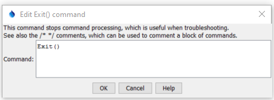

# StateDMI / Command / Exit #

* [Overview](#overview)
* [Command Editor](#command-editor)
* [Command Syntax](#command-syntax)
* [Examples](#examples)
* [Troubleshooting](#troubleshooting)
* [See Also](#see-also)

-------------------------

## Overview ##

The `Exit` command
can be inserted anywhere in a command file and causes the processing of commands to stop at that line.
This is useful for temporarily processing a subset of a long list of commands.
Multi-line comments (`/*   */`) can also be used to temporarily disable one or more commands.
It may also useful to add an `Exit` command at the end of the file so that it is easy to insert
commands above this command when the end line is selected (rather than having to deselect all commands when editing).

In the future the command may be enhanced to have parameters that more explicitly control processing shut-down.

## Command Editor ##

The following dialog is used to edit the command and illustrates the command syntax.

**<p style="text-align: center;">

</p>**

**<p style="text-align: center;">
`Exit` Command Editor (<a href="../Exit.png">see also the full-size image</a>)
</p>**

## Command Syntax ##

The command syntax is as follows:

```text
Exit(Parameter="Value",...)
```
**<p style="text-align: center;">
Command Parameters
</p>**

| **Parameter**&nbsp;&nbsp;&nbsp;&nbsp;&nbsp;&nbsp;&nbsp;&nbsp;&nbsp;&nbsp;&nbsp;&nbsp; | **Description** | **Default**&nbsp;&nbsp;&nbsp;&nbsp;&nbsp;&nbsp;&nbsp;&nbsp;&nbsp;&nbsp; |
| --------------|-----------------|----------------- |
| | There are currently no command parameters. | |

## Examples ##

See the [automated tests](https://github.com/OpenCDSS/cdss-app-statedmi-test/tree/master/test/regression/commands/Exit).

## Troubleshooting ##

[See the main troubleshooting documentation](../../troubleshooting/troubleshooting.md)

## See Also ##

There are no additional related commands.