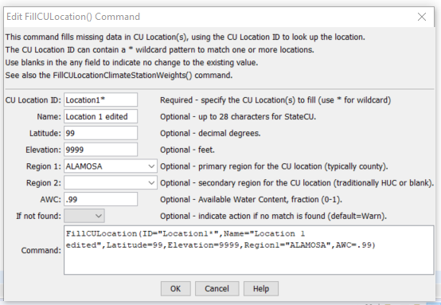

# StateDMI / Command / FillCULocation #

* [Overview](#overview)
* [Command Editor](#command-editor)
* [Command Syntax](#command-syntax)
* [Examples](#examples)
* [Troubleshooting](#troubleshooting)
* [See Also](#see-also)

-------------------------

## Overview ##

The `FillCULocation` command (for StateMod)
fills missing data in existing CU Locations.

## Command Editor ##

The following dialog is used to edit the command and illustrates the command syntax.

**<p style="text-align: center;">

</p>**

**<p style="text-align: center;">
`FillCULocation` Command Editor (<a href="../FillCULocation.png">see also the full-size image</a>)
</p>**

## Command Syntax ##

The command syntax is as follows:

```text
FillCULocation(Parameter="Value",...)
```
**<p style="text-align: center;">
Command Parameters
</p>**

| **Parameter**&nbsp;&nbsp;&nbsp;&nbsp;&nbsp;&nbsp;&nbsp;&nbsp;&nbsp;&nbsp;&nbsp;&nbsp; | **Description** | **Default**&nbsp;&nbsp;&nbsp;&nbsp;&nbsp;&nbsp;&nbsp;&nbsp;&nbsp;&nbsp; |
| --------------|-----------------|----------------- |
| `ID` | A single CU Location identifier to match or a pattern using wildcards (e.g., `20*`). | None – must be specified. |
| `Name` | The name to be assigned for matching locations. | If not specified, the original value will remain. |
| `Latitude` | The latitude to be assigned for all matching CU Locations with missing latitude. | If not specified, the original value will remain. |
| `Elevation` | The elevation to be assigned for matching locations. | If not specified, the original value will remain. |
| `Region1` | The Region1 to be assigned for all matching CU Locations with missing `Region1`. | If not specified, the original value will remain. |
| `Region2` | The Region2 to be assigned for all matching CU Locations with missing `Region2`. | If not specified, the original value will remain. |
| `AWC` | The available water content (AWC)  to be assigned for all matching CU Locations with missing AWC. | If not specified, the original value will remain. |
| `IfNotFound` | Used for error handling, one of the following:<ul><li>`Fail` – generate a failure message if the ID pattern is not matched</li><li>`Ignore` – ignore (don’t generate a message) if the ID pattern is not matched</li><li>`Warn` – generate a warning message if the ID pattern is not matched</li></ul> | `Warn` |

## Examples ##

See the [automated tests](https://github.com/OpenCDSS/cdss-app-statedmi-test/tree/master/test/regression/commands/FillCULocation).

## Troubleshooting ##

## See Also ##

* [`FillCULocationClimateStationWeights`](../FillCULocationClimateStationWeights/FillCULocationClimateStationWeights.md) command
* [`FillCULocationsFromHydroBase`](../FillCULocationsFromHydroBase/FillCULocationsFromHydroBase.md) command
* [`FillCULocationsFromList`](../FillCULocationsFromList/FillCULocationsFromList.md) command
* [`SetCULocation`](../SetCULocation/SetCULocation.md) command
* [`SetCULocationClimateStationWeights`](../SetCULocationClimateStationWeights/SetCULocationClimateStationWeights.md) command
* [`SetCULocationClimateStationWeightsFromHydroBase`](../SetCULocationClimateStationWeightsFromHydroBase/SetCULocationClimateStationWeightsFromHydroBase.md) command
* [`SetCULocationClimateStationWeightsFromList`](../SetCULocationClimateStationWeightsFromList/SetCULocationClimateStationWeightsFromList.md) command
