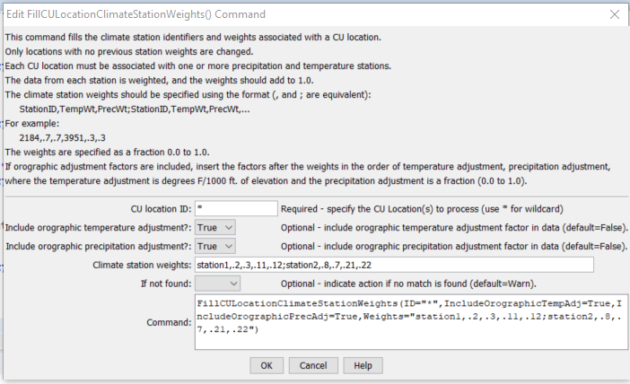

# StateDMI / Command / FillCULocationClimateStationWeights #

* [Overview](#overview)
* [Command Editor](#command-editor)
* [Command Syntax](#command-syntax)
* [Examples](#examples)
* [Troubleshooting](#troubleshooting)
* [See Also](#see-also)

-------------------------

## Overview ##

The `FillCULocationClimateStationWeights` command (for StateCU)
fills climate station weights data in existing CU Locations.
Only locations that have no climate stations assigned will be modified.

## Command Editor ##

The following dialog is used to edit the command and illustrates the command syntax.

**<p style="text-align: center;">

</p>**

**<p style="text-align: center;">
`FillCULocationClimateStationWeights` Command Editor (<a href="../FillCULocationClimateStationWeights.png">see also the full-size image</a>)
</p>**

## Command Syntax ##

The command syntax is as follows:

```text
FillCULocationClimateStationWeights(Parameter="Value",...)
```
**<p style="text-align: center;">
Command Parameters
</p>**

| **Parameter**&nbsp;&nbsp;&nbsp;&nbsp;&nbsp;&nbsp;&nbsp;&nbsp;&nbsp;&nbsp;&nbsp;&nbsp;&nbsp;&nbsp;&nbsp;&nbsp;&nbsp;&nbsp;&nbsp;&nbsp;&nbsp;&nbsp;&nbsp;&nbsp;&nbsp;&nbsp;&nbsp;&nbsp;&nbsp;&nbsp;&nbsp;&nbsp;&nbsp;&nbsp; | **Description** | **Default**&nbsp;&nbsp;&nbsp;&nbsp;&nbsp;&nbsp;&nbsp;&nbsp;&nbsp;&nbsp; |
| --------------|-----------------|----------------- |
| `ID` | A single CU Location identifier to match or a pattern using wildcards (e.g., `20*`). | None – must be specified. |
| `IncludeOrographicTempAdj` | If `True`, include the orographic temperature adjustment factor, after the Weights described below, specified as degrees/1000 feet. | `False` |
| `IncludeOrographicPrecAdj` | If `True`, include the orographic precipitation adjustment factor, after the Weights described below, specified as a fraction `0.0` to `1.0`.  Place after the orographic temperature adjustment factor if it is specified. | `False` |
| `Weights` | A repeating pattern of `StationID,TempWt,PrecWt`, where the station identifiers match climate station identifiers and the weights are specified as fractions in the range `0.0` to `1.0`.  Also include the orographic temperature and/or orographic precipitation adjustment factors if the above parameters are `True`. | None – must be specified. |
| `IfNotFound` | Used for error handling, one of the following:<ul><li>`Fail` – generate a failure message if the ID pattern is not matched</li><li>`Ignore` – ignore (don’t generate a message) if the ID pattern is not matched</li><li>`Warn` – generate a warning message if the ID pattern is not matched</li></ul> | `Warn` |

## Examples ##

See the [automated tests](https://github.com/OpenCDSS/cdss-app-statedmi-test/tree/master/test/regression/commands/FillCULocationClimateStationWeights).

An example command file is shown below:

```
ReadCULocationsFromList(ListFile="cmstrlist.csv",IDCol=1,NameCol=6)
FillCULocationsFromHydroBase(ID="*",CULocType=Structure,Region1Type=County,Region2Type=HUC)
SetCULocationsFromList(ListFile="cmstrlist.csv",IDCol=1,LatitudeCol=2,AWCCol=11)
SetCULocationsFromList(ListFile="plateau.csv",IDCol=1,Region1Col=2)
SetCULocationClimateStationWeightsFromList(ListFile="cowts.csv",StationIDCol=1,Region1Col=2,Region2Col=3,TempWtCol=4,PrecWtCol=5)
FillCULocationClimateStationWeights(ID="72_ADC065",Weights="3146,0.68,0.68,3489,0.32,0.32")
FillCULocationClimateStationWeights(ID="36*",Weights="4664,1.0,0,3592,0,1.0")
FillCULocationClimateStationWeights(ID="37*",Weights="2454,1.0,1.0")
FillCULocationClimateStationWeights(ID="38*",Weights="3359,1.0,1.0")
FillCULocationClimateStationWeights(ID="39*",Weights="7031,1.0,1.0")
FillCULocationClimateStationWeights(ID="45*",Weights="7031,1.0,1.0")
FillCULocationClimateStationWeights(ID="50*",Weights="3500,0.5,0.5,4664,0.5,0.5")
FillCULocationClimateStationWeights(ID="51*",Weights="3500,0.5,0.5,4664,0.5,0.5")
FillCULocationClimateStationWeights(ID="52*",Weights="9265,1.0,1.0")
FillCULocationClimateStationWeights(ID="53*",Weights="9265,1.0,1.0")
FillCULocationClimateStationWeights(ID="70*",Weights="0214,1.0,1.0")
FillCULocationClimateStationWeights(ID="72*",Weights="1741,1.0,1.0")
FillCULocationClimateStationWeights(ID="950001",Weights="3146,0.68,0.68,3489,0.32,0.32")
FillCULocationClimateStationWeights(ID="950010",Weights="7031,1.0,1.0")
FillCULocationClimateStationWeights(ID="950011",Weights="7031,1.0,1.0")
FillCULocationClimateStationWeights(ID="950050",Weights="3146,0.68,0.68,3489,0.32,0.32")
WriteCULocationsToStateCU(OutputFile="cm2006.str",WriteHow=OverwriteFile)
# Check the results
CheckCULocations(ID="*")
WriteCheckFile(OutputFile="cm2006.str.check.html")
```

## Troubleshooting ##

## See Also ##

* [`FillCULocation`](../FillCULocation/FillCULocation.md) command
* [`SetCULocation`](../SetCULocation/SetCULocation.md) command
* [`SetCULocationClimateStationWeights`](../SetCULocationClimateStationWeights/SetCULocationClimateStationWeights.md) command
* [`SetCULocationClimateStationWeightsFromHydroBase`](../SetCULocationClimateStationWeightsFromHydroBase/SetCULocationClimateStationWeightsFromHydroBase.md) command
* [`SetCULocationClimateStationWeightsFromList`](../SetCULocationClimateStationWeightsFromList/SetCULocationClimateStationWeightsFromList.md) command
