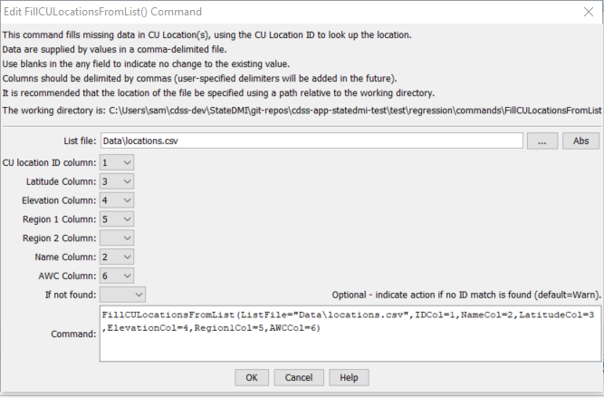

# StateDMI / Command / FillCULocationsFromList #

* [Overview](#overview)
* [Command Editor](#command-editor)
* [Command Syntax](#command-syntax)
* [Examples](#examples)
* [Troubleshooting](#troubleshooting)
* [See Also](#see-also)

-------------------------

## Overview ##

The `FillCULocationsFromList` command (for StateCU)
fills missing data in existing CU Locations by reading information from a delimited file.

## Command Editor ##

The following dialog is used to edit the command and illustrates the command syntax.

**<p style="text-align: center;">

</p>**

**<p style="text-align: center;">
`FillCULocationsFromList` Command Editor (<a href="../FillCULocationsFromList.png">see also the full-size image</a>)
</p>**

## Command Syntax ##

The command syntax is as follows:

```text
FillCULocationsFromList(Parameter="Value",...)
```
**<p style="text-align: center;">
Command Parameters
</p>**

| **Parameter**&nbsp;&nbsp;&nbsp;&nbsp;&nbsp;&nbsp;&nbsp;&nbsp;&nbsp;&nbsp;&nbsp;&nbsp; | **Description** | **Default**&nbsp;&nbsp;&nbsp;&nbsp;&nbsp;&nbsp;&nbsp;&nbsp;&nbsp;&nbsp; |
| --------------|-----------------|----------------- |
| `ListFile` | Path to the delimited list file to read. | None – must be specified. |
| `IDCol` | The column number (1+) containing the CU Location identifiers. | None – must be specified. |
| `LatitudeCol` | The column number (1+) containing the CU Location latitude. | If not specified, the previous value will remain. |
| `ElevationCol` | The column number (1+) containing the CU Location elevation. | If not specified, the previous value will remain. |
| `Region1Col` | The column number (1+) containing the CU Location `Region1`. | If not specified, the previous value will remain. |
| `Region2Col` | The column number (1+) containing the CU Location `Region2`. | If not specified, the previous value will remain. |
| `NameCol` | The column number (1+) containing the CU Location name. | If not specified, the previous value will remain. |
| `AWCCol` | The column number (1+) containing the CU Location AWC. | If not specified, the previous value will remain. |
| `IfNotFound` | Used for error handling, one of the following:<ul><li>`Fail` – generate a failure message if the ID pattern is not matched</li><li>`Ignore` – ignore (don’t generate a message) if the ID pattern is not matched</li><li>`Warn` – generate a warning message if the ID pattern is not matched | `Warn` |

## Examples ##

See the [automated tests](https://github.com/OpenCDSS/cdss-app-statedmi-test/tree/master/test/regression/commands/FillCULocationsFromList).

Lines starting with the # character are treated as comments.
If the first line’s values are surrounded by double quotes, the line is assumed to indicate column headings.

An example list file is shown below, which provides elevations for key locations:

```
#WDID/NAME/Elevation(ft),,
0100501,EMPIRE DITCH,4543
0100503_D,RIVERSIDE CANAL,4533
0100507_D,BIJOU CANAL,4495
0100511,WELDON VALLEY DITCH,4405
0100513,JACKSON LAKE INLET DITCH,4460
0100514,FT MORGAN CANAL,4347
0100515,UPPER PLATTE BEAVER CNL,4289
0100517,DEUEL SNYDER CANAL,4310
0100518,LOWER PLATTE BEAVER D,4247
0100519_D,TREMONT DITCH,4243
0100520,GILL STEVENS DITCH,4224
...
```

## Troubleshooting ##

[See the main troubleshooting documentation](../../troubleshooting/troubleshooting.md)

## See Also ##

* [`FillCULocation`](../FillCULocation/FillCULocation.md) command
* [`FillCULocationsFromHydroBase`](../FillCULocationsFromHydroBase/FillCULocationsFromHydroBase.md) command
* [`SetCULocation`](../SetCULocation/SetCULocation.md) command
* [`SetCULocationsFromList`](../SetCULocationsFromList/SetCULocationsFromList.md) command
