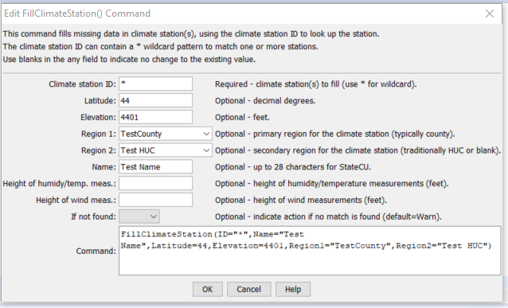

# StateDMI / Command / FillClimateStation #

* [Overview](#overview)
* [Command Editor](#command-editor)
* [Command Syntax](#command-syntax)
* [Examples](#examples)
* [Troubleshooting](#troubleshooting)
* [See Also](#see-also)

-------------------------

## Overview ##

The `FillClimateStation` command (for StateCU)
fills missing data in existing climate stations.

## Command Editor ##

The following dialog is used to edit the command and illustrates the command syntax.

**<p style="text-align: center;">

</p>**

**<p style="text-align: center;">
`FillClimateStation` Command Editor (<a href="../FillClimateStation.png">see also the full-size image</a>)
</p>**

## Command Syntax ##

The command syntax is as follows:

```text
FillClimateStation(Parameter="Value",...)
```
**<p style="text-align: center;">
Command Parameters
</p>**

| **Parameter**&nbsp;&nbsp;&nbsp;&nbsp;&nbsp;&nbsp;&nbsp;&nbsp;&nbsp;&nbsp;&nbsp;&nbsp;&nbsp;&nbsp;&nbsp;&nbsp;&nbsp;&nbsp;&nbsp;&nbsp; | **Description** | **Default**&nbsp;&nbsp;&nbsp;&nbsp;&nbsp;&nbsp;&nbsp;&nbsp;&nbsp;&nbsp; |
| --------------|-----------------|----------------- |
| `ID` | A single climate station identifier to match or a pattern using wildcards (e.g., `20*`). | None – must be specified. |
| `Latitude` | The climate station latitude to be assigned for all matching climate stations with missing latitude. | If not specified, the original value will remain. |
| `Elevation` | The climate station elevation to be assigned for all matching climate stations with missing elevation. | If not specified, the original value will remain. |
| `Region1` | The climate station Region1 (typically county) to be assigned for all matching climate stations with missing `Region1`. | If not specified, the original value will remain. |
| `Region2` | The climate station Region2 (traditionally HUC but can be blank) to be assigned for all matching climate stations with missing `Region2`. | If not specified, the original value will remain. |
| `Name` | The climate station name to be assigned for all matching climate stations with missing name. | If not specified, the original value will remain.
| `HeightHumidityMeas` | The height of humidity and temperature measurements (feet), only used with daily analysis. | If not specified, the original value will remain. |
| `HeightWindMeas` | The height of wind measurements (feet), only used with daily analysis. | If not specified, the original value will remain. |
| `IfNotFound` | Used for error handling, one of the following:<ul><li>`Fail` – generate a failure message if the ID pattern is not matched</li><li>`Ignore` – ignore (don’t generate a message) if the ID pattern is not matched</li><li>`Warn` – generate a warning message if the ID pattern is not matched</li></ul> | `Warn` |

## Examples ##

See the [automated tests](https://github.com/OpenCDSS/cdss-app-statedmi-test/tree/master/test/regression/commands/FillClimateStation).

## Troubleshooting ##

[See the main troubleshooting documentation](../../troubleshooting/troubleshooting.md)

## See Also ##

* [`FillClimateStationsFromHydroBase`](../FillClimateStationsFromHydroBase/FillClimateStationsFromHydroBase.md) command
* [`SetClimateStation`](../SetClimateStation/SetClimateStation.md) command
