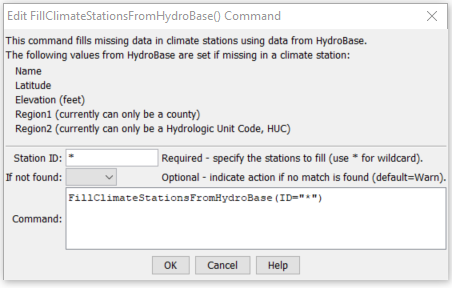

# StateDMI / Command / FillClimateStationsFromHydroBase #

* [Overview](#overview)
* [Command Editor](#command-editor)
* [Command Syntax](#command-syntax)
* [Examples](#examples)
* [Troubleshooting](#troubleshooting)
* [See Also](#see-also)

-------------------------

## Overview ##

The `FillClimateStationsFromHydroBase` command (for StateCU)
fills missing data in existing climate stations, using HydroBase for data.

## Command Editor ##

The following dialog is used to edit the command and illustrates the command syntax.

**<p style="text-align: center;">

</p>**

**<p style="text-align: center;">
`FillClimateStationsFromHydroBase` Command Editor (<a href="../FillClimateStationsFromHydroBase.png">see also the full-size image</a>)
</p>**

## Command Syntax ##

The command syntax is as follows:

```text
FillClimateStationsFromHydroBase(Parameter="Value",...)
```
**<p style="text-align: center;">
Command Parameters
</p>**

| **Parameter**&nbsp;&nbsp;&nbsp;&nbsp;&nbsp;&nbsp;&nbsp;&nbsp;&nbsp;&nbsp;&nbsp;&nbsp; | **Description** | **Default**&nbsp;&nbsp;&nbsp;&nbsp;&nbsp;&nbsp;&nbsp;&nbsp;&nbsp;&nbsp; |
| --------------|-----------------|----------------- |
| `ID` | A single climate station identifier to match or a pattern using wildcards (e.g., `20*`). | None – must be specified. |
| `IfNotFound` | Used for error handling, one of the following:<ul><li>`Fail` – generate a failure message if the climate station is not found</li><li>`Ignore` – ignore (don’t generate a message) if the climate station is not found</li><li>`Warn` – generate a warning message if the climate station is not found</li></ul> | `Warn` |

## Examples ##

See the [automated tests](https://github.com/OpenCDSS/cdss-app-statedmi-test/tree/master/test/regression/commands/FillClimateStationsFromHydroBase).

The following example command file illustrates how climate stations can be defined, filled from HydroBase, and written to a StateCU file:

```
ReadClimateStationsFromList(ListFile="climsta.lst",IDCol=1)
FillClimateStationsFromHydroBase(ID="*")
SetClimateStation(ID="3016",Region2="14080106",IfNotFound=Warn)
SetClimateStation(ID="1018",Region2="14040106",IfNotFound=Warn)
SetClimateStation(ID="1928",Elevation=6440,IfNotFound=Warn)
SetClimateStation(ID="0484",Region1="MOFFAT",IfNotFound=Add)
WriteClimateStationsToStateCU(OutputFile="COclim2006.cli")
```

## Troubleshooting ##

## See Also ##

* [`FillClimateStation`](../FillClimateStation/FillClimateStation.md) command
* [`SetClimateStation`](../SetClimateStation/SetClimateStation.md) command
