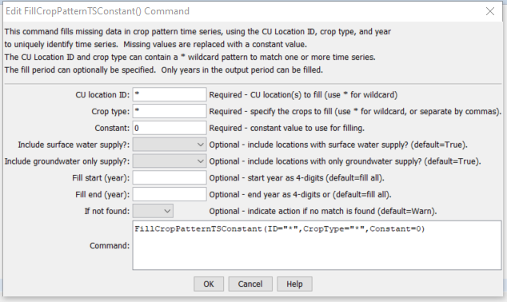

# StateDMI / Command / FillCropPatternTSConstant #

* [Overview](#overview)
* [Command Editor](#command-editor)
* [Command Syntax](#command-syntax)
* [Examples](#examples)
* [Troubleshooting](#troubleshooting)
* [See Also](#see-also)

-------------------------

## Overview ##

The `FillCropPatternTSConstant` command (for StateCU)
fills crop pattern time series data for a CU Location, using a constant value.
Only data for matching locations, years, and crop type are filled.
A common use of this command is to ensure that there are no missing data values
for years when an irrigated lands assessment has occurred.
In this case it is assumed that if other data sources for the year of study have not identified crops
(e.g., GIS and user-supplied values), then remaining missing values should be set to zero,
indicating that no irrigation occurred.
For example, if in one year a structure has irrigated acreage but in another year is has no acreage,
the time series for the crop acreage will have a missing value in the second case.
Using this command with a zero constant value will ensure that zero is used for the second year.
Subsequent data filling by repeating values or interpolation will be impacted by the constant values.

## Command Editor ##

The following dialog is used to edit the command and illustrates the command syntax.

**<p style="text-align: center;">

</p>**

**<p style="text-align: center;">
`FillCropPatternTSConstant` Command Editor (<a href="../FillCropPatternTSConstant.png">see also the full-size image</a>)
</p>**

## Command Syntax ##

The command syntax is as follows:

```text
FillCropPatternTSConstant(Parameter="Value",...)
```
**<p style="text-align: center;">
Command Parameters
</p>**

| **Parameter**&nbsp;&nbsp;&nbsp;&nbsp;&nbsp;&nbsp;&nbsp;&nbsp;&nbsp;&nbsp;&nbsp;&nbsp;&nbsp;&nbsp;&nbsp;&nbsp;&nbsp;&nbsp;&nbsp;&nbsp;&nbsp;&nbsp;&nbsp;&nbsp;&nbsp;&nbsp;&nbsp;&nbsp;&nbsp;&nbsp;&nbsp;&nbsp;&nbsp;&nbsp;&nbsp;&nbsp;&nbsp;&nbsp;&nbsp;&nbsp;&nbsp;&nbsp; | **Description** | **Default**&nbsp;&nbsp;&nbsp;&nbsp;&nbsp;&nbsp;&nbsp;&nbsp;&nbsp;&nbsp;&nbsp;&nbsp;&nbsp;&nbsp;&nbsp;&nbsp;&nbsp;&nbsp;&nbsp;&nbsp; |
| --------------|-----------------|----------------- |
| `ID` | A single CU Location identifier to match or a pattern using wildcards (e.g., `20*`). | None – must be specified. |
| `CropType` | A single crop type to match or a pattern using wildcards (e.g., `*`). | None – must be specified. |
| `Constant` | The constant value to be used to fill missing data. | None – must be specified. |
| `IncludeSurfaceWaterSupply` | Indicate whether locations with surface water supply should be processed (those other than groundwater-only locations). | `True` |
| `IncludeGroundwaterOnlySupply` | Indicate whether locations with only groundwater supply (collections where `PartType=Parcel`) should be processed.  Typically this is specified as `True`. | `True` |
| `FillStart` | The first year to fill. | If not specified, fill the full period. |
| `FillEnd` | The last year to fill. | If not specified, fill the full period. |
| `IfNotFound` | Used for error handling, one of the following:<ul><li>`Fail` – generate a failure message if the ID is not matched</li><li>`Ignore` – ignore (don’t add and don’t generate a message) if the ID is not matched</li><li>`Warn` – generate a warning message if the ID is not matched</li></ul> | `Warn` |

## Examples ##

See the [automated tests](https://github.com/OpenCDSS/cdss-app-statedmi-test/tree/master/test/regression/commands/FillCropPatternTSConstant).

## Troubleshooting ##

[See the main troubleshooting documentation](../../troubleshooting/troubleshooting.md)

## See Also ##

* [`FillCropPatternTSInterpolate`](../FillCropPatternTSInterpolate/FillCropPatternTSInterpolate.md) command
* [`FillCropPatternTSRepeat`](../FillCropPatternTSRepeat/FillCropPatternTSRepeat.md) command
* [`FillCropPatternTSUsingWellRights`](../FillCropPatternTSUsingWellRights/FillCropPatternTSUsingWellRights.md) command
* [`SetCropPatternTS`](../SetCropPatternTS/SetCropPatternTS.md) command
* [`SetCropPatternTSFromList`](../SetCropPatternTSFromList/SetCropPatternTSFromList.md) command
