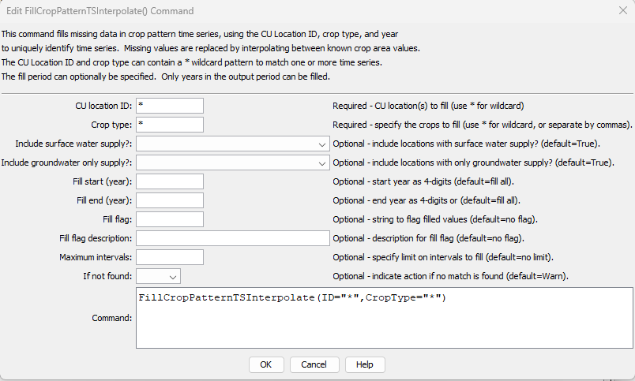

# StateDMI / Command / FillCropPatternTSInterpolate #

* [Overview](#overview)
* [Command Editor](#command-editor)
* [Command Syntax](#command-syntax)
* [Examples](#examples)
* [Troubleshooting](#troubleshooting)
* [See Also](#see-also)

-------------------------

## Overview ##

The `FillCropPatternTSInterpolate` command (for StateCU)
fills crop pattern time series data for a CU Location, using interpolation.
Data will not be extrapolated past the end-points and therefore another fill method (e.g.,
[`FillCropPatternTSRepeat`](../FillCropPatternTSRepeat/FillCropPatternTSRepeat.md))
may be required after the interpolation command.
Filling is currently always in a forward direction.
If the data set contains groundwater,
it is typical to fill groundwater-only crop pattern time series prior to the first year of HydroBase data using
[`FillCropPatternTSUsingWellRights`](../FillCropPatternTSUsingWellRights/FillCropPatternTSUsingWellRights.md)
and use
[`FillCropPatternTSRepeat`](../FillCropPatternTSRepeat/FillCropPatternTSRepeat.md) and/or
[`FillCropPatternTSInterpolate`](../FillCropPatternTSInterpolate/FillCropPatternTSInterpolate.md)
for all other time series and parts of the period.

## Command Editor ##

The following dialog is used to edit the command and illustrates the command syntax.

**<p style="text-align: center;">

</p>**

**<p style="text-align: center;">
`FillCropPatternTSInterpolate` Command Editor (<a href="../FillCropPatternTSInterpolate.png">see also the full-size image</a>)
</p>**

## Command Syntax ##

The command syntax is as follows:

```text
FillCropPatternTSInterpolate(Parameter="Value",...)
```
**<p style="text-align: center;">
Command Parameters
</p>**

| **Parameter**&nbsp;&nbsp;&nbsp;&nbsp;&nbsp;&nbsp;&nbsp;&nbsp;&nbsp;&nbsp;&nbsp;&nbsp;&nbsp;&nbsp;&nbsp;&nbsp;&nbsp;&nbsp;&nbsp;&nbsp;&nbsp;&nbsp;&nbsp;&nbsp;&nbsp;&nbsp;&nbsp;&nbsp;&nbsp;&nbsp;&nbsp;&nbsp;&nbsp;&nbsp;&nbsp;&nbsp;&nbsp;&nbsp;&nbsp;&nbsp;&nbsp;&nbsp; | **Description** | **Default**&nbsp;&nbsp;&nbsp;&nbsp;&nbsp;&nbsp;&nbsp;&nbsp;&nbsp;&nbsp;&nbsp;&nbsp;&nbsp;&nbsp;&nbsp;&nbsp;&nbsp;&nbsp;&nbsp;&nbsp; |
| --------------|-----------------|----------------- |
| `ID` | A single CU Location identifier to match or a pattern using wildcards (e.g., `20*`). | None – must be specified. |
| `CropType` | A single crop type to match or a pattern using wildcards (e.g., `*`). | None – must be specified. |
| `IncludeSurfaceWaterSupply` | Indicate whether locations with surface water supply should be processed (those other than groundwater-only locations). | `True` |
| `IncludeGroundwaterOnlySupply` | Indicate whether locations with only groundwater supply (collections where `PartType=Parcel`) should be processed.  Typically this is specified as true unless the [`FillCropPatternTSUsingWellRights`](../FillCropPatternTSUsingWellRights/FillCropPatternTSUsingWellRights.md) command has been applied for the fill period. | `True` |
| `FillStart` | The first year to fill.  This should be a year with observations to allow interpolation. | If not specified, fill the full period. |
| `FillEnd` | The last year to fill.  This should be a year with observations to allow interpolation. | If not specified, fill the full period. |
| `MaxIntervals` | The maximum number of intervals to fill in any gap. | If not specified, fill the entire gap. |
| `IfNotFound` | Used for error handling, one of the following:<ul><li>`Fail` – generate a failure message if the ID is not matched</li><li>`Ignore` – ignore (don’t add and don’t generate a message) if the ID is not matched</li><li>`Warn` – generate a warning message if the ID is not matched</li></ul> | `Warn` |

## Examples ##

See the [automated tests](https://github.com/OpenCDSS/cdss-app-statedmi-test/tree/master/test/regression/commands/FillCropPatternTSInterpolate).

## Troubleshooting ##

## See Also ##

* [`FillCropPatternTSConstant`](../FillCropPatternTSConstant/FillCropPatternTSConstant.md) command
* [`FillCropPatternTSRepeat`](../FillCropPatternTSRepeat/FillCropPatternTSRepeat.md) command
* [`FillCropPatternTSUsingWellRights`](../FillCropPatternTSUsingWellRights/FillCropPatternTSUsingWellRights.md) command
* [`SetCropPatternTS`](../SetCropPatternTS/SetCropPatternTS.md) command
* [`SetCropPatternTSFromList`](../SetCropPatternTSFromList/SetCropPatternTSFromList.md) command
