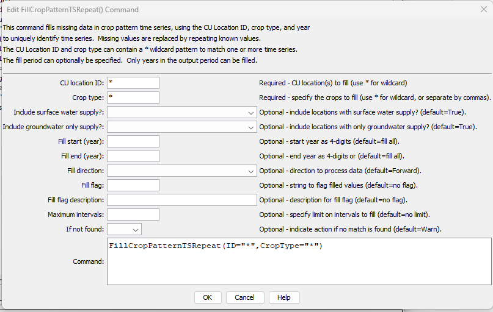

# StateDMI / Command / FillCropPatternTSRepeat #

*   [Overview](#overview)
*   [Command Editor](#command-editor)
*   [Command Syntax](#command-syntax)
*   [Examples](#examples)
*   [Troubleshooting](#troubleshooting)
*   [See Also](#see-also)

-------------------------

## Overview ##

The `FillCropPatternTSRepeat` command (for StateCU)
fills crop pattern time series data for a CU Location by repeating known values.
Filling can occur forward or backward in time, but not both.
Therefore, it may be necessary to use two similar commands, one filling forward,
and one filling backward, in order to completely fill the ends of time series.

## Command Editor ##

The following dialog is used to edit the command and illustrates the command syntax.

**<p style="text-align: center;">

</p>**

**<p style="text-align: center;">
`FillCropPatternTSRepeat` Command Editor (<a href="../FillCropPatternTSRepeat.png">see also the full-size image</a>)
</p>**

## Command Syntax ##

The command syntax is as follows:

```text
FillCropPatternTSRepeat(Parameter="Value",...)
```
**<p style="text-align: center;">
Command Parameters
</p>**

| **Parameter**&nbsp;&nbsp;&nbsp;&nbsp;&nbsp;&nbsp;&nbsp;&nbsp;&nbsp;&nbsp;&nbsp;&nbsp;&nbsp;&nbsp;&nbsp;&nbsp;&nbsp;&nbsp;&nbsp;&nbsp;&nbsp;&nbsp;&nbsp;&nbsp;&nbsp;&nbsp;&nbsp;&nbsp;&nbsp;&nbsp;&nbsp;&nbsp;&nbsp;&nbsp;&nbsp;&nbsp;&nbsp;&nbsp;&nbsp;&nbsp;&nbsp;&nbsp; | **Description** | **Default**&nbsp;&nbsp;&nbsp;&nbsp;&nbsp;&nbsp;&nbsp;&nbsp;&nbsp;&nbsp;&nbsp;&nbsp;&nbsp;&nbsp;&nbsp;&nbsp;&nbsp;&nbsp;&nbsp;&nbsp; |
| --------------|-----------------|----------------- |
| `ID` | A single CU Location identifier to match or a pattern using wildcards (e.g., `20*`). | None – must be specified. |
| `CropType` | A single crop type to match or a pattern using wildcards (e.g., `*`). | None – must be specified. |
| `IncludeSurfaceWaterSupply` | Indicate whether locations with surface water supply should be processed (those other than groundwater-only locations). | `True` |
| `IncludeGroundwaterOnlySupply` | Indicate whether locations with only groundwater supply (collections where `PartType=Parcel`) should be processed.  Typically this is specified as `True`. | `True` |
| `FillStart` | The first year to fill, typically a year with observations if filling forward. | If not specified, fill the full period. |
| `FillEnd` | The last year to fill, typically a year with observations if filling backward. | If not specified, fill the full period. |
| `FillDirection` | The direction to fill, either `Forward` or `Backward`. | `Forward` |
| `FillFlag` | A string to flag values that are filled, supported by some output formats. | No flag is used |
| `FillFlagDescription` | The description for the data flag, used in legends. | No flag is set. |
| `MaxIntervals` | The maximum number of intervals to fill in any gap. | If not specified, fill the entire gap. |
| `IfNotFound` | Used for error handling, one of the following:<ul><li>`Fail` – generate a failure message if the ID is not matched</li><li>`Ignore` – ignore (don’t add and don’t generate a message) if the ID is not matched</li><li>`Warn` – generate a warning message if the ID is not matched</li></ul> | `Warn` |

## Examples ##

See the [automated tests](https://github.com/OpenCDSS/cdss-app-statedmi-test/tree/master/test/regression/commands/FillCropPatternTSRepeat).

## Troubleshooting ##

[See the main troubleshooting documentation](../../troubleshooting/troubleshooting.md).

## See Also ##

*   [`FillCropPatternTSConstant`](../FillCropPatternTSConstant/FillCropPatternTSConstant.md) command
*   [`FillCropPatternTSInterpolate`](../FillCropPatternTSInterpolate/FillCropPatternTSInterpolate.md) command
*   [`FillCropPatternTSUsingWellRights`](../FillCropPatternTSUsingWellRights/FillCropPatternTSUsingWellRights.md) command
*   [`SetCropPatternTS`](../SetCropPatternTS/SetCropPatternTS.md) command
*   [`SetCropPatternTSFromList`](../SetCropPatternTSFromList/SetCropPatternTSFromList.md) command
