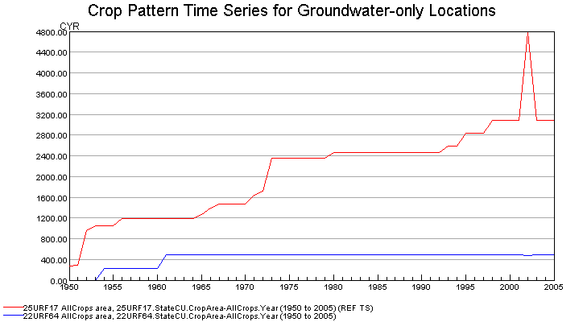
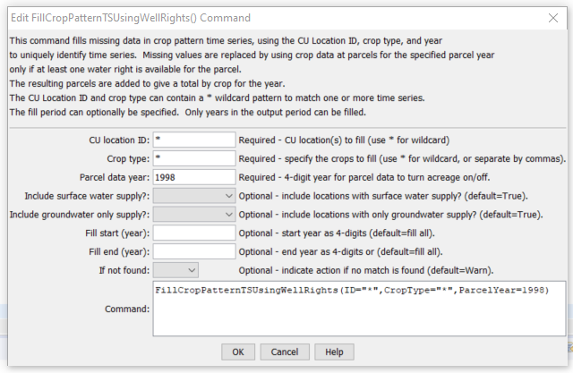

# StateDMI / Command / FillCropPatternTSUsingWellRights #

* [Overview](#overview)
* [Command Editor](#command-editor)
* [Command Syntax](#command-syntax)
* [Examples](#examples)
* [Troubleshooting](#troubleshooting)
* [See Also](#see-also)

-------------------------

## Overview ##

**This is a legacy command that should not be used in current work.  It is included to help migrate legacy command files.**

The `FillCropPatternTSUsingWellRights` command (for StateCU)
fills missing crop pattern time series (yearly) information for CU locations using well rights.
This command should typically only be used to fill data in the period before the earliest
modeling year for which data are available in HydroBase and helps initialize the acreage data in the early period.
For example, in the Río Grande, 1998 parcel data and associated rights are used to fill the earlier period.
The parcels associated with groundwater are turned off earlier in time,
in years when no well water rights are associated with parcels.
This results in the crop pattern acreage decreasing back in time.
It is typical that only the groundwater-only locations are filled with this command,
given that the parcel’s supply can be related directly to well water rights.
Crop pattern time series for locations having surface water supply are often then interpolated or repeated back in time.
The following figure shows groundwater acreage filled using well water rights.

**<p style="text-align: center;">

</p>**

**<p style="text-align: center;">
`FillCropPatternTSUsingWellRights` Command Editor (<a href="../FillCropPatternTSUsingWellRights_Example.png">see also the full-size image</a>)
</p>**

Prerequisites:

1. This command should be executed after the crop pattern time series are read from HydroBase (see
[`ReadCropPatternTSFromHydroBase`](../ReadCropPatternTSFromHydroBase/ReadCropPatternTSFromHydroBase.md),
which saves a list of parcels associated with each location during processing).
Data for lands that are not in HydroBase should have been specified with
[`SetCropPatternTSFromList`](../SetCropPatternTSFromList/SetCropPatternTSFromList.md) commands.
2. A non-merged, non-aggregated well water right file should have been read using the
[`ReadWellRightsFromStateMod`](../ReadWellRightsFromStateMod/ReadWellRightsFromStateMod.md) or similar command.
A StateMod well rights file with comments including parcel year and parcel identifier are needed
to ensure that rights matching the parcels for ParcelYear are available (see parameter description below).

The steps executed by the command are described below.  Note that “CU location” refers to the StateCU model identifier.

1. For each parcel found in the water rights data, create a yearly time series of decree.
The resulting time series indicates for a parcel the decreed water rights
(y-axis) associated with the parcel over time (x-axis).
2. Loop through each CU location that matches the ID pattern and perform the following:
	1. Get the list of parcels associated with the location for `ParcelYear`,
	taken from the crop pattern time series.
	The list of parcels will have been saved when the
	[`ReadCropPatternTSFromHydroBase`](../ReadCropPatternTSFromHydroBase/ReadCropPatternTSFromHydroBase)
	command was processed.
	2. For each year being processed, if acreage time series are missing,
	loop over the list of parcels for the location
	(note that the parcel area will be multiplied by the ditch coverage percent irrigated if the parcel is for a D&W node):
		1. If no parcels were found for the location in the `ParcelYear`,
		set all crop pattern time series to zero.  Consequently, an estimate of zero acreage will occur.
		2. Otherwise, set the crop pattern time series values as follows:
			1. If the decree time series for the parcel is zero in a year,
			set the acreage for all crops and the total to zero for the year.
			2. If the parcel has groundwater supply (one or more wells in `ParcelYear`):
			increment the acreage for the crop grown on the parcel.  Recompute the total acreage.
			3. If the result is missing, set the acreage for all crops and the total to zero.

## Command Editor ##

The following dialog is used to edit the command and illustrates the command syntax.

**<p style="text-align: center;">

</p>**

**<p style="text-align: center;">
`FillCropPatternTSUsingWellRights` Command Editor (<a href="../FillCropPatternTSUsingWellRights.png">see also the full-size image</a>)
</p>**

## Command Syntax ##

The command syntax is as follows:

```text
FillCropPatternTSUsingWellRights(Parameter="Value",...)
```
**<p style="text-align: center;">
Command Parameters
</p>**

| **Parameter**&nbsp;&nbsp;&nbsp;&nbsp;&nbsp;&nbsp;&nbsp;&nbsp;&nbsp;&nbsp;&nbsp;&nbsp;&nbsp;&nbsp;&nbsp;&nbsp;&nbsp;&nbsp;&nbsp;&nbsp;&nbsp;&nbsp;&nbsp;&nbsp;&nbsp;&nbsp;&nbsp;&nbsp;&nbsp;&nbsp;&nbsp;&nbsp;&nbsp;&nbsp;&nbsp;&nbsp;&nbsp;&nbsp;&nbsp;&nbsp;&nbsp;&nbsp; | **Description** | **Default**&nbsp;&nbsp;&nbsp;&nbsp;&nbsp;&nbsp;&nbsp;&nbsp;&nbsp;&nbsp;&nbsp;&nbsp;&nbsp;&nbsp;&nbsp;&nbsp;&nbsp;&nbsp;&nbsp;&nbsp; |
| --------------|-----------------|----------------- |
| `ID` | A single CU location identifier to match or a pattern using wildcards (e.g., `20*`). | None – must be specified. |
| `IncludeSurfaceWaterSupply` | Indicate whether locations with surface water supply should be processed (those other than groundwater-only locations).  Locations will only be processed if they also have groundwater supply.  Currently this must always be specified as `False` – interpolation or repeat commands are typically used for surface water supply lands.  Additional capability may be enabled in the future. | `True` |
| `IncludeGroundwaterOnlySupply` | Indicate whether locations with only groundwater supply should be processed.  Typically this is specified as `True`. | `True` |
| `CropType` | Crop type(s) to fill or blank to fill all.  If more than one specific crop, separate with commas. | Fill all. |
| `FillStart` | A starting year to fill data, normally the start of the output period. | The output period start. |
| `FillEnd` | An ending year to fill data, normally one year prior to the `ParcelYear`. | The output period end. |
| `ParcelYear` | A calendar year to use for parcel data, needed to determine relationships between diversion stations/parcels/wells and for well aggregate/systems.  Only the water rights generated from parcels in this year will be used to limit groundwater acreage. | None – must be specified. |
| `IfNotFound` | Used for error handling, one of the following:<ul><li>`Fail` – generate a failure message if the ID is not matched</li><li>`Ignore` – ignore (don’t add and don’t generate a message) if the ID is not matched</li><li>`Warn` – generate a warning message if the ID is not matched</li></ul> | `Warn` |

## Examples ##

See the [automated tests](https://github.com/OpenCDSS/cdss-app-statedmi-test/tree/master/test/regression/commands/FillCropPatternTSUsingWellRights).

## Troubleshooting ##

## See Also ##

* [`FillCropPatternConstant`](../FillCropPatternTSConstant/FillCropPatternTSConstant.md) command
* [`FillCropPatternTSInterpolate`](../FillCropPatternTSInterpolate/FillCropPatternTSInterpolate.md) command
* [`FillCropPatternTSRepeat`](../FillCropPatternTSRepeat/FillCropPatternTSRepeat.md) command
* [`ReadCropPatternTSFromHydroBase`](../ReadCropPatternTSFromHydroBase/ReadCropPatternTSFromHydroBase.md) command
* [`ReadWellRightsFromStateMod`](../ReadWellRightsFromStateMod/ReadWellRightsFromStateMod.md) command
* [`SetCropPatternTS`](../SetCropPatternTS/SetCropPatternTS.md) command
* [`SetCropPatternTSFromList`](../SetCropPatternTSFromList/SetCropPatternTSFromList.md) command
