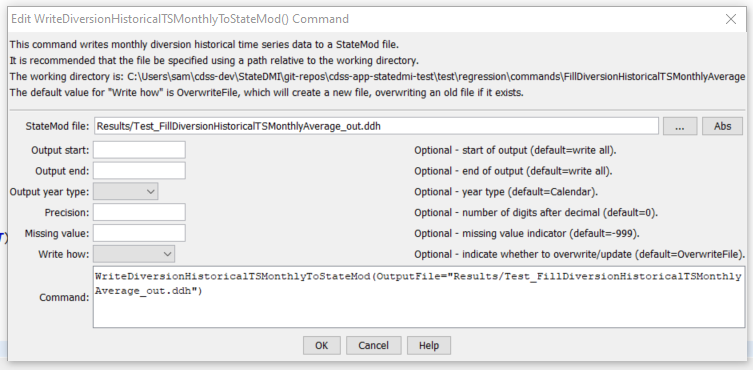

# StateDMI / Command / FillDiversionHistoricalTSMonthlyAverage #

* [Overview](#overview)
* [Command Editor](#command-editor)
* [Command Syntax](#command-syntax)
* [Examples](#examples)
* [Troubleshooting](#troubleshooting)
* [See Also](#see-also)

-------------------------

## Overview ##

The `FillDiversionHistoricalTSMonthlyAverage` command (for StateMod)
fills missing diversion historical time series (monthly) data, using average monthly values.
The historical averages are computed immediately after
reading time series (e.g., from HydroBase or a file).
The average values that are used during data filling are printed to the log file.

## Command Editor ##

The following dialog is used to edit the command and illustrates the command syntax.

**<p style="text-align: center;">

</p>**

**<p style="text-align: center;">
`FillDiversionHistoricalTSMonthlyAverage` Command Editor (<a href="../FillDiversionHistoricalTSMonthlyAverage.png">see also the full-size image</a>)
</p>**

## Command Syntax ##

The command syntax is as follows:

```text
FillDiversionHistoricalTSMonthlyAverage(Parameter="Value",...)
```
**<p style="text-align: center;">
Command Parameters
</p>**

| **Parameter**&nbsp;&nbsp;&nbsp;&nbsp;&nbsp;&nbsp;&nbsp;&nbsp;&nbsp;&nbsp;&nbsp;&nbsp;&nbsp;&nbsp;&nbsp;&nbsp;&nbsp;&nbsp;&nbsp;&nbsp; | **Description** | **Default**&nbsp;&nbsp;&nbsp;&nbsp;&nbsp;&nbsp;&nbsp;&nbsp;&nbsp;&nbsp;&nbsp;&nbsp;&nbsp;&nbsp;&nbsp;&nbsp;&nbsp;&nbsp;&nbsp;&nbsp; |
| --------------|-----------------|----------------- |
| `ID` | A single diversion station identifier to match or a pattern using wildcards (e.g., `20*`). | None – must be specified. |
| `IncludeCollections` | Indicates whether time series for collections (diversion stations that are aggregates or systems) are included in the processing.  If the time series for these stations have been filled during the read, then it may not be necessary to fill again.  On the other hand, it may be necessary to use the sum of the time series to fill missing data. | `True` |
| `FillStart` | The first date to fill. | If not specified, fill the full period. |
| `FillEnd` | The last date to fill. | If not specified, fill the full period. |
| `FillFlag` | If specified as a single character, data flags will be enabled for the time series and each filled value will be tagged with the specified character.  The flag can then be used later to label graphs, etc.  The flag will be appended to existing flags if necessary. | No flag is assigned. |
| `IfNotFound` | Used for error handling, one of the following:<ul><li>`Fail` – generate a failure message if the ID is not matched</li><li>`Ignore` – ignore (don’t add and don’t generate a message) if the ID is not matched</li><li>`Warn` – generate a warning message if the ID is not matched</li></ul> | `Warn` |

## Examples ##

See the [automated tests](https://github.com/OpenCDSS/cdss-app-statedmi-test/tree/master/test/regression/commands/FillDiversionHistoricalTSMonthlyAverage).

The following abbreviated command file illustrates how the StateMod diversion historical time series file can be produced.
Note that an initial diversion stations file is read and is then updated based on time series information.

```
StartLog(LogFile="ddh.commands.StateDMI.log")
# ddh.commands.StateDMI
#
#  StateDMI command file to create the historical diversion file
#           and the "step 2" direct diversion structure file, updated so structure
#           capacity = maximum historical diversion
#
#  Step 1 - set time-series period and year type
#
SetOutputPeriod(OutputStart="10/1908",OutputEnd="09/2005")
SetOutputYearType(OutputYearType=Water)
#
#  Step 2 - read structure list from preliminary direct diversion structure file
#
ReadDiversionStationsFromStateMod(InputFile="cm2005_dds.dds")
#
#  Step 3 - read aggregate and diversion system structure assignments.  Note that
#        want to combine historical diversions for aggs and diversion systems, but
#        historical diversions are separate for primary and secondary components
#        of multistructures
#
SetDiversionAggregateFromList(ListFile="cm_agg.csv",IDCol=1,NameCol=2,PartIDsCol=3,PartsListedHow=InRow)
SetDiversionSystemFromList(ListFile="cm_divsys.csv",IDCol=1,NameCol=2,PartIDsCol=3,PartsListedHow=InRow)
#
#  Step 4 - read historical diversions from HydroBase. Note that want individual structures
#           in aggregates and diversion systems to be filled first, then diversions combined.
#
ReadDiversionHistoricalTSMonthlyFromHydroBase(ID="*",IncludeCollections=False,UseDiversionComments=True)
#
#  Step 5 - read fill pattern file, and assign patterns to water districts
#
ReadPatternFile(InputFile="fill2005.pat")
ReadDiversionHistoricalTSMonthlyFromHydroBase(ID="36*",IncludeExplicit=False,UseDiversionComments=True,PatternID="09037500",FillPatternOrder=1,FillAverageOrder=2)
#
#  Step 6 - assign transbasin diversions from streamflow gages
#
SetDiversionHistoricalTSMonthly(ID="364626",TSID="09047300.DWR.Streamflow.Month~HydroBase")
...similar commands omitted...
# note that adams tunnel streamgage ID changed in 10/1996 from 09013000 to ADANETCO
SetDiversionHistoricalTSMonthly(ID="514634",TSID="514634...MONTH~StateMod~514634.stm")
#     Con-Hoosier System - Blue River Diversion, driven by operating rules to con-hoosier summary demand
SetDiversionHistoricalTSMonthly(ID="364683",TSID="364683...MONTH~StateMod~zero.stm")
SetDiversionHistoricalTSMonthly(ID="364699",TSID="364699...MONTH~StateMod~zero.stm")
#     Fryingpan-Arkansas Project
SetDiversionHistoricalTSMonthly(ID="381594",TSID="381594...MONTH~StateMod~381594.stm")
SetDiversionHistoricalTSMonthly(ID="384625",TSID="384625...MONTH~StateMod~384625.stm")
SetDiversionHistoricalTSMonthly(ID="954699",TSID="954699...MONTH~StateMod~zero.stm")
...similar commands omitted...
#
#  Step 7 - set diversions from external time-series files
#
# The following commands are added to access Task 11.2 replacement files
SetDiversionHistoricalTSMonthly(ID="380757",TSID="380757...MONTH~StateMod~380757.stm")
...similar commands omitted...
#
# The following structures are set for Municipal and Industrial Diversions
SetDiversionHistoricalTSMonthly(ID="360784",TSID="360784...MONTH~StateMod~360784.stm")
...similar commands omitted...
#
# Set transbasin diversions to "0" prior to construction
#
#      Wurtz Ditch
SetDiversionHistoricalTSMonthlyConstant(ID="374648",Constant=0,SetEnd="01/1929")
...similar commands omitted...
#
#  Step 8 - fill historical diversion using pattern approach
#
FillDiversionHistoricalTSMonthlyPattern(ID="36*",PatternID="09034500")
...similar commands omitted...
#
#   Step 9 - Fill remaining missing with month average
#
FillDiversionHistoricalTSMonthlyAverage(ID="*")
#
#   Step 10 - Limit filled diversion to water rights. Exceptions include structure
#             receiving significant reservoir supply, carrier structures, etc.
#
LimitDiversionHistoricalTSMonthlyToRights(InputFile="..\statemod\cm2005.ddr",ID="*",IgnoreID="954683,952001,950010,950011")
#
#   Step 11 - sort structures and create historical diversion file
#
SortDiversionHistoricalTSMonthly(Order=Ascending)
WriteDiversionHistoricalTSMonthlyToStateMod(OutputFile="..\StateMod\cm2005.ddh")
#
#  Step 12 - update capacities and create final direct diversion station file
#
SetDiversionStationCapacitiesFromTS(ID="*")
WriteDiversionStationsToStateMod(OutputFile="..\statemod\cm2005.dds")
#
# Check the results.
CheckDiversionHistoricalTSMonthly(ID="*")
WriteCheckFile(OutputFile="ddh.commands.StateDMI.check.html")
```

## Troubleshooting ##

[See the main troubleshooting documentation](../../troubleshooting/troubleshooting.md)

## See Also ##

* [`FillDiversionHistoricalTSMonthlyConstant`](../FillDiversionHistoricalTSMonthlyConstant/FillDiversionHistoricalTSMonthlyConstant.md) command
* [`FillDiversionHistoricalTSMonthlyPattern`](../FillDiversionHistoricalTSMonthlyPattern/FillDiversionHistoricalTSMonthlyPattern.md) command
* [`SetDiversionHistoricalTSMonthly`](../SetDiversionHistoricalTSMonthly/SetDiversionHistoricalTSMonthly.md) command
* [`SetDiversionHistoricalTSMonthlyConstant`](../SetDiversionHistoricalTSMonthlyConstant/SetDiversionHistoricalTSMonthlyConstant.md) command
