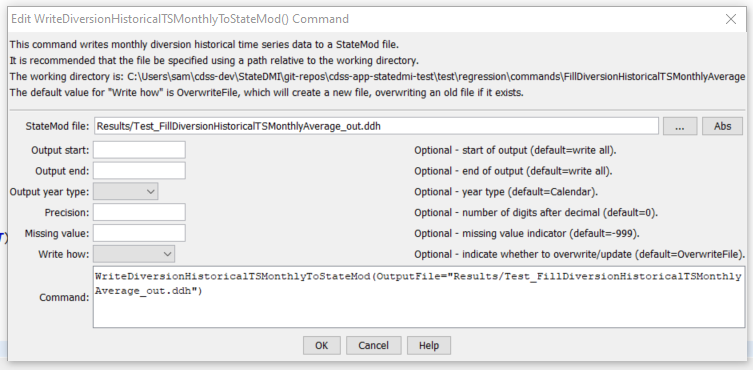

# StateDMI / Command / FillDiversionHistoricalTSMonthlyConstant #

* [Overview](#overview)
* [Command Editor](#command-editor)
* [Command Syntax](#command-syntax)
* [Examples](#examples)
* [Troubleshooting](#troubleshooting)
* [See Also](#see-also)

-------------------------

## Overview ##

The `FillDiversionHistoricalTSMonthlyConstant` command (StateMod)
fills missing diversion historical time series (monthly) data, using a constant value.
This command is useful, for example, to set diversion values to zero if other
fill commands are unable to provide data estimates for missing data.

## Command Editor ##

The following dialog is used to edit the command and illustrates the command syntax.

**<p style="text-align: center;">

</p>**

**<p style="text-align: center;">
`FillDiversionHistoricalTSMonthlyConstant` Command Editor (<a href="../FillDiversionHistoricalTSMonthlyConstant.png">see also the full-size image</a>)
</p>**

## Command Syntax ##

The command syntax is as follows:

```text
FillDiversionHistoricalTSMonthlyConstant(Parameter="Value",...)
```
**<p style="text-align: center;">
Command Parameters
</p>**

| **Parameter**&nbsp;&nbsp;&nbsp;&nbsp;&nbsp;&nbsp;&nbsp;&nbsp;&nbsp;&nbsp;&nbsp;&nbsp; | **Description** | **Default**&nbsp;&nbsp;&nbsp;&nbsp;&nbsp;&nbsp;&nbsp;&nbsp;&nbsp;&nbsp;&nbsp;&nbsp;&nbsp;&nbsp;&nbsp;&nbsp;&nbsp;&nbsp;&nbsp;&nbsp; |
| --------------|-----------------|----------------- |
| `ID` | A single diversion station identifier to match or a pattern using wildcards (e.g., `20*`). | None – must be specified. |
| `FillStart` | The first year to fill. | If not specified, fill the full period. |
| `FillEnd` | The last year to fill. | If not specified, fill the full period. |
| `Constant` | The constant value to be used to fill missing data. | None – must be specified. |
| `FillFlag` | If specified as a single character, data flags will be enabled for the time series and each filled value will be tagged with the specified character.  The flag can then be used later to label graphs, etc.  The flag will be appended to existing flags if necessary. | No flag is assigned. |
| `IfNotFound` | Used for error handling, one of the following:<ul><li>`Fail` – generate a failure message if the ID is not matched</li><li>`Ignore` – ignore (don’t add and don’t generate a message) if the ID is not matched</li><li>`Warn` – generate a warning message if the ID is not matched</li></ul> | `Warn` |

## Examples ##

See the [automated tests](https://github.com/OpenCDSS/cdss-app-statedmi-test/tree/master/test/regression/commands/FillDiversionHistoricalTSMonthlyConstant).

## Troubleshooting ##

## See Also ##

* [`FillDiversionHistoricalTSMonthlyAverage`](../FillDiversionHistoricalTSMonthlyAverage/FillDiversionHistoricalTSMonthlyAverage.md) command
* [`FillDiversionHistoricalTSMonthlyPattern`](../FillDiversionHistoricalTSMonthlyPattern/FillDiversionHistoricalTSMonthlyPattern.md) command
* [`SetDiversionHistoricalTSMonthly`](../SetDiversionHistoricalTSMonthly/SetDiversionHistoricalTSMonthly.md) command
* [`SetDiversionHistoricalTSMonthlyConstant`](../SetDiversionHistoricalTSMonthlyConstant/SetDiversionHistoricalTSMonthlyConstant.md) command
