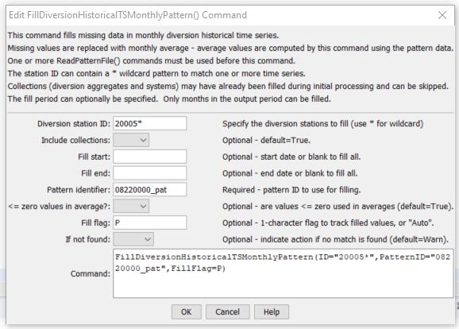

# StateDMI / Command / FillDiversionHistoricalTSMonthlyPattern #

* [Overview](#overview)
* [Command Editor](#command-editor)
* [Command Syntax](#command-syntax)
* [Examples](#examples)
* [Troubleshooting](#troubleshooting)
* [See Also](#see-also)

-------------------------

## Overview ##

The `FillDiversionHistoricalTSMonthlyPattern` command (for StateMod)
fills missing diversion historical time series (monthly) data, using average monthly wet/dry/average values.
The historical averages are computed using patterns read by the
[`ReadPatternFile`](../ReadPatternFile/ReadPatternFile.md) command.
The average values that are used during data filling are printed to the log file.
For example, if a value is missing for May 1980,
the pattern for the specified pattern identifier is checked for `WET`, `DRY`, or `AVG`.
The values of all May’s for `WET`, `DRY`, or `AVG` are then averaged in the time series to be filled,
and the resulting average used to fill missing data.
This command therefore will result in filled values that are more appropriate than simple averages;
however, work must be done to characterize the wet, dry, and average months.

## Command Editor ##

The following dialog is used to edit the command and illustrates the command syntax.

**<p style="text-align: center;">

</p>**

**<p style="text-align: center;">
`FillDiversionHistoricalTSMonthlyPattern` Command Editor (<a href="../FillDiversionHistoricalTSMonthlyPattern.png">see also the full-size image</a>)
</p>**

## Command Syntax ##

The command syntax is as follows:

```text
FillDiversionHistoricalTSMonthlyPattern(Parameter="Value",...)
```
**<p style="text-align: center;">
Command Parameters
</p>**

| **Parameter**&nbsp;&nbsp;&nbsp;&nbsp;&nbsp;&nbsp;&nbsp;&nbsp;&nbsp;&nbsp;&nbsp;&nbsp;&nbsp;&nbsp;&nbsp;&nbsp;&nbsp;&nbsp;&nbsp;&nbsp; | **Description** | **Default**&nbsp;&nbsp;&nbsp;&nbsp;&nbsp;&nbsp;&nbsp;&nbsp;&nbsp;&nbsp;&nbsp;&nbsp;&nbsp;&nbsp;&nbsp;&nbsp;&nbsp;&nbsp;&nbsp;&nbsp; |
| --------------|-----------------|----------------- |
| `ID` | A single diversion station identifier to match or a pattern using wildcards (e.g., `20*`). | None – must be specified. |
| `IncludeCollections` | Indicates whether time series for collections (diversion stations that are aggregates or systems) are included in the processing.  If the time series for these stations have been filled during the read, then it may not be necessary to fill again.  On the other hand, it may be necessary to use the sum of the time series to fill missing data. | `True` |
| `FillStart` | The first date to fill. | If not specified, fill the full period. |
| `FillEnd` | The last date to fill. | If not specified, fill the full period. |
| `PatternID` | The pattern identifier for data read with a [`ReadPatternFile`](../ReadPatternFile/ReadPatternFile.md) command. | None – must be specified. |
| `LEZeroInAverage` | Indicates whether values ≤ 0 should be considered when computing monthly averages. | `True` |
| `FillFlag` | If specified as a single character, data flags will be enabled for the time series and each filled value will be tagged with the specified character.  The flag can then be used later to label graphs, etc.  The flag will be appended to existing flags if necessary. | No flag is assigned. |
| `IfNotFound` | Used for error handling, one of the following:<ul><li>`Fail` – generate a failure message if the ID is not matched</li><li>`Ignore` – ignore (don’t add and don’t generate a message) if the ID is not matched</li><li>`Warn` – generate a warning message if the ID is not matched</li></ul> | `Warn` |

## Examples ##

See the [automated tests](https://github.com/OpenCDSS/cdss-app-statedmi-test/tree/master/test/regression/commands/FillDiversionHistoricalTSMonthlyPattern).

## Troubleshooting ##

[See the main troubleshooting documentation](../../troubleshooting/troubleshooting.md)

## See Also ##

* [`FillDiversionHistoricalTSMonthlyAverage`](../FillDiversionHistoricalTSMonthlyAverage/FillDiversionHistoricalTSMonthlyAverage.md) command
* [`FillDiversionHistoricalTSMonthlyConstant`](../FillDiversionHistoricalTSMonthlyConstant/FillDiversionHistoricalTSMonthlyConstant.md) command
* [`ReadPatternFile`](../ReadPatternFile/ReadPatternFile.md) command
* [`SetDiversionHistoricalTSMonthly`](../SetDiversionHistoricalTSMonthly/SetDiversionHistoricalTSMonthly.md) command
* [`SetDiversionHistoricalTSMonthlyConstant`](../SetDiversionHistoricalTSMonthlyConstant/SetDiversionHistoricalTSMonthlyConstant.md) command
