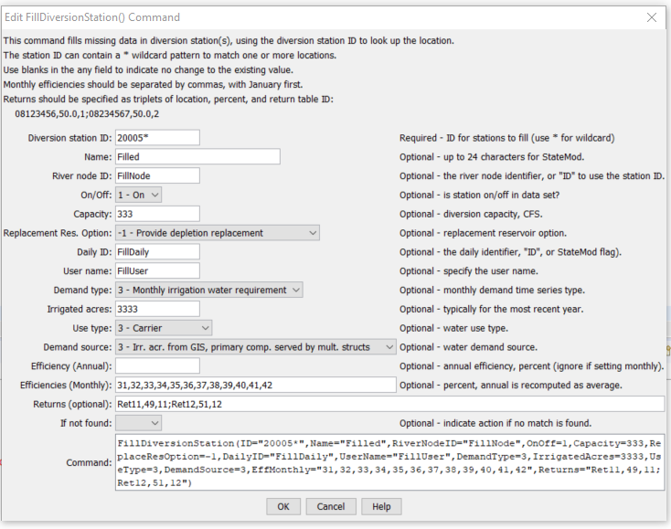

# StateDMI / Command / FillDiversionStation #

* [Overview](#overview)
* [Command Editor](#command-editor)
* [Command Syntax](#command-syntax)
* [Examples](#examples)
* [Troubleshooting](#troubleshooting)
* [See Also](#see-also)

-------------------------

## Overview ##

The `FillDiversionStation` command (for StateMod)
fills missing data in existing diversion stations.

## Command Editor ##

The following dialog is used to edit the command and illustrates the command syntax.

**<p style="text-align: center;">

</p>**

**<p style="text-align: center;">
`FillDiversionStation` Command Editor (<a href="../FillDiversionStation.png">see also the full-size image</a>)
</p>**

## Command Syntax ##

The command syntax is as follows:

```text
FillDiversionStation(Parameter="Value",...)
```
**<p style="text-align: center;">
Command Parameters
</p>**

| **Parameter**&nbsp;&nbsp;&nbsp;&nbsp;&nbsp;&nbsp;&nbsp;&nbsp;&nbsp;&nbsp;&nbsp;&nbsp;&nbsp;&nbsp; | **Description** | **Default**&nbsp;&nbsp;&nbsp;&nbsp;&nbsp;&nbsp;&nbsp;&nbsp;&nbsp;&nbsp;&nbsp;&nbsp;&nbsp;&nbsp;&nbsp;&nbsp;&nbsp;&nbsp;&nbsp;&nbsp;&nbsp;&nbsp; |
| --------------|-----------------|----------------- |
| `ID` | A single diversion station identifier to match or a pattern using wildcards (e.g., `20*`). | None – must be specified. |
| `Name` | The name to be assigned for all matching diversion stations with missing name. | If not specified, the original value will remain. |
| `RiverNodeID` | The river node identifier to be assigned for all matching diversion stations with missing river node identifier.  Specify ID to assign to the diversion station identifier. | If not specified, the original value will remain. |
| `OnOff` | The on/off switch value to be assigned for all matching diversion stations with missing switch, either 1 for on or 0 for off. | If not specified, the original value will remain. |
| `Capacity` | The diversion station capacity to be assigned for all matching diversion stations with missing capacity, CFS. | If not specified, the original value will remain. |
| `ReplaceResOption` | The replacement reservoir option to be assigned for all matching diversion stations with missing option, as per the StateMod documentation. | If not specified, the original value will remain. |
| `DailyID` | The daily identifier to be assigned for all matching diversion stations with missing daily identifier. | If not specified, the original value will remain. |
| `UserName` | The diversion user name (owner) to be assigned for all matching diversion stations with missing user name. | If not specified, the original value will remain. |
| `DemandType` | The demand type to be assigned for all matching diversion stations with missing demand type (see StateMod documentation). | If not specified, the original value will remain. |
| `IrrigatedAcres` | The irrigated acres to be assigned for all matching diversion stations with missing irrigated acres. | If not specified, the original value will remain. |
| `UseType` | The use type to be assigned for all matching diversion stations with missing user type (see StateMod documentation). | If not specified, the original value will remain.
| `DemandSource` | The demand source to be assigned for all matching diversion stations with missing demand source (see StateMod documentation). | If not specified, the original value will remain.
| `EffAnnual` | The annual efficiency (percent, 0  - 100) to be assigned for all matching diversion stations with missing annual efficiency (see StateMod documentation).  Monthly efficiencies will be set to the same value (but not used). | If not specified, the original value will remain. |
| `EffMonthly` | The monthly efficiencies  (percent, 0 – 100) to be assigned for all matching diversion stations with missing data, specified as 12 comma-separated values, January to December.  The annual efficiency will be set to the average value.  The order of the values in the output file will be according to the output year type set by [`SetOutputYearType`](../SetOutputYearType/SetOutputYearType.md), or calendar by default. | If not specified, the original value will remain. |
| `Returns` | The return flows to be assigned for all matching diversion stations with missing returns.  Specify as `StationID,Percent,DelayTableID;StationID,Percent,DelayTableID;` etc. | If not specified, the original value will remain.
| `IfNotFound` | Used for error handling, one of the following:<ul><li>`Fail` – generate a failure message if the ID is not matched</li><li>`Ignore` – ignore (don’t add and don’t generate a message) if the ID is not matched</li><li>`Warn` – generate a warning message if the ID is not matched</li></ul> | `Warn` |

## Examples ##

See the [automated tests](https://github.com/OpenCDSS/cdss-app-statedmi-test/tree/master/test/regression/commands/FillDiversionStation).

## Troubleshooting ##

[See the main troubleshooting documentation](../../troubleshooting/troubleshooting.md)

## See Also ##

* [`FillDiversionStationsFromHydroBase`](../FillDiversionStationsFromHydroBase/FillDiversionStationsFromHydroBase.md) command
* [`FillDiversionStationsFromNetwork`](../FillDiversionStationsFromNetwork/FillDiversionStationsFromNetwork.md) command
* [`SetDiversionStation`](../SetDiversionStation/SetDiversionStation.md) command
