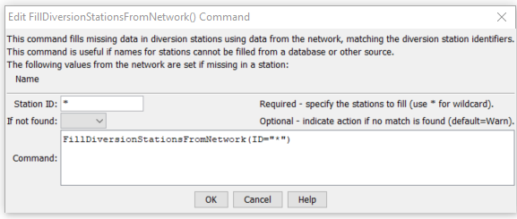

# StateDMI / Command / FillDiversionStationsFromNetwork #

* [Overview](#overview)
* [Command Editor](#command-editor)
* [Command Syntax](#command-syntax)
* [Examples](#examples)
* [Troubleshooting](#troubleshooting)
* [See Also](#see-also)

-------------------------

## Overview ##

The `FillDiversionStationsFromNetwork` command (from StateMod)
fills missing data in diversion stations, using a StateMod network for data.
This command is usually used after filling from other sources (e.g., HydroBase),
because the information in the network file may have been specified mainly
for the diagram and therefore does not necessarily match official data sources.
It is assumed that the network has been read in a previous command
(e.g., when the list of diversion stations was originally read).

## Command Editor ##

The following dialog is used to edit the command and illustrates the command syntax.

**<p style="text-align: center;">

</p>**

**<p style="text-align: center;">
`FillDiversionStationsFromNetwork` Command Editor (<a href="../FillDiversionStationsFromNetwork.png">see also the full-size image</a>)
</p>**

## Command Syntax ##

The command syntax is as follows:

```text
FillDiversionStationsFromNetwork(Parameter="Value",...)
```
**<p style="text-align: center;">
Command Parameters
</p>**

| **Parameter**&nbsp;&nbsp;&nbsp;&nbsp;&nbsp;&nbsp;&nbsp;&nbsp;&nbsp;&nbsp;&nbsp;&nbsp; | **Description** | **Default**&nbsp;&nbsp;&nbsp;&nbsp;&nbsp;&nbsp;&nbsp;&nbsp;&nbsp;&nbsp; |
| --------------|-----------------|----------------- |
| `ID` | A single diversion station identifier to match or a pattern using wildcards (e.g., `20*`). | None – must be specified. |
| `IfNotFound` | Used for error handling, one of the following:<ul><li>`Fail` – generate a failure message if the ID is not matched</li><li>`Ignore` – ignore (don’t add and don’t generate a message) if the `ID` is not matched</li><li>`Warn` – generate a warning message if the ID is not matched</li></ul> | `Warn` |

## Examples ##

See the [automated tests](https://github.com/OpenCDSS/cdss-app-statedmi-test/tree/master/test/regression/commands/FillDiversionStationsFromNetwork).

The following example illustrates how to fill diversion station names from the network.
A command to fill from HydroBase or another source will often be run before the second command below.

```
ReadDiversionStationsFromNetwork(InputFile="sp2005.net")
FillDiversionStationsFromNetwork(ID="*")
```

## Troubleshooting ##

[See the main troubleshooting documentation](../../troubleshooting/troubleshooting.md)

## See Also ##

* [`FillDiversionStation`](../FillDiversionStation/FillDiversionStation.md) command
* [`FillDiversionStationsFromHydroBase`](../FillDiversionStationsFromHydroBase/FillDiversionStationsFromHydroBase.md) command
* [`SetDiversionStation`](../SetDiversionStation/SetDiversionStation.md) command
