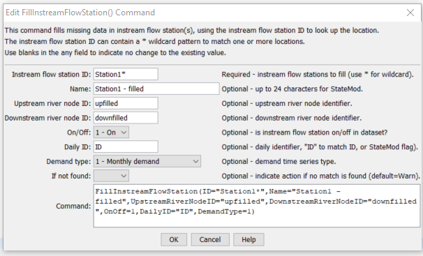

# StateDMI / Command / FillInstreamFlowStation #

* [Overview](#overview)
* [Command Editor](#command-editor)
* [Command Syntax](#command-syntax)
* [Examples](#examples)
* [Troubleshooting](#troubleshooting)
* [See Also](#see-also)

-------------------------

## Overview ##

The `FillInstreamFlowStation` command (for StateMod)
fills missing data in existing instream flow stations.

## Command Editor ##

The following dialog is used to edit the command and illustrates the command syntax.

**<p style="text-align: center;">

</p>**

**<p style="text-align: center;">
`FillInstreamFlowStation` Command Editor (<a href="../FillInstreamFlowStation.png">see also the full-size image</a>)
</p>**

## Command Syntax ##

The command syntax is as follows:

```text
FillInstreamFlowStation(Parameter="Value",...)
```
**<p style="text-align: center;">
Command Parameters
</p>**

| **Parameter**&nbsp;&nbsp;&nbsp;&nbsp;&nbsp;&nbsp;&nbsp;&nbsp;&nbsp;&nbsp;&nbsp;&nbsp;&nbsp;&nbsp;&nbsp;&nbsp;&nbsp;&nbsp;&nbsp;&nbsp;&nbsp;&nbsp;&nbsp;&nbsp;&nbsp;&nbsp;&nbsp;&nbsp; | **Description** | **Default**&nbsp;&nbsp;&nbsp;&nbsp;&nbsp;&nbsp;&nbsp;&nbsp;&nbsp;&nbsp;&nbsp;&nbsp;&nbsp;&nbsp;&nbsp;&nbsp;&nbsp;&nbsp;&nbsp;&nbsp; |
| --------------|-----------------|----------------- |
| `ID` | A single instream flow station identifier to match or a pattern using wildcards (e.g., `20*`). | None – must be specified. |
| `Name` | The name to be assigned for all matching instream flow station identifiers with missing name. | If not specified, the original value will remain. |
| `UpstreamRiverNodeID` | The upstream river node identifier to be assigned for all matching instream flow station identifiers with missing river node identifier. | If not specified, the original value will remain. |
| `DownstreamRiverNodeID` | The downstream river node identifier to be assigned for all matching instream flow station identifiers with missing river node identifier. | If not specified, the original value will remain. |
| `OnOff` | The on/off switch to be assigned for all matching instream flow station identifiers with missing river node identifier, either 1 for on or 0 for off. | If not specified, the original value will remain. |
| `DailyID` | The daily identifier to be assigned for all matching stream gage identifiers with missing river node identifier | If not specified, the original value will remain. |
| `DemandType` | The demand type to be assigned for all matching instream flow stations with missing demand type, one of:<ul><li>`1` – Monthly demand</li><li>`2` – Average monthly demand`</li></ul> | If not specified, the original value will remain. |
| `IfNotFound` | Used for error handling, one of the following:<ul><li>`Fail` – generate a failure message if the ID is not matched</li><li>`Ignore` – ignore (don’t generate a message) if the ID is not matched</li><li>`Warn` – generate a warning message if the ID is not matched</li></ul> | `Warn` |

## Examples ##

See the [automated tests](https://github.com/OpenCDSS/cdss-app-statedmi-test/tree/master/test/regression/commands/FillInstreamFlowStation).

## Troubleshooting ##

[See the main troubleshooting documentation](../../troubleshooting/troubleshooting.md)

## See Also ##

* [`FillInstreamFlowStationsFromHydroBase`](../FillInstreamFlowStationsFromHydroBase/FillInstreamFlowStationsFromHydroBase.md) command
* [`FillInstreamFlowStationsFromNetwork`](../FillInstreamFlowStationsFromNetwork/FillInstreamFlowStationsFromNetwork.md) command
* [`SetInstreamFlowStation`](../SetInstreamFlowStation/SetInstreamFlowStation.md) command
