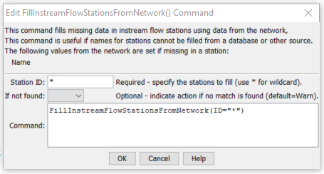

# StateDMI / Command / FillInstreamFlowStationsFromNetwork #

* [Overview](#overview)
* [Command Editor](#command-editor)
* [Command Syntax](#command-syntax)
* [Examples](#examples)
* [Troubleshooting](#troubleshooting)
* [See Also](#see-also)

-------------------------

## Overview ##

The `FillInstreamFlowStationsFromNetwork` command (for StateMod)
fills missing data in instream flow stations, using a StateMod network for data.
This command is usually used after filling from other sources (e.g., HydroBase),
because the information in the network file may have been specified mainly for the
diagram and therefore does not necessarily match official data sources.
It is assumed that the network has been read in a previous command
(e.g., when the list of instream flow stations was originally read).

## Command Editor ##

The following dialog is used to edit the command and illustrates the command syntax.

**<p style="text-align: center;">

</p>**

**<p style="text-align: center;">
`FillInstreamFlowStationsFromNetwork` Command Editor (<a href="../FillInstreamFlowStationsFromNetwork.png">see also the full-size image</a>)
</p>**

## Command Syntax ##

The command syntax is as follows:

```text
FillInstreamFlowStationsFromNetwork(Parameter="Value",...)
```
**<p style="text-align: center;">
Command Parameters
</p>**

| **Parameter**&nbsp;&nbsp;&nbsp;&nbsp;&nbsp;&nbsp;&nbsp;&nbsp;&nbsp;&nbsp;&nbsp;&nbsp; | **Description** | **Default**&nbsp;&nbsp;&nbsp;&nbsp;&nbsp;&nbsp;&nbsp;&nbsp;&nbsp;&nbsp; |
| --------------|-----------------|----------------- |
| `ID` | A single instream flow station identifier to match or a pattern using wildcards (e.g., `20*`). | None – must be specified. |

## Examples ##

See the [automated tests](https://github.com/OpenCDSS/cdss-app-statedmi-test/tree/master/test/regression/commands/FillInstreamFlowStationsFromNetwork).

The following example illustrates how to fill instream flow station names from the network.  A command to fill from HydroBase or another source will often be run before the second command below.

```
ReadInstreamFlowStationsFromNetwork(InputFile="sp2005.net")
FillInstreamFlowStationsFromNetwork(ID="*")
```

## Troubleshooting ##

[See the main troubleshooting documentation](../../troubleshooting/troubleshooting.md)

## See Also ##

* [`FillInstreamFlowStation`](../FillInstreamFlowStation/FillInstreamFlowStation.md) command
* [`FillInstreamFlowStationsFromHydroBase`](../FillInstreamFlowStationsFromHydroBase/FillInstreamFlowStationsFromHydroBase.md) command
* [`SetInstreamFlowStation`](../SetInstreamFlowStation/SetInstreamFlowStation.md) command
