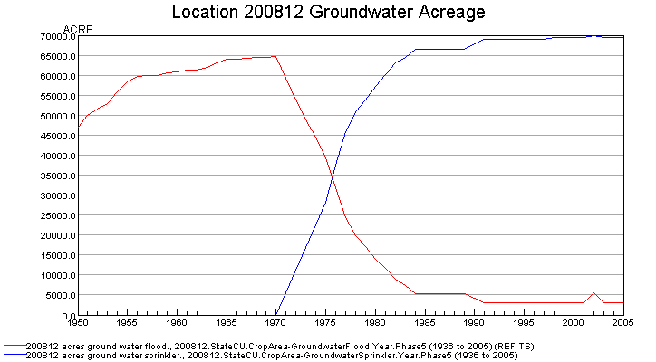
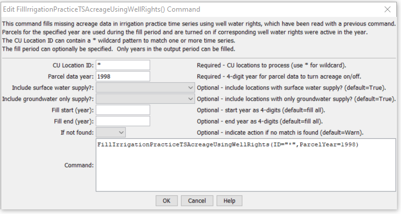

# StateDMI / Command / FillIrrigationPracticeTSAcreageUsingWellRights #

* [Overview](#overview)
* [Command Editor](#command-editor)
* [Command Syntax](#command-syntax)
* [Examples](#examples)
* [Troubleshooting](#troubleshooting)
* [See Also](#see-also)

-------------------------

## Overview ##

The `FillIrrigationPracticeTSAcreageUsingWellRights` command (for StateMod)
fills missing irrigation practice groundwater acreage time series (yearly) information for CU locations using well rights.
This command should only be used to fill data in the period before the earliest modeling
year for which data are available in HydroBase and helps initialize the acreage data in the early period.
For example, in the Rio Grande, 1998 parcel data and associated rights are used to fill the earlier period.
The parcels associated with groundwater are turned off earlier in time,
in years when no well water rights are associated with parcels.
This results in the groundwater acreage decreasing back in time,
as shown in the following figure (in this case there is only a slight decrease
from approximately 70,000 acres to 47,000 acres, with more change being in the irrigation method):

**<p style="text-align: center;">

</p>**

**<p style="text-align: center;">
Groundwater Acreage Example Graph (<a href="../FillIrrigationPracticeTSAcreageUsingWellRights_Example.png">see also the full-size image</a>)
</p>**

Prerequisites:

1. This command should be executed after the irrigation practice time series are read from HydroBase (see
[`ReadIrrigationPracticeTSFromHydroBase`](../ReadIrrigationPracticeTSFromHydroBase/ReadIrrigationPracticeTSFromHydroBase.md),
which saves a list of parcels associated with each location during processing).
Data for lands that are not in HydroBase should have been specified with
[`SetIrrigationPracticeTSFromList`](../SetIrrigationPracticeTSFromList/SetIrrigationPracticeTSFromList.md) commands.
2. Total acreage has been set to the crop pattern time series total (see
[`SetIrrigationPracticeTSTotalAcreageToCropPatternTSTotalAcreage`](../SetIrrigationPracticeTSTotalAcreageToCropPatternTSTotalAcreage/SetIrrigationPracticeTSTotalAcreageToCropPatternTSTotalAcreage.md)).
The total acres are needed for checks.
3. A non-merged, non-aggregated well water right file should have been read using the
[`ReadWellRightsFromStateMod`](../ReadWellRightsFromStateMod/ReadWellRightsFromStateMod.md) or similar command.
A StateMod well rights file with comments including parcel year and parcel are needed
to ensure that rights matching the parcels for `ParcelYear` are available (see parameter description below).

The steps executed by the command are described below.
Note that “CU location” refers to the StateCU model identifier.

1. For each parcel found in the water rights data, create a yearly time series of decree.
The resulting time series indicates for a parcel the decreed water rights (y-axis)
associated with the parcel over time (x-axis).
2. Loop through each CU location that matches the ID pattern and perform the following:
	1. Get the list of parcels associated with the location for `ParcelYear`,
	taken from the irrigation practice time series.
	The list of parcels will have been saved when  the
	[`ReadIrrigationPracticeTSFromHydroBase`](../ReadIrrigationPracticeTSFromHydroBase/ReadIrrigationPracticeTSFromHydroBase.md)
	command was processed.
	2. For each year being processed, if acreage time series are missing,
	loop over the list of parcels for the location (note that the parcel area will be multiplied
	by the ditch coverage percent irrigated if the parcel is for a D&W node):
		1. If no parcels were found for the location in the `ParcelYear`,
		set all groundwater acreage time series to zero.
		Consequently, an estimate of zero acreage will occur.
		2. Otherwise, set the groundwater acreage values as follows:
			1. If the decree time series for the parcel is zero in a year,
			set the groundwater acreage to zero for the year.
			2. If the parcel has groundwater supply (one or more wells in `ParcelYear`):  if high
			efficiency irrigation method (`DRIP` or `SPRINKLER`),
			increment the groundwater sprinkler acreage; if low efficiency (all other irrigation methods),
			increment the groundwater flood acreage.
			3. If the result is missing, set the groundwater sprinkler and flood to zero.
		3. Recompute the groundwater acreage by method and total.
		If either term is missing, set the groundwater total to missing.
		Otherwise, set the groundwater total to the sum of the parts.
		4. Recompute the surface water acreage by method and total.
		If either term is missing, set the surface water total to missing.
		Otherwise, set the surface water total to the sum of the parts.
		5. Adjust the groundwater acres to total acres and cascade changes:
			1. If groundwater only, set the groundwater acres to total acres if they do not already match.
			Else, only adjust groundwater acres down to the total (because surface water can take up the remainder).
			2. Adjust the groundwater parts (`SPRINKLER` and `FLOOD`) to agree with the new groundwater total.
			If one part is zero, adjust only the non-zero part to match the total.
			Otherwise, prorate based on the original groundwater total and acreage split.
			3. Adjust the surface water total and parts (`SPRINLER` and `FLOOD`)
			to agree with the new surface water total.
			The surface water total is first set to the total acreage minus the groundwater acreage.
			Next adjust the parts.  If one part is zero, adjust only the non-zero part to match the total.
			Otherwise, prorate based on the original surface water total and acreage split.

## Command Editor ##

The following dialog is used to edit the command and illustrates the command syntax.

**<p style="text-align: center;">

</p>**

**<p style="text-align: center;">
`FillIrrigationPracticeTSAcreageUsingWellRights` Command Editor (<a href="../FillIrrigationPracticeTSAcreageUsingWellRights.png">see also the full-size image</a>)
</p>**

## Command Syntax ##

The command syntax is as follows:

```text
FillIrrigationPracticeTSAcreageUsingWellRights(Parameter="Value",...)
```
**<p style="text-align: center;">
Command Parameters
</p>**

| **Parameter**&nbsp;&nbsp;&nbsp;&nbsp;&nbsp;&nbsp;&nbsp;&nbsp;&nbsp;&nbsp;&nbsp;&nbsp;&nbsp;&nbsp;&nbsp;&nbsp;&nbsp;&nbsp;&nbsp;&nbsp;&nbsp;&nbsp;&nbsp;&nbsp;&nbsp;&nbsp;&nbsp;&nbsp;&nbsp;&nbsp;&nbsp;&nbsp;&nbsp;&nbsp;&nbsp;&nbsp;&nbsp;&nbsp;&nbsp;&nbsp;&nbsp;&nbsp; | **Description** | **Default**&nbsp;&nbsp;&nbsp;&nbsp;&nbsp;&nbsp;&nbsp;&nbsp;&nbsp;&nbsp;&nbsp;&nbsp;&nbsp;&nbsp;&nbsp;&nbsp;&nbsp;&nbsp;&nbsp;&nbsp; |
| --------------|-----------------|----------------- |
| `ID` | A single CU location identifier to match or a pattern using wildcards (e.g., `20*`). | None – must be specified. |
| `ParcelYear` | A calendar year to use for parcel data, needed to determine relationships between diversion stations/parcels/wells and for well aggregate/systems.  Only the water rights generated from parcels in this year will be used to limit groundwater acreage. | None – must be specified. |
| `IncludeSurfaceWaterSupply` | Indicate whether locations with surface water supply should be processed.  Locations will only be processed if they also have groundwater supply. | `True` |
| `IncludeGroundwaterOnlySupply` | Indicate whether locations with only groundwater supply should be processed. | `True` |
| `FillStart` | A starting year to fill data, normally the start of the output period. | The output period start. |
| `FillEnd` | An ending year to fill data, normally one year prior to the `ParcelYear`. | The output period end. |
| `IfNotFound` | Used for error handling, one of the following:<ul><li>`Fail` – generate a failure message if the `ID` is not matched</li><li>`Ignore` – ignore (don’t add and don’t generate a message) if the `ID` is not matched</li><li>`Warn` – generate a warning message if the `ID` is not matched</li></ul> | `Warn` |

## Examples ##

See the [automated tests](https://github.com/OpenCDSS/cdss-app-statedmi-test/tree/master/test/regression/commands/FillIrrigationPracticeTSAcreageUsingWellRights).

The following command file illustrates the use of the command:

```
#
# Sp2008L_DDH.StateDMI
# _____________________________________________________________________________
#
# StartLog(LogFile="SP_IPY.log")
SetOutputPeriod(OutputStart="01/1950",OutputEnd="12/2006")
# Step 1 - Read CU Locations from list
#
ReadCULocationsFromList(ListFile="..\Sp2008L_StructList.csv",IDCol=1)
#
# Step 2 - Read SW aggregates, GW aggregates, and divsystems
#
SetDiversionAggregateFromList(ListFile="..\Sp2008L_SWAgg.csv",IDCol=1,NameCol=2,PartIDsCol=3,PartsListedHow=InColumn)
SetDiversionSystemFromList(ListFile="..\Sp2008L_DivSys_CDS.csv",IDCol=1,NameCol=2,PartIDsCol=3,PartsListedHow=InRow)
#
SetWellSystemFromList(ListFile="..\SP_GWAgg_1956.csv",Year=1956,Div=1,PartType=Parcel,IDCol=1,PartIDsCol=2,PartsListedHow=InColumn)
SetWellSystemFromList(ListFile="..\SP_GWAgg_1976.csv",Year=1976,Div=1,PartType=Parcel,IDCol=1,PartIDsCol=2,PartsListedHow=InColumn)
SetWellSystemFromList(ListFile="..\SP_GWAgg_1987.csv",Year=1987,Div=1,PartType=Parcel,IDCol=1,PartIDsCol=2,PartsListedHow=InColumn)
SetWellSystemFromList(ListFile="..\SP_GWAgg_2001.csv",Year=2001,Div=1,PartType=Parcel,IDCol=1,PartIDsCol=2,PartsListedHow=InColumn)
SetWellSystemFromList(ListFile="..\SP_GWAgg_2005.csv",Year=2005,Div=1,PartType=Parcel,IDCol=1,PartIDsCol=2,PartsListedHow=InColumn)
#
# Step 3 - Create form for *.ipy file
CreateIrrigationPracticeTSForCULocations(ID="*")
#
# Step 4 - Set conveyance efficiencies from file for key and sw aggregate structures - NOT in HydroBase
SetIrrigationPracticeTSFromList(ListFile="Sp2008L_Eff.csv",ID="*",SetStart=1950,SetEnd=2006,IDCol="1",SurfaceDelEffMaxCol="3")
#
# Step 5 - set max flood and surface water efficiencies and GWmode - NOT in HydroBase
SetIrrigationPracticeTS(ID="*",SetStart=1950,SetEnd=2006,FloodAppEffMax=.6,SprinklerAppEffMax=.8,GWMode=2)
#
# Step 6 - Read well rights file and Set Max pumping (use merged *.wer file)
ReadWellRightsFromStateMod(InputFile="..\Wells\Sp2008L.wer")
SetIrrigationPracticeTSPumpingMaxUsingWellRights(ID="*",IncludeSurfaceWaterSupply=True,IncludeGroundwaterOnlySupply="True",NumberOfDaysInMonth=30.4)
# Step 7 - Read category acreage from HydroBase
ReadIrrigationPracticeTSFromHydroBase(ID="*",Div="1")
#
# Step 8 - Read total acreage from *.cds file and Set total for *.ipy file
ReadCropPatternTSFromStateCU(InputFile="Sp2008L.cds")
SetIrrigationPracticeTSTotalAcreageToCropPatternTSTotalAcreage(ID="*")
#
# Step 9 - Estimate 1950 ground water acreage based on active wells as defined in the non-merged *.wer file
#
ReadWellRightsFromStateMod(InputFile="..\Wells\Sp2008L_NotMerged.wer",Append=False)
FillIrrigationPracticeTSAcreageUsingWellRights(ID="*",IncludeSurfaceWaterSupply=True,IncludeGroundwaterOnlySupply="True",FillStart=1950,FillEnd=1955,ParcelYear=1956)
#
# Step 10 - Fill Interpolate Acreage Type (SW and GW) 1956-2006
# Step 11a - estimate total GW and total SW
FillIrrigationPracticeTSInterpolate(ID="*",DataType="CropArea-GroundWater",FillStart="1956",FillEnd="1976")
FillIrrigationPracticeTSInterpolate(ID="*",DataType="CropArea-GroundWater",FillStart="1976",FillEnd="1987")
FillIrrigationPracticeTSInterpolate(ID="*",DataType="CropArea-GroundWater",FillStart="1987",FillEnd="2001")
FillIrrigationPracticeTSInterpolate(ID="*",DataType="CropArea-GroundWater",FillStart="2001",FillEnd="2005")
FillIrrigationPracticeTSRepeat(ID="*",DataType="CropArea-GroundWater",FillStart="2005",FillEnd="2006",FillDirection="Forward")
#
# Step 11b - set sprinkler to zero in early period
SetIrrigationPracticeTS(ID="*",SetStart=1950,SetEnd=1969,AcresSWSprinkler=0,AcresGWSprinkler=0)
#
# Step 11c - fill remaining irrigation method values
FillIrrigationPracticeTSInterpolate(ID="*",DataType="CropArea-SurfaceWaterOnlySprinkler",FillStart="1969",FillEnd="1976")
FillIrrigationPracticeTSInterpolate(ID="*",DataType="CropArea-SurfaceWaterOnlySprinkler",FillStart="1976",FillEnd="1987")
FillIrrigationPracticeTSInterpolate(ID="*",DataType="CropArea-SurfaceWaterOnlySprinkler",FillStart="1987",FillEnd="2001")
FillIrrigationPracticeTSInterpolate(ID="*",DataType="CropArea-SurfaceWaterOnlySprinkler",FillStart="2001",FillEnd="2005")
FillIrrigationPracticeTSRepeat(ID="*",DataType="CropArea-SurfaceWaterOnlySprinkler",FillStart="2005",FillEnd="2006",FillDirection="Forward")
FillIrrigationPracticeTSInterpolate(ID="*",DataType="CropArea-GroundWaterSprinkler",FillStart="1969",FillEnd="1976")
FillIrrigationPracticeTSInterpolate(ID="*",DataType="CropArea-GroundWaterSprinkler",FillStart="1976",FillEnd="1987")
FillIrrigationPracticeTSInterpolate(ID="*",DataType="CropArea-GroundWaterSprinkler",FillStart="1987",FillEnd="2001")
FillIrrigationPracticeTSInterpolate(ID="*",DataType="CropArea-GroundWaterSprinkler",FillStart="2001",FillEnd="2005")
FillIrrigationPracticeTSRepeat(ID="*",DataType="CropArea-GroundWaterSprinkler",FillStart="2005",FillEnd="2006",FillDirection="Forward")
#
# Step 12 - Set Acreage = 0 for structures that are in diversion systems, so acreage is not double accounted
SetIrrigationPracticeTS(ID="0100503_D",SetStart=1950,SetEnd=2006,AcresSWFlood=0,AcresSWSprinkler=0,AcresGWFlood=0,AcresGWSprinkler=0,PumpingMax=0,AcresTotal=0)
SetIrrigationPracticeTS(ID="0100507_D",SetStart=1950,SetEnd=2006,AcresSWFlood=0,AcresSWSprinkler=0,AcresGWFlood=0,AcresGWSprinkler=0,PumpingMax=0,AcresTotal=0)
SetIrrigationPracticeTS(ID="0100687",SetStart=1950,SetEnd=2006,AcresSWFlood=0,AcresSWSprinkler=0,AcresGWFlood=0,AcresGWSprinkler=0,PumpingMax=0,AcresTotal=0)
#
SetIrrigationPracticeTS(ID="0200834",SetStart=1950,SetEnd=2006,AcresSWFlood=0,AcresSWSprinkler=0,AcresGWFlood=0,AcresGWSprinkler=0,PumpingMax=0,AcresTotal=0)
#
SetIrrigationPracticeTS(ID="6400511_D",SetStart=1950,SetEnd=2006,AcresSWFlood=0,AcresSWSprinkler=0,AcresGWFlood=0,AcresGWSprinkler=0,PumpingMax=0,AcresTotal=0)
#
# Step 13 - Set Acreage = 0,  1950-2006
SetIrrigationPracticeTS(ID="0100501",SetStart=1950,SetEnd=2006,AcresSWFlood=0,AcresSWSprinkler=0,AcresGWFlood=0,AcresGWSprinkler=0,PumpingMax=0,AcresTotal=0)
SetIrrigationPracticeTS(ID="0100513",SetStart=1950,SetEnd=2006,AcresSWFlood=0,AcresSWSprinkler=0,AcresGWFlood=0,AcresGWSprinkler=0,PumpingMax=0,AcresTotal=0)
SetIrrigationPracticeTS(ID="0100829",SetStart=1950,SetEnd=2006,AcresSWFlood=0,AcresSWSprinkler=0,AcresGWFlood=0,AcresGWSprinkler=0,PumpingMax=0,AcresTotal=0)
#
SetIrrigationPracticeTS(ID="6400519",SetStart=1950,SetEnd=2006,AcresSWFlood=0,AcresSWSprinkler=0,AcresGWFlood=0,AcresGWSprinkler=0,PumpingMax=0,AcresTotal=0)
#
# Step 14 - Write final ipy file
#
WriteIrrigationPracticeTSToStateCU(OutputFile="Sp2008L.ipy",WriteHow=OverwriteFile)
WriteIrrigationPracticeTSToStateCU(OutputFile="..\StateCU\Historic\Sp2008L.ipy",WriteHow=OverwriteFile)
WriteIrrigationPracticeTSToStateCU(OutputFile="..\StateMod\Historic\Sp2008L.ipy",WriteHow=OverwriteFile)
```

## Troubleshooting ##

[See the main troubleshooting documentation](../../troubleshooting/troubleshooting.md)

## See Also ##

* [`FillIrrigationPracticeTSInterpolate`](../FillIrrigationPracticeTSInterpolate/FillIrrigationPracticeTSInterpolate.md) command
* [`FillIrrigationPracticeTSRepeat`](../FillIrrigationPracticeTSRepeat/FillIrrigationPracticeTSRepeat.md) command
* [`ReadIrrigationPracticeTSFromHydroBase`](../ReadIrrigationPracticeTSFromHydroBase/ReadIrrigationPracticeTSFromHydroBase.md) command
* [`ReadWellRightsFromStateMod`](../ReadWellRightsFromStateMod/ReadWellRightsFromStateMod.md) command
* [`SetIrrigationPracticeTS`](../SetIrrigationPracticeTS/SetIrrigationPracticeTS.md) command
* [`SetIrrigationPracticeTSFromList`](../SetIrrigationPracticeTSFromList/SetIrrigationPracticeTSFromList.md) command
* [`SetIrrigationPracticeTSFromStateCU`](../SetIrrigationPracticeTSFromStateCU/SetIrrigationPracticeTSFromStateCU.md) command
* [`SetIrrigationPracticeTSPumpingMaxUsingWellRights`](../SetIrrigationPracticeTSPumpingMaxUsingWellRights/SetIrrigationPracticeTSPumpingMaxUsingWellRights.md) command
* [`SetIrrigationPracticeTSSprinklerAcreageFromList`](../SetIrrigationPracticeTSSprinklerAcreageFromList/SetIrrigationPracticeTSSprinklerAcreageFromList.md) command
* [`SetIrrigationPracticeTSTotalAcreageToCropPatternTSTotalAcreage`](../SetIrrigationPracticeTSTotalAcreageToCropPatternTSTotalAcreage/SetIrrigationPracticeTSTotalAcreageToCropPatternTSTotalAcreage.md) command

### Legacy Commands ###

* [`SetIrrigationPracticeTSFromHydroBase`](../SetIrrigationPracticeTSFromHydroBase/SetIrrigationPracticeTSFromHydroBase.md) command
* [`SetIrrigationPracticeTSMaxPumpingToRights`](../SetIrrigationPracticeTSMaxPumpingToRights/SetIrrigationPracticeTSMaxPumpingToRights.md) command
* [`SetIrrigationPracticeTSSprinklerAreaFromList`](../SetIrrigationPracticeTSSprinklerAreaFromList/SetIrrigationPracticeTSSprinklerAreaFromList.md) command
