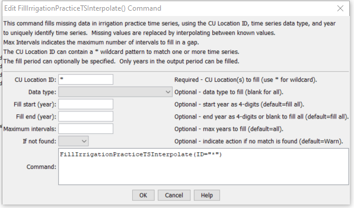

# StateDMI / Command / FillIrrigationPracticeTSInterpolate #

* [Overview](#overview)
* [Command Editor](#command-editor)
* [Command Syntax](#command-syntax)
* [Examples](#examples)
* [Troubleshooting](#troubleshooting)
* [See Also](#see-also)

-------------------------

## Overview ##

The `FillIrrigationPracticeTSInterpolate` command (for StateCU)
fills irrigation practice time series data for a CU Location, using interpolation.
Data will not be extrapolated past the end-points and therefore another fill method (e.g.,
[`FillIrrigationPracticeTSRepeat`](../FillIrrigationPracticeTSRepeat/FillIrrigationPracticeTSRepeat.md))
may be required after the interpolation command.
Filling is currently always in a forward direction.
Setting acreage values results in a cascade of adjustments to maintain sums, and will be noted in the log file.
Preference is given to maintaining the total acreage, then groundwater acreage, and then surface water acreage.
Irrigation method within groundwater will agree with the total and the sprinkler
and flood acreage will be prorated based on previous values if necessary to adjust to the total.
Similar adjustments are made to surface water acreage.

If applied to acreage, it is typical to first fill the groundwater acreage separately
and then use this command to interpolate the surface water acreage by interpolating between years with observations.

Prerequisites for acreage filling:

1. This command should be executed after the irrigation practice
time series are read from HydroBase (see
[`ReadIrrigationPracticeTSFromHydroBase`](../ReadIrrigationPracticeTSFromHydroBase/ReadIrrigationPracticeTSFromHydroBase.md)).
2. Total acreage has been set to the crop pattern time series total (see
[`SetIrrigationPracticeTSTotalAcreageToCropPatternTSTotalAcreage`](../SetIrrigationPracticeTSTotalAcreageToCropPatternTSTotalAcreage/SetIrrigationPracticeTSTotalAcreageToCropPatternTSTotalAcreage.md)).
The total acres are needed for checks.
3. The groundwater acreage should also have been filled using well rights before the first year of observations using
[`FillIrrigationPracticeTSAcreageUsingWellRights`](../FillIrrigationPracticeTSAcreageUsingWellRights/FillIrrigationPracticeTSAcreageUsingWellRights.md).

## Command Editor ##

The following dialog is used to edit the command and illustrates the command syntax.

**<p style="text-align: center;">

</p>**

**<p style="text-align: center;">
`FillIrrigationPracticeTSInterpolate` Command Editor (<a href="../FillIrrigationPracticeTSInterpolate.png">see also the full-size image</a>)
</p>**

Currently, the following check is always done after interpolation on any acreage data to adjust acreage parts to the total acreage:

1. If any of the acreage terms (surface water flood, surface water sprinkler,
groundwater flood, groundwater sprinkler) is missing, print a warning.
This should not occur if valid `FillStart` and `FillEnd` are specified, with observations at endpoints.
2. Compute the “target” surface water acreage as the total acreage
minus the groundwater terms (groundwater flood + sprinkler).
Compute the actual surface water (from current in-memory data) as the total of surface water flood and sprinkler acreage.
	1. If the target is less than zero, the groundwater acres are greater than the total.
	Adjust the groundwater acreage to the total, maintaining the ratio of flood and sprinkler
	acres to the total as with the previous groundwater total.
	Recompute the target surface water total acres (will be zero).
	2. If the surface water actual is zero and its terms cannot be adjusted to the target,
	attempt to adjust the groundwater acreage to make up the difference.
		1. If the groundwater acreage terms are zero, print a warning – no adjustment is possible.
		The user will need to take action.
		2. Else, adjust the groundwater to equal the total,
		maintaining the ratio of flood and sprinkler acres to the total as with the previous groundwater total.
	3. Else if the surface water actual is not zero, adjust the surface water total to match the target,
	maintaining a ratio of surface water flood and sprinkler consistent with the previous values.
	This may result in the surface water terms being set to zero.

## Command Syntax ##

The command syntax is as follows:

```text
FillIrrigationPracticeTSInterpolate(Parameter="Value",...)
```
**<p style="text-align: center;">
Command Parameters
</p>**

| **Parameter**&nbsp;&nbsp;&nbsp;&nbsp;&nbsp;&nbsp;&nbsp;&nbsp;&nbsp;&nbsp;&nbsp;&nbsp; | **Description** | **Default**&nbsp;&nbsp;&nbsp;&nbsp;&nbsp;&nbsp;&nbsp;&nbsp;&nbsp;&nbsp; |
| --------------|-----------------|----------------- |
| `ID` | A single CU Location identifier to match or a pattern using wildcards (e.g., `20*`). | None – must be specified. |
| `DataType` | A single data type or blank for all data types (see command editor for choices). | If not specified, fill all data types. |
| `FillStart` | The first year to fill.  Include an endpoint with observations because they will be needed for interpolation. | If not specified, fill the full period. |
| `FillEnd` | The last year to fill.  Include an endpoint with observations because they will be needed for interpolation. | If not specified, fill the full period. |
| `MaxIntervals` | The maximum number of intervals to fill in any gap. | If not specified, fill the entire gap. |
| `IfNotFound` | Used for error handling, one of the following:<ul><li>`Fail` – generate a failure message if the ID is not matched</li><li>`Ignore` – ignore (don’t add and don’t generate a message) if the ID is not matched</li><li>`Warn` – generate a warning message if the ID is not matched</li></ul> | `Warn` |

## Examples ##

See the [automated tests](https://github.com/OpenCDSS/cdss-app-statedmi-test/tree/master/test/regression/commands/FillIrrigationPracticeTSInterpolate).

The following command file illustrates how to process the irrigation practice time series file where groundwater supply is used:

```
#
# Sp2008L_DDH.StateDMI
# _____________________________________________________________________________
#
# StartLog(LogFile="SP_IPY.log")
SetOutputPeriod(OutputStart="01/1950",OutputEnd="12/2006")
# Step 1 - Read CU Locations from list
#
ReadCULocationsFromList(ListFile="..\Sp2008L_StructList.csv",IDCol=1)
#
# Step 2 - Read SW aggregates, GW aggregates, and divsystems
#
SetDiversionAggregateFromList(ListFile="..\Sp2008L_SWAgg.csv",IDCol=1,NameCol=2,PartIDsCol=3,PartsListedHow=InColumn)
SetDiversionSystemFromList(ListFile="..\Sp2008L_DivSys_CDS.csv",IDCol=1,NameCol=2,PartIDsCol=3,PartsListedHow=InRow)
#
SetWellSystemFromList(ListFile="..\SP_GWAgg_1956.csv",Year=1956,Div=1,PartType=Parcel,IDCol=1,PartIDsCol=2,PartsListedHow=InColumn)
SetWellSystemFromList(ListFile="..\SP_GWAgg_1976.csv",Year=1976,Div=1,PartType=Parcel,IDCol=1,PartIDsCol=2,PartsListedHow=InColumn)
SetWellSystemFromList(ListFile="..\SP_GWAgg_1987.csv",Year=1987,Div=1,PartType=Parcel,IDCol=1,PartIDsCol=2,PartsListedHow=InColumn)
SetWellSystemFromList(ListFile="..\SP_GWAgg_2001.csv",Year=2001,Div=1,PartType=Parcel,IDCol=1,PartIDsCol=2,PartsListedHow=InColumn)
SetWellSystemFromList(ListFile="..\SP_GWAgg_2005.csv",Year=2005,Div=1,PartType=Parcel,IDCol=1,PartIDsCol=2,PartsListedHow=InColumn)
#
# Step 3 - Create form for *.ipy file
CreateIrrigationPracticeTSForCULocations(ID="*")
#
# Step 4 - Set conveyance efficiencies from file for key and sw aggregate structures - NOT in HydroBase
SetIrrigationPracticeTSFromList(ListFile="Sp2008L_Eff.csv",ID="*",SetStart=1950,SetEnd=2006,IDCol="1",SurfaceDelEffMaxCol="3")
#
# Step 5 - set max flood and surface water efficiencies and GWmode - NOT in HydroBase
SetIrrigationPracticeTS(ID="*",SetStart=1950,SetEnd=2006,FloodAppEffMax=.6,SprinklerAppEffMax=.8,GWMode=2)
#
# Step 6 - Read well rights file and Set Max pumping (use merged *.wer file)
ReadWellRightsFromStateMod(InputFile="..\Wells\Sp2008L.wer")
SetIrrigationPracticeTSPumpingMaxUsingWellRights(ID="*",IncludeSurfaceWaterSupply=True,IncludeGroundwaterOnlySupply="True",NumberOfDaysInMonth=30.4)
# Step 7 - Read category acreage from HydroBase
ReadIrrigationPracticeTSFromHydroBase(ID="*",Div="1")
#
# Step 8 - Read total acreage from *.cds file and Set total for *.ipy file
ReadCropPatternTSFromStateCU(InputFile="Sp2008L.cds")
SetIrrigationPracticeTSTotalAcreageToCropPatternTSTotalAcreage(ID="*")
#
# Step 9 - Estimate 1950 ground water acreage based on active wells as defined in the non-merged *.wer file
#
ReadWellRightsFromStateMod(InputFile="..\Wells\Sp2008L_NotMerged.wer",Append=False)
FillIrrigationPracticeTSAcreageUsingWellRights(ID="*",IncludeSurfaceWaterSupply=True,IncludeGroundwaterOnlySupply="True",FillStart=1950,FillEnd=1955,ParcelYear=1956)
#
# Step 10 - Fill Interpolate Acreage Type (SW and GW) 1956-2006
# Step 11a - estimate total GW and total SW
FillIrrigationPracticeTSInterpolate(ID="*",DataType="CropArea-GroundWater",FillStart="1956",FillEnd="1976")
FillIrrigationPracticeTSInterpolate(ID="*",DataType="CropArea-GroundWater",FillStart="1976",FillEnd="1987")
FillIrrigationPracticeTSInterpolate(ID="*",DataType="CropArea-GroundWater",FillStart="1987",FillEnd="2001")
FillIrrigationPracticeTSInterpolate(ID="*",DataType="CropArea-GroundWater",FillStart="2001",FillEnd="2005")
FillIrrigationPracticeTSRepeat(ID="*",DataType="CropArea-GroundWater",FillStart="2005",FillEnd="2006",FillDirection="Forward")
#
# Step 11b - set sprinkler to zero in early period
SetIrrigationPracticeTS(ID="*",SetStart=1950,SetEnd=1969,AcresSWSprinkler=0,AcresGWSprinkler=0)
#
# Step 11c - fill remaining irrigation method values
FillIrrigationPracticeTSInterpolate(ID="*",DataType="CropArea-SurfaceWaterOnlySprinkler",FillStart="1969",FillEnd="1976")
FillIrrigationPracticeTSInterpolate(ID="*",DataType="CropArea-SurfaceWaterOnlySprinkler",FillStart="1976",FillEnd="1987")
FillIrrigationPracticeTSInterpolate(ID="*",DataType="CropArea-SurfaceWaterOnlySprinkler",FillStart="1987",FillEnd="2001")
FillIrrigationPracticeTSInterpolate(ID="*",DataType="CropArea-SurfaceWaterOnlySprinkler",FillStart="2001",FillEnd="2005")
FillIrrigationPracticeTSRepeat(ID="*",DataType="CropArea-SurfaceWaterOnlySprinkler",FillStart="2005",FillEnd="2006",FillDirection="Forward")
FillIrrigationPracticeTSInterpolate(ID="*",DataType="CropArea-GroundWaterSprinkler",FillStart="1969",FillEnd="1976")
FillIrrigationPracticeTSInterpolate(ID="*",DataType="CropArea-GroundWaterSprinkler",FillStart="1976",FillEnd="1987")
FillIrrigationPracticeTSInterpolate(ID="*",DataType="CropArea-GroundWaterSprinkler",FillStart="1987",FillEnd="2001")
FillIrrigationPracticeTSInterpolate(ID="*",DataType="CropArea-GroundWaterSprinkler",FillStart="2001",FillEnd="2005")
FillIrrigationPracticeTSRepeat(ID="*",DataType="CropArea-GroundWaterSprinkler",FillStart="2005",FillEnd="2006",FillDirection="Forward")
#
# Step 12 - Set Acreage = 0 for structures that are in diversion systems, so acreage is not double accounted
SetIrrigationPracticeTS(ID="0100503_D",SetStart=1950,SetEnd=2006,AcresSWFlood=0,AcresSWSprinkler=0,AcresGWFlood=0,AcresGWSprinkler=0,PumpingMax=0,AcresTotal=0)
SetIrrigationPracticeTS(ID="0100507_D",SetStart=1950,SetEnd=2006,AcresSWFlood=0,AcresSWSprinkler=0,AcresGWFlood=0,AcresGWSprinkler=0,PumpingMax=0,AcresTotal=0)
SetIrrigationPracticeTS(ID="0100687",SetStart=1950,SetEnd=2006,AcresSWFlood=0,AcresSWSprinkler=0,AcresGWFlood=0,AcresGWSprinkler=0,PumpingMax=0,AcresTotal=0)
#
SetIrrigationPracticeTS(ID="0200834",SetStart=1950,SetEnd=2006,AcresSWFlood=0,AcresSWSprinkler=0,AcresGWFlood=0,AcresGWSprinkler=0,PumpingMax=0,AcresTotal=0)
#
SetIrrigationPracticeTS(ID="6400511_D",SetStart=1950,SetEnd=2006,AcresSWFlood=0,AcresSWSprinkler=0,AcresGWFlood=0,AcresGWSprinkler=0,PumpingMax=0,AcresTotal=0)
#
# Step 13 - Set Acreage = 0,  1950-2006
SetIrrigationPracticeTS(ID="0100501",SetStart=1950,SetEnd=2006,AcresSWFlood=0,AcresSWSprinkler=0,AcresGWFlood=0,AcresGWSprinkler=0,PumpingMax=0,AcresTotal=0)
SetIrrigationPracticeTS(ID="0100513",SetStart=1950,SetEnd=2006,AcresSWFlood=0,AcresSWSprinkler=0,AcresGWFlood=0,AcresGWSprinkler=0,PumpingMax=0,AcresTotal=0)
SetIrrigationPracticeTS(ID="0100829",SetStart=1950,SetEnd=2006,AcresSWFlood=0,AcresSWSprinkler=0,AcresGWFlood=0,AcresGWSprinkler=0,PumpingMax=0,AcresTotal=0)
#
SetIrrigationPracticeTS(ID="6400519",SetStart=1950,SetEnd=2006,AcresSWFlood=0,AcresSWSprinkler=0,AcresGWFlood=0,AcresGWSprinkler=0,PumpingMax=0,AcresTotal=0)
#
# Step 14 - Write final ipy file
#
WriteIrrigationPracticeTSToStateCU(OutputFile="Sp2008L.ipy",WriteHow=OverwriteFile)
WriteIrrigationPracticeTSToStateCU(OutputFile="..\StateCU\Historic\Sp2008L.ipy",WriteHow=OverwriteFile)
WriteIrrigationPracticeTSToStateCU(OutputFile="..\StateMod\Historic\Sp2008L.ipy",WriteHow=OverwriteFile)
```

## Troubleshooting ##

## See Also ##

* [`FillIrrigationTSPracticeTSAcreageUsingWellRights`](../FillIrrigationTSPracticeTSAcreageUsingWellRights/FillIrrigationTSPracticeTSAcreageUsingWellRights.md) command
* [`FillIrrigationTSPracticeTSRepeat`](../FillIrrigationTSPracticeTSRepeat/FillIrrigationTSPracticeTSRepeat.md) command
* [`ReadIrrigationPracticeTSFromHydroBase`](../ReadIrrigationPracticeTSFromHydroBase/ReadIrrigationPracticeTSFromHydroBase.md) command
* [`ReadWellRightsFromStateMod`](../ReadWellRightsFromStateMod/ReadWellRightsFromStateMod.md) command
* [`SetIrrigationPracticeTS`](../SetIrrigationPracticeTS/SetIrrigationPracticeTS.md) command
* [`SetIrrigationPracticeTSFromHydroBase`](../SetIrrigationPracticeTSFromHydroBase/SetIrrigationPracticeTSFromHydroBase.md) command
* [`SetIrrigationPracticeTSFromList`](../SetIrrigationPracticeTSFromList/SetIrrigationPracticeTSFromList.md) command
* [`SetIrrigationPracticeTSFromStateCU`](../SetIrrigationPracticeTSFromStateCU/SetIrrigationPracticeTSFromStateCU.md) command
* [`SetIrrigationPracticeTSMaxPumpingToRights`](../SetIrrigationPracticeTSMaxPumpingToRights/SetIrrigationPracticeTSMaxPumpingToRights.md) command
* [`SetIrrigationPracticeTSPumpingMaxToWellRights`](../SetIrrigationPracticeTSPumpingMaxToWellRights/SetIrrigationPracticeTSPumpingMaxToWellRights.md) command
* [`SetIrrigationPracticeTSSprinklerAcreageFromList`](../SetIrrigationPracticeTSSprinklerAcreageFromList/SetIrrigationPracticeTSSprinklerAcreageFromList.md) command
* [`SetIrrigationPracticeTSSprinklerAreaFromList`](../SetIrrigationPracticeTSSprinklerAreaFromList/SetIrrigationPracticeTSSprinklerAreaFromList.md) command
* [`SetIrrigationPracticeTSTotalAcreageToCropPatternTSTotalAcreage`](../SetIrrigationPracticeTSTotalAcreageToCropPatternTSTotalAcreage/SetIrrigationPracticeTSTotalAcreageToCropPatternTSTotalAcreage.md) command
