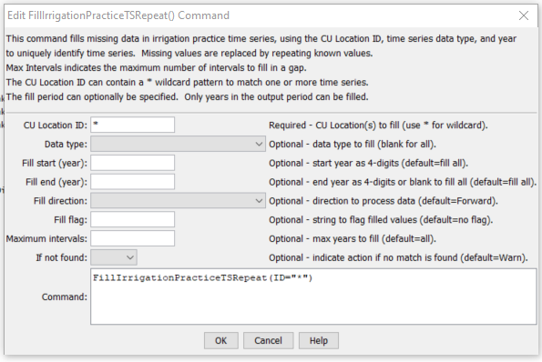

# StateDMI / Command / FillIrrigationPracticeTSRepeat #

* [Overview](#overview)
* [Command Editor](#command-editor)
* [Command Syntax](#command-syntax)
* [Examples](#examples)
* [Troubleshooting](#troubleshooting)
* [See Also](#see-also)

-------------------------

## Overview ##

The `FillIrrigationPracticeTSRepeat` command (for StateCU)
fills irrigation practice time series data for a CU Location, by repeating known values.
Filling can occur forward or backward in time, but not both.
Therefore, it may be necessary to use two similar commands, one filling forward,
and one filling backward, in order to completely fill the ends of time series.
Setting acreage values results in a cascade of adjustments to maintain sums,
and will be noted in the log file.  Preference is given to maintaining the total acreage,
then groundwater acreage, and then surface water acreage.
Irrigation method within groundwater will agree with the total and the sprinkler
and flood acreage will be prorated based on previous values if necessary to adjust to the total.
Similar adjustments are made to surface water acreage.

## Command Editor ##

The following dialog is used to edit the command and illustrates the command syntax.

**<p style="text-align: center;">

</p>**

**<p style="text-align: center;">
`FillIrrigationPracticeTSRepeat` Command Editor (<a href="../FillIrrigationPracticeTSRepeat.png">see also the full-size image</a>)
</p>**

Currently, the following check is always done after filling on any acreage data to adjust acreage parts to the total acreage:

1. If any of the acreage terms (surface water flood, surface water sprinkler,
groundwater flood, groundwater sprinkler) is missing, print a warning.
This should not occur if valid `FillStart` and `FillEnd` are specified, with observations at endpoints.
2. Compute the “target” surface water acreage as the total acreage minus
the groundwater terms (groundwater flood + sprinkler).
Compute the actual surface water (from current in-memory data)
as the total of surface water flood and sprinkler acreage.
	1. If the target is less than zero, the groundwater acres are greater than the total.
	Adjust the groundwater acreage to the total, maintaining the ratio of flood and sprinkler acres to the total as with the previous groundwater total.  Recompute the target surface water total acres (will be zero).
	2. If the surface water actual is zero and its terms cannot be adjusted to the target,
	attempt to adjust the groundwater acreage to make up the difference.
		1. If the groundwater acreage terms are zero, print a warning – no adjustment is possible.
		The user will need to take action.
		2. Else, adjust the groundwater to equal the total,
		maintaining the ratio of flood and sprinkler acres to the total as with the previous groundwater total.
	3. Else if the surface water actual is not zero,
	adjust the surface water total to match the target,
	maintaining a ratio of surface water flood and sprinkler consistent with the previous values.
	This may result in the surface water terms being set to zero.

## Command Syntax ##

The command syntax is as follows:

```text
FillIrrigationPracticeTSRepeat(Parameter="Value",...)
```
**<p style="text-align: center;">
Command Parameters
</p>**

| **Parameter**&nbsp;&nbsp;&nbsp;&nbsp;&nbsp;&nbsp;&nbsp;&nbsp;&nbsp;&nbsp;&nbsp;&nbsp; | **Description** | **Default**&nbsp;&nbsp;&nbsp;&nbsp;&nbsp;&nbsp;&nbsp;&nbsp;&nbsp;&nbsp; |
| --------------|-----------------|----------------- |
| `ID` | A single CU Location identifier to match or a pattern using wildcards (e.g., `20*`). | None – must be specified. |
| `DataType` | A single data type, `CropArea-AllSurfaceAcreageParts` (for surface water sprinkler and surface water flood), or blank for all data types. | If not specified, fill all data types. |
| `FillStart` | The first year to fill.  Specify as a year with complete data if filling forward. | If not specified, fill the full period. |
| `FillEnd` | The last year to fill. Specify as a year with complete data if filling backward. | If not specified, fill the full period. |
| `FillDirection` | The direction to fill, either Forward or Backward. | Forward |
| `FillFlag` | A string to flag values that are filled, supported by some output formats. | No flag is used |
| `MaxIntervals` | The maximum number of intervals to fill in any gap. | If not specified, fill the entire gap. |
| `IfNotFound` | Used for error handling, one of the following:<ul><li>`Fail` – generate a failure message if the `ID` is not matched</li><li>`Ignore` – ignore (don’t add and don’t generate a message) if the `ID` is not matched</li><li>`Warn` – generate a warning message if the `ID` is not matched</li></ul> | `Warn` |

## Examples ##

See the [automated tests](https://github.com/OpenCDSS/cdss-app-statedmi-test/tree/master/test/regression/commands/FillIrrigationPracticeTSRepeat).

## Troubleshooting ##

## See Also ##

* [`FillIrrigationTSPracticeTSAcreageUsingWellRights`](../FillIrrigationTSPracticeTSAcreageUsingWellRights/FillIrrigationTSPracticeTSAcreageUsingWellRights.md) command
* [`FillIrrigationTSPracticeTSInterpolate`](../FillIrrigationTSPracticeTSInterpolate/FillIrrigationTSPracticeTSInterpolate.md) command
* [`ReadIrrigationPracticeTSFromHydroBase`](../ReadIrrigationPracticeTSFromHydroBase/ReadIrrigationPracticeTSFromHydroBase.md) command
* [`ReadWellRightsFromStateMod`](../ReadWellRightsFromStateMod/ReadWellRightsFromStateMod.md) command
* [`SetIrrigationPracticeTS`](../SetIrrigationPracticeTS/SetIrrigationPracticeTS.md) command
* [`SetIrrigationPracticeTSFromHydroBase`](../SetIrrigationPracticeTSFromHydroBase/SetIrrigationPracticeTSFromHydroBase.md) command
* [`SetIrrigationPracticeTSFromList`](../SetIrrigationPracticeTSFromList/SetIrrigationPracticeTSFromList.md) command
* [`SetIrrigationPracticeTSFromStateCU`](../SetIrrigationPracticeTSFromStateCU/SetIrrigationPracticeTSFromStateCU.md) command
* [`SetIrrigationPracticeTSMaxPumpingToRights`](../SetIrrigationPracticeTSMaxPumpingToRights/SetIrrigationPracticeTSMaxPumpingToRights.md) command
* [`SetIrrigationPracticeTSPumpingMaxToWellRights`](../SetIrrigationPracticeTSPumpingMaxToWellRights/SetIrrigationPracticeTSPumpingMaxToWellRights.md) command
* [`SetIrrigationPracticeTSSprinklerAcreageFromList`](../SetIrrigationPracticeTSSprinklerAcreageFromList/SetIrrigationPracticeTSSprinklerAcreageFromList.md) command
* [`SetIrrigationPracticeTSSprinklerAreaFromList`](../SetIrrigationPracticeTSSprinklerAreaFromList/SetIrrigationPracticeTSSprinklerAreaFromList.md) command
* [`SetIrrigationPracticeTSTotalAcreageToCropPatternTSTotalAcreage`](../SetIrrigationPracticeTSTotalAcreageToCropPatternTSTotalAcreage/SetIrrigationPracticeTSTotalAcreageToCropPatternTSTotalAcreage.md) command
