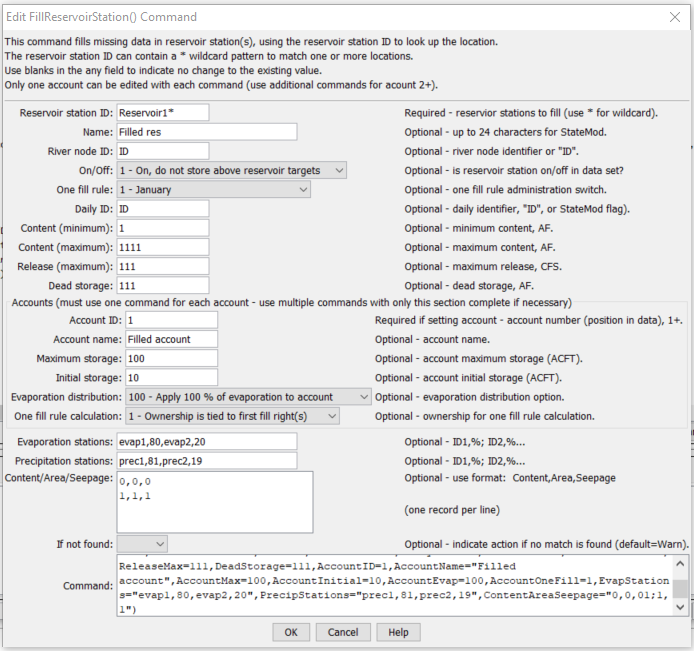

# StateDMI / Command / FillReservoirStation #

* [Overview](#overview)
* [Command Editor](#command-editor)
* [Command Syntax](#command-syntax)
* [Examples](#examples)
* [Troubleshooting](#troubleshooting)
* [See Also](#see-also)

-------------------------

## Overview ##

The `FillReservoirStation` command (for StateMod)
fills missing data in existing reservoir stations.

Currently, accounts cannot be filled, and if specified with this command, are set as if the SetReservoirStation() command is being used.


## Command Editor ##

The following dialog is used to edit the command and illustrates the command syntax.

**<p style="text-align: center;">

</p>**

**<p style="text-align: center;">
`FillReservoirStation` Command Editor (<a href="../FillReservoirStation.png">see also the full-size image</a>)
</p>**

## Command Syntax ##

The command syntax is as follows:

```text
FillReservoirStation(Parameter="Value",...)
```
**<p style="text-align: center;">
Command Parameters
</p>**

| **Parameter**&nbsp;&nbsp;&nbsp;&nbsp;&nbsp;&nbsp;&nbsp;&nbsp;&nbsp;&nbsp;&nbsp;&nbsp; | **Description** | **Default**&nbsp;&nbsp;&nbsp;&nbsp;&nbsp;&nbsp;&nbsp;&nbsp;&nbsp;&nbsp; |
| --------------|-----------------|----------------- |
| `ID` | A single diversion station identifier to match or a pattern using wildcards (e.g., `20*`). | None – must be specified. |
| `Name` | The name to be assigned for all matching reservoir stations with missing name. | If not specified, the original value will remain. |
| `RiverNodeID` | The river node identifier to be assigned for all matching reservoir stations with missing river node ID.  Specify ID to assign to the reservoir station ID. | If not specified, the original value will remain. |
| `OnOff` | The on/off switch value to be assigned for all matching reservoir stations with missing `OnOff`, either `1` for on or `0` for off. | If not specified, the original value will remain. |
| `OneFillRule` | The date for one fill rule administration (see the StateMod documentation) to be assigned for all matching reservoir stations with missing value. | If not specified, the original value will remain. |
| `DailyID` | The daily identifier to be assigned for all matching reservoir stations with missing value. | If not specified, the original value will remain. |
| `ContentMin` | The reservoir minimum content, ACFT to be assigned for all matching reservoir stations with missing value. | If not specified, the original value will remain. |
| `ContentMax` | The reservoir maximum content, ACFT to be assigned for all matching reservoir stations with missing value. | If not specified, the original value will remain. |
| `ReleaseMax` | The reservoir maximum release, CFS to be assigned for all matching reservoir stations with missing value. | If not specified, the original value will remain. |
| `DeadStorage` | The reservoir dead storage, ACFT to be assigned for all matching reservoir stations with missing value. | If not specified, the original value will remain. |
| `AccountID` | A reservoir account identifier, a number 1+.  Reservoir accounts in the StateMod reservoir station are identified only by the account name.  This `AccountID` lets the software know the order of the accounts.  If the `AccountID` is specified as 1, all the accounts are deleted and a new list of accounts is started.  Therefore, specify account information in sequential order. | Must be specified when providing account information. |
| `AccountName` | A reservoir account name. | If not specified, the original value will remain. |
| `AccountMax` | The account maximum content, ACFT. | If not specified, the original value will remain. |
| `AccountInitial` | The account initial content, ACFT. | If not specified, the original value will remain. |
| `AccountEvap` | The account evaporation distribution – see the StateMod documentation. | If not specified, the original value will remain. |
| `AccountOneFill` | The account information for one fill calculations – see the StateMod documentation. | If not specified, the original value will remain. |
| `EvapStations` | A list of evaporation stations and weights (%) for the reservoir station, using the format:  `ID,%; ID,%`. | If not specified, the original value will remain. |
| `PrecipStations` | A list of precipitation stations and weights (%) for the reservoir station, using the format:  `ID,%; ID,%`. | If not specified, the original value will remain. |
| `ContentAreaSeepage` | Content/area/seepage values, using the format:  `Content,Area,Seepage; Content,Area,Seepage`. | If not specified, the original value will remain. |

## Examples ##

See the [automated tests](https://github.com/OpenCDSS/cdss-app-statedmi-test/tree/master/test/regression/commands/FillReservoirStation).

## Troubleshooting ##

[See the main troubleshooting documentation](../../troubleshooting/troubleshooting.md)

## See Also ##

* [`FillReservoirStationsFromHydroBase`](../FillReservoirStationsFromHydroBase/FillReservoirStationsFromHydroBase.md) command
* [`FillReservoirStationsFromNetwork`](../FillReservoirStationsFromNetwork/FillReservoirStationsFromNetwork.md) command
* [`SetReservoirStation`](../SetReservoirStation/SetReservoirStation.md) command
