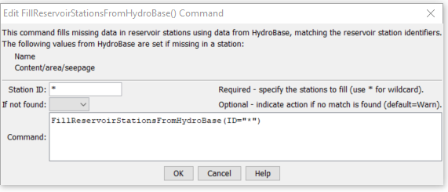

# StateDMI / Command / FillReservoirStationsFromHydroBase #

* [Overview](#overview)
* [Command Editor](#command-editor)
* [Command Syntax](#command-syntax)
* [Examples](#examples)
* [Troubleshooting](#troubleshooting)
* [See Also](#see-also)

-------------------------

## Overview ##

The `FillReservoirStationsFromHydroBase` command (for StateMod)
fills missing data in existing reservoir stations, using HydroBase for data.

If not in HydroBase, a bounding zero value point is inserted as the first record in the curve.
A maximum bound of content `9999999` is also added, using the area and seepage of the last record from HydroBase.

## Command Editor ##

The following dialog is used to edit the command and illustrates the command syntax.

**<p style="text-align: center;">

</p>**

**<p style="text-align: center;">
`FillReservoirStationsFromHydroBase` Command Editor (<a href="../FillReservoirStationsFromHydroBase.png">see also the full-size image</a>)
</p>**

## Command Syntax ##

The command syntax is as follows:

```text
FillReservoirStationsFromHydroBase(Parameter="Value",...)
```
**<p style="text-align: center;">
Command Parameters
</p>**

| **Parameter**&nbsp;&nbsp;&nbsp;&nbsp;&nbsp;&nbsp;&nbsp;&nbsp;&nbsp;&nbsp;&nbsp;&nbsp; | **Description** | **Default**&nbsp;&nbsp;&nbsp;&nbsp;&nbsp;&nbsp;&nbsp;&nbsp;&nbsp;&nbsp; |
| --------------|-----------------|----------------- |
| `ID` | A single reservoir station identifier to match or a pattern using wildcards (e.g., `20*`). | None – must be specified. |
| `IfNotFound` | Used for error handling, one of the following:<ul><li>`Fail` – generate a failure message if the ID is not matched</li><li>`Ignore` – ignore (don’t add and don’t generate a message) if the ID is not matched</li><li>`Warn` – generate a warning message if the ID is not matched</li></ul> | `Warn` |

## Examples ##

See the [automated tests](https://github.com/OpenCDSS/cdss-app-statedmi-test/tree/master/test/regression/commands/FillReservoirStationsFromHydroBase).

## Troubleshooting ##

## See Also ##

* [`FillReservoirStation`](../FillReservoirStation/FillReservoirStation.md) command
* [`FillReservoirStationsFromNetwork`](../FillReservoirStationsFromNetwork/FillReservoirStationsFromNetwork.md) command
* [`SetReservoirStation`](../SetReservoirStation/SetReservoirStation.md) command
