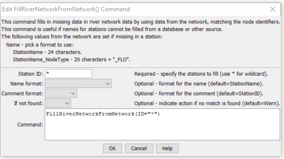

# StateDMI / Command / FillRiverNetworkFromNetwork #

* [Overview](#overview)
* [Command Editor](#command-editor)
* [Command Syntax](#command-syntax)
* [Examples](#examples)
* [Troubleshooting](#troubleshooting)
* [See Also](#see-also)

-------------------------

## Overview ##

The `FillRiverNetworkFromNetwork` command (for StateMod)
fills missing data in the StateMod river network, using the generalized network for data.  This is used, for example, when the river network has been created from the generalized network and “official” node names are first filled from HydroBase.   Any remaining missing names can then be filled from the generalized network, using labels for the diagram.

## Command Editor ##

The following dialog is used to edit the command and illustrates the command syntax.

**<p style="text-align: center;">

</p>**

**<p style="text-align: center;">
`FillRiverNetworkFromNetwork` Command Editor (<a href="../FillRiverNetworkFromNetwork.png">see also the full-size image</a>)
</p>**

## Command Syntax ##

The command syntax is as follows:

```text
FillRiverNetworkFromNetwork(Parameter="Value",...)
```
**<p style="text-align: center;">
Command Parameters
</p>**

| **Parameter**&nbsp;&nbsp;&nbsp;&nbsp;&nbsp;&nbsp;&nbsp;&nbsp;&nbsp;&nbsp;&nbsp;&nbsp; | **Description** | **Default**&nbsp;&nbsp;&nbsp;&nbsp;&nbsp;&nbsp;&nbsp;&nbsp;&nbsp;&nbsp; |
| --------------|-----------------|----------------- |
| `ID` | A single river station identifier to match or a pattern using wildcards (e.g., `20*`). | None – must be specified. |
| `NameFormat` | The format to use when setting the name, one of:<ul><li>`StationName` – use the station name from HydroBase</li><li>`StationName_NodeType` – use the first 20 characters of the name from Hydrobase + “_” + the node type.</li></ul> | StationName |
| `CommentFormat` | The format to use for the river station comment, currently only:<ul><li>`StationID` – the river station identifier.</li></ul> | If not specified, the original data will remain unchanged. |
| `IfNotFound` | Used for error handling, one of the following:<ul><li>`Fail` – generate a failure message if the ID is not matched</li><li>`Ignore` – ignore (don’t add and don’t generate a message) if the ID is not matched</li><li>`Warn` – generate a warning message if the ID is not matched</li></ul> | `Warn` |

## Examples ##

See the [automated tests](https://github.com/OpenCDSS/cdss-app-statedmi-test/tree/master/test/regression/commands/FillRiverNetworkFromNetwork).

The following command file illustrates how a StateMod river network file can be created from the generalized network file:

```
StartLog(LogFile="rin.commands.StateDMI.log")
# rin.commands.StateDMI
#
# creates the river network file for the Colorado River monthly/daily models
#
#  Step 1 - read river nodes from the network file and create file framework
#
ReadNetworkFromStateMod(InputFile="cm2005.net")
CreateRiverNetworkFromNetwork()
#
#  Step 2 - get node (diversion, stream stations, reservoirs, instream flows)
#           names from HydroBase
#
FillRiverNetworkFromHydroBase(ID="*",NameFormat=StationName_NodeType)
#
#  Step 3 - read missing node names from network file
#
FillRiverNetworkFromNetwork(ID="*",NameFormat="StationName_NodeType",CommentFormat="StationID")
#
#  Step 4 - create StateMod river network file
#
WriteRiverNetworkToStateMod(OutputFile="..\StateMod\cm2005.rin")
#
# Check the results
CheckRiverNetwork(ID="*")
WriteCheckFile(OutputFile="rin.commands.StateDMI.check.html")
```

## Troubleshooting ##

## See Also ##

* [`FillRiverNetworkFromHydroBase`](../FillRiverNetworkFromHydroBase/FillRiverNetworkFromHydroBase.md) command
* [`FillRiverNetworkNode`](../FillRiverNetworkNode/FillRiverNetworkNode.md) command
* [`SetRiverNetworkNode`](../SetRiverNetworkNode/SetRiverNetworkNode.md) command
