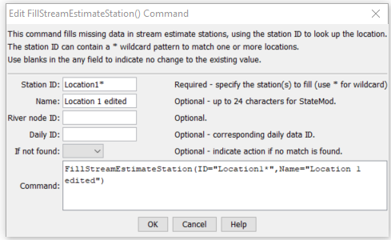

# StateDMI / Command / FillStreamEstimateStation #

* [Overview](#overview)
* [Command Editor](#command-editor)
* [Command Syntax](#command-syntax)
* [Examples](#examples)
* [Troubleshooting](#troubleshooting)
* [See Also](#see-also)

-------------------------

## Overview ##

The `FillStreamEstimateStation` command (from StateMod)
fills missing data in existing stream estimate stations.

## Command Editor ##

The following dialog is used to edit the command and illustrates the command syntax.

**<p style="text-align: center;">

</p>**

**<p style="text-align: center;">
`FillStreamEstimateStation` Command Editor (<a href="../FillStreamEstimateStation.png">see also the full-size image</a>)
</p>**

## Command Syntax ##

The command syntax is as follows:

```text
FillStreamEstimateStation(Parameter="Value",...)
```
**<p style="text-align: center;">
Command Parameters
</p>**

| **Parameter**&nbsp;&nbsp;&nbsp;&nbsp;&nbsp;&nbsp;&nbsp;&nbsp;&nbsp;&nbsp;&nbsp;&nbsp; | **Description** | **Default**&nbsp;&nbsp;&nbsp;&nbsp;&nbsp;&nbsp;&nbsp;&nbsp;&nbsp;&nbsp; |
| --------------|-----------------|----------------- |
| `ID` | A single stream estimate identifier to match or a pattern using wildcards (e.g., `20*`). | None – must be specified. |
| `RiverNodeID` | The river node identifier to be assigned for all matching stream estimate identifiers with missing river node identifier | If not specified, the original value will remain. |
| `DailyID` | The daily identifier to be assigned for all matching stream estimate identifiers with missing river node identifier | If not specified, the original value will remain. |
| `Name` | The name to be assigned for all matching stream estimate identifiers with missing name. | If not specified, the original value will remain. |
| `IfNotFound` | Used for error handling, one of the following:<ul><li>`Fail` – generate a failure message if the ID is not matched</li><li>`Ignore` – ignore (don’t add and don’t generate a message) if the ID is not matched</li><li>`Warn` – generate a warning message if the ID is not matched</li></ul> | `Warn` |

## Examples ##

See the [automated tests](https://github.com/OpenCDSS/cdss-app-statedmi-test/tree/master/test/regression/commands/FillStreamEstimateStation).

## Troubleshooting ##

[See the main troubleshooting documentation](../../troubleshooting/troubleshooting.md)

## See Also ##

* [`FillStreamEstimateStationsFromHydroBase`](../FillStreamEstimateStationsFromHydroBase/FillStreamEstimateStationsFromHydroBase.md) command
* [`FillStreamEstimateStationsFromNetwork`](../FillStreamEstimateStationsFromNetwork/FillStreamEstimateStationsFromNetwork.md) command
* [`SetStreamEstimateCoefficients`](../SetStreamEstimateCoefficients/SetStreamEstimateCoefficients.md) command
* [`SetStreamEstimateCoefficientsPFGage`](../SetStreamEstimateCoefficientsPFGage/SetStreamEstimateCoefficientsPFGage.md) command
* [`SetStreamEstimateStation`](../SetStreamEstimateStation/SetStreamEstimateStation.md) command
