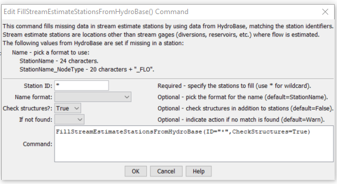

# StateDMI / Command / FillStreamEstimateStationsFromHydroBase #

* [Overview](#overview)
* [Command Editor](#command-editor)
* [Command Syntax](#command-syntax)
* [Examples](#examples)
* [Troubleshooting](#troubleshooting)
* [See Also](#see-also)

-------------------------

## Overview ##

The `FillStreamEstimateStationsFromHydroBase` command (for StateMod)
fills missing data in existing stream estimate stations, using HydroBase for data.

## Command Editor ##

The following dialog is used to edit the command and illustrates the command syntax.

**<p style="text-align: center;">

</p>**

**<p style="text-align: center;">
`FillStreamEstimateStationsFromHydroBase` Command Editor (<a href="../FillStreamEstimateStationsFromHydroBase.png">see also the full-size image</a>)
</p>**

## Command Syntax ##

The command syntax is as follows:

```text
FillStreamEstimateStationsFromHydroBase(Parameter="Value",...)
```
**<p style="text-align: center;">
Command Parameters
</p>**

| **Parameter**&nbs;&nbs;&nbsp;&nbsp;&nbsp;&nbsp;&nbsp;&nbsp;&nbsp;&nbsp;&nbsp;&nbsp;&nbsp;&nbsp; | **Description** | **Default**&nbsp;&nbsp;&nbsp;&nbsp;&nbsp;&nbsp;&nbsp;&nbsp;&nbsp;&nbsp; |
| --------------|-----------------|----------------- |
| `ID` | A single stream estimate station identifier to match or a pattern using wildcards (e.g., `20*`). | None – must be specified. |
| `NameFormat` | The format to use when setting the name, one of:<ul><li>`StationName` – use the station name from HydroBase</li><li>`StationName_NodeType` – use the first 20 characters of the name from Hydrobase + “_” + the node type.</li></ul> | `StationName` |
| `CheckStructures` | The old convention in StateMod was to combine stream gage and stream estimate stations in the stream gage station file.  A new convention that is being evaluated is to have separate stream gage and estimate station files.  Because stream estimate stations are often at HydroBase structures, filling names requires checking HydroBase structures.  Since this step is not needed in the new convention, it is included as an option.  Specify True to check structures when filling data from HydroBase. | `False` |
| `IfNotFound` | Used for error handling, one of the following:<ul><li>`Fail` – generate a failure message if the ID is not matched</li><li>`Ignore` – ignore (don’t add and don’t generate a message) if the ID is not matched</li><li>`Warn` – generate a warning message if the ID is not matched</li></ul> | `Warn` |

## Examples ##

See the [automated tests](https://github.com/OpenCDSS/cdss-app-statedmi-test/tree/master/test/regression/commands/FillStreamEstimateStationsFromHydroBase).

## Troubleshooting ##

## See Also ##

* [`FillStreamEstimateStation`](../FillStreamEstimateStation/FillStreamEstimateStation.md) command
* [`FillStreamEstimateStationsFromNetwork`](../FillStreamEstimateStationsFromNetwork/FillStreamEstimateStationsFromNetwork.md) command
* [`SetStreamEstimateCoefficients`](../SetStreamEstimateCoefficients/SetStreamCoefficients.md) command
* [`SetStreamEstimateCoefficientsPFGage`](../SetStreamEstimateCoefficientsPFGage/SetStreamCoefficientsPFGage.md) command
* [`SetStreamEstimateStation`](../SetStreamEstimateStation/SetStreamEstimateStation.md) command
