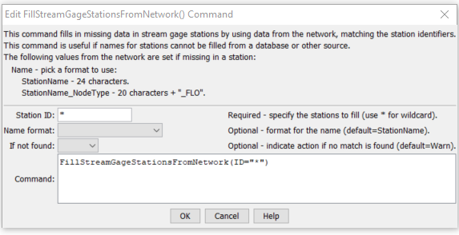

# StateDMI / Command / FillStreamGageStationsFromNetwork #

* [Overview](#overview)
* [Command Editor](#command-editor)
* [Command Syntax](#command-syntax)
* [Examples](#examples)
* [Troubleshooting](#troubleshooting)
* [See Also](#see-also)

-------------------------

## Overview ##

The `FillStreamGageStationsFromNetwork` command (for StateMod)
fills missing data in stream gage stations, using a StateMod network for data.
This command is usually used after filling from other sources (e.g., HydroBase),
because the information in the network file may have been specified mainly for the
diagram and therefore does not necessarily match official data sources.
It is assumed that the network has been read in a previous command
(e.g., when the list of stream gage stations was originally read).

## Command Editor ##

The following dialog is used to edit the command and illustrates the command syntax.

**<p style="text-align: center;">

</p>**

**<p style="text-align: center;">
`FillStreamGageStationsFromNetwork` Command Editor (<a href="../FillStreamGageStationsFromNetwork.png">see also the full-size image</a>)
</p>**

## Command Syntax ##

The command syntax is as follows:

```text
FillStreamGageStationsFromNetwork(Parameter="Value",...)
```
**<p style="text-align: center;">
Command Parameters
</p>**

| **Parameter**&nbsp;&nbsp;&nbsp;&nbsp;&nbsp;&nbsp;&nbsp;&nbsp;&nbsp;&nbsp;&nbsp;&nbsp; | **Description** | **Default**&nbsp;&nbsp;&nbsp;&nbsp;&nbsp;&nbsp;&nbsp;&nbsp;&nbsp;&nbsp; |
| --------------|-----------------|----------------- |
| `ID` | A single stream gage station identifier to match or a pattern using wildcards (e.g., `20*`). | None – must be specified. |
| `NameFormat` | The format to use when setting the name, one of:<ul><li>`StationName` – use the station name from HydroBase</li><li>`StationName_NodeType` – use the first 20 characters of the name from Hydrobase + “_” + the node type.</li></ul> | `StationName` |
| `IfNotFound` | Used for error handling, one of the following:<ul><li>`Fail` – generate a failure message if the ID is not matched</li><li>`Ignore` – ignore (don’t add and don’t generate a message) if the ID is not matched</li><li>`Warn` – generate a warning message if the ID is not matched</li></ul> | `Warn` |

## Examples ##

See the [automated tests](https://github.com/OpenCDSS/cdss-app-statedmi-test/tree/master/test/regression/commands/FillStreamGageStationsFromNetwork).

## Troubleshooting ##

## See Also ##

* [`FillStreamGageStation`](../FillStreamGageStation/FillStreamGageStation.md) command
* [`FillStreamGageStationsFromHydroBase`](../FillStreamGageStationsFromHydroBase/FillStreamGageStationsFromHydroBase.md) command
* [`SetStreamGageStation`](../SetStreamGageStation/SetStreamGageStation.md) command
