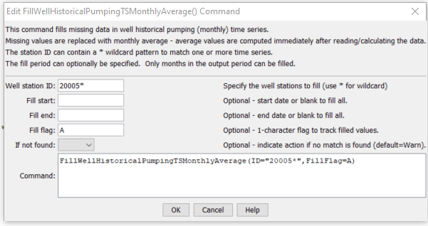

# StateDMI / Command / FillWellHistoricalPumpingTSMonthlyAverage #

* [Overview](#overview)
* [Command Editor](#command-editor)
* [Command Syntax](#command-syntax)
* [Examples](#examples)
* [Troubleshooting](#troubleshooting)
* [See Also](#see-also)

-------------------------

## Overview ##

The `FillWellHistoricalPumpingTSMonthlyAverage` command (for StateCU and StateMod)
fills missing well historical pumping time series (monthly) data, using average monthly values.
The averages are computed immediately after reading time series (e.g., from HydroBase or a file).
The average values that are used during data filling are printed to the log file.

## Command Editor ##

The following dialog is used to edit the command and illustrates the command syntax.

**<p style="text-align: center;">

</p>**

**<p style="text-align: center;">
`FillWellHistoricalPumpingTSMonthlyAverage` Command Editor (<a href="../FillWellHistoricalPumpingTSMonthlyAverage.png">see also the full-size image</a>)
</p>**

## Command Syntax ##

The command syntax is as follows:

```text
FillWellHistoricalPumpingTSMonthlyAverage(Parameter="Value",...)
```
**<p style="text-align: center;">
Command Parameters
</p>**

| **Parameter**&nbsp;&nbsp;&nbsp;&nbsp;&nbsp;&nbsp;&nbsp;&nbsp;&nbsp;&nbsp;&nbsp;&nbsp; | **Description** | **Default**&nbsp;&nbsp;&nbsp;&nbsp;&nbsp;&nbsp;&nbsp;&nbsp;&nbsp;&nbsp; |
| --------------|-----------------|----------------- |
| `ID` | A single well station identifier to match or a pattern using wildcards (e.g., `20*`). | None – must be specified. |
| `FillStart` | The first date to fill, `YYYY-MM` or `MM/YYYY`. | If not specified, fill the full period. |
| `FillEnd` | The last date to fill, `YYYY-MM` or `MM/YYYY`. | If not specified, fill the full period. |
| `FillFlag` | If specified as a single character, data flags will be enabled for the time series and each filled value will be tagged with the specified character.  The flag can then be used later to label graphs, etc.  The flag will be appended to existing flags if necessary. | No flag is assigned. |
| `IfNotFound` | Used for error handling, one of the following:<ul><li>`Fail` – generate a failure message if the ID is not matched</li><li>`Ignore` – ignore (don’t generate a message) if the ID is not matched</li><li>`Warn` – generate a warning message if the ID is not matched</li></ul> | `Warn` |

## Examples ##

See the [automated tests](https://github.com/OpenCDSS/cdss-app-statedmi-test/tree/master/test/regression/commands/FillWellHistoricalPumpingTSMonthlyAverage).

## Troubleshooting ##

## See Also ##

* [`FillWellHistoricalPumpingTSMonthlyConstant`](../FillWellHistoricalPumpingTSMonthlyConstant/FillWellHistoricalPumpingTSMonthlyConstant.md) command
* [`FillWellHistoricalPumpingTSMonthlyPattern`](../FillWellHistoricalPumpingTSMonthlyPattern/FillWellHistoricalPumpingTSMonthlyPattern.md) command
* [`SetWellHistoricalPumpingTSMonthly`](../SetWellHistoricalPumpingTSMonthly/SetWellHistoricalPumpingTSMonthly.md) command
* [`SetWellHistoricalPumpingTSMonthlyConstant`](../SetWellHistoricalPumpingTSMonthlyConstant/SetWellHistoricalPumpingTSMonthlyConstant.md) command
